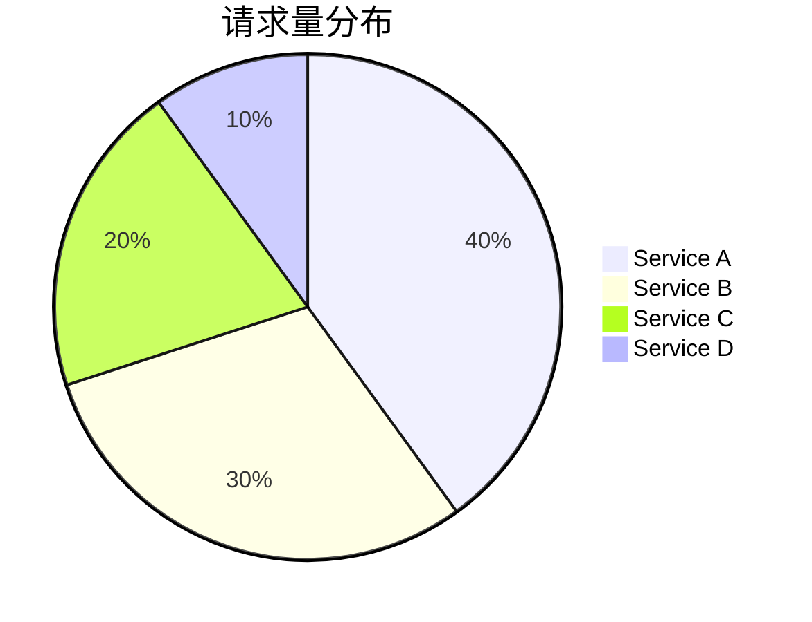

# 可视化最佳实践

在现代监控系统中，可视化是理解数据的关键。Prometheus 作为一个强大的监控工具，提供了丰富的指标数据，但如何将这些数据以清晰、直观的方式呈现出来，是每个初学者需要掌握的重要技能。本文将介绍 Prometheus 可视化的最佳实践，帮助你从零开始构建高效的可视化方案。

## 什么是 Prometheus 可视化？

Prometheus 可视化是指将 Prometheus 收集的指标数据通过图表、仪表盘等形式展示出来，以便用户能够快速理解系统的运行状态。常见的可视化工具包括 Grafana、Prometheus 自带的表达式浏览器等。通过可视化，你可以更直观地监控系统的性能、发现潜在问题，并做出相应的优化。

## 可视化最佳实践

### 1. 选择合适的图表类型

不同的指标数据适合不同的图表类型。以下是一些常见的图表类型及其适用场景：

- **折线图（Line Chart）**：适用于展示随时间变化的趋势，例如 CPU 使用率、内存使用量等。
- **柱状图（Bar Chart）**：适用于比较不同类别的数据，例如不同服务的请求量。
- **饼图（Pie Chart）**：适用于展示比例关系，例如不同状态码的请求比例。
- **仪表盘（Gauge）**：适用于展示当前状态，例如当前系统的 CPU 使用率。

:::tip
选择合适的图表类型可以让数据更加直观易懂。避免在不适合的场景中使用复杂的图表类型。
:::

### 2. 使用有意义的标签和标题

在创建图表时，确保为每个图表添加有意义的标题和标签。这有助于用户快速理解图表所展示的内容。

```promql
# 示例：查询 CPU 使用率
rate(node_cpu_seconds_total{mode="system"}[1m])
```

在 Grafana 中，你可以为图表添加标题 "CPU 使用率（System Mode）"，并确保 Y 轴的标签为 "CPU Usage (%)"。

### 3. 避免过度可视化

虽然可视化可以帮助我们理解数据，但过多的图表可能会导致信息过载。在设计仪表盘时，尽量保持简洁，只展示最关键的数据。

:::caution
避免在一个仪表盘中放置过多的图表，这会让用户难以聚焦于重要信息。
:::

### 4. 使用颜色和样式增强可读性

颜色和样式可以帮助用户快速区分不同的数据系列。例如，在展示多个服务的请求量时，可以为每个服务分配不同的颜色。



:::note
使用颜色时，确保颜色对比度足够高，以便色盲用户也能轻松区分。
:::

### 5. 定期审查和优化可视化

随着系统的变化，监控需求也会发生变化。定期审查你的可视化方案，确保它们仍然能够有效地反映系统的状态。

## 实际案例

假设你正在监控一个 Web 服务的性能，以下是你可以采取的可视化步骤：

1. **创建仪表盘**：在 Grafana 中创建一个新的仪表盘，命名为 "Web 服务性能监控"。
2. **添加图表**：
   - 添加一个折线图，展示请求响应时间的变化趋势。
   - 添加一个柱状图，展示不同 HTTP 状态码的请求量。
   - 添加一个仪表盘，展示当前系统的 CPU 使用率。
3. **设置警报**：为关键指标设置警报，例如当响应时间超过 500ms 时触发警报。

## 总结

Prometheus 可视化是监控系统中不可或缺的一部分。通过选择合适的图表类型、使用有意义的标签、避免过度可视化、增强可读性以及定期优化，你可以构建出高效、清晰的可视化方案。希望本文的内容能够帮助你快速上手 Prometheus 可视化，并在实际项目中应用这些最佳实践。

## 附加资源

- [Grafana 官方文档](https://grafana.com/docs/)
- [Prometheus 查询语言（PromQL）指南](https://prometheus.io/docs/prometheus/latest/querying/basics/)
- [可视化设计原则](https://www.nngroup.com/articles/ten-usability-heuristics/)

## 练习

1. 在 Grafana 中创建一个仪表盘，展示你当前系统的 CPU 使用率和内存使用量。
2. 尝试为你的 Web 服务创建一个可视化方案，展示请求响应时间和错误率。
3. 为关键指标设置警报，并测试其有效性。
