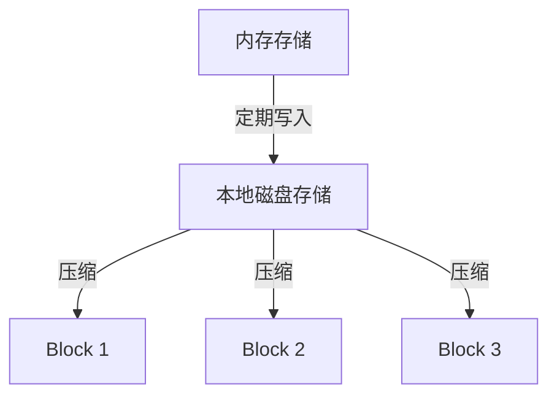
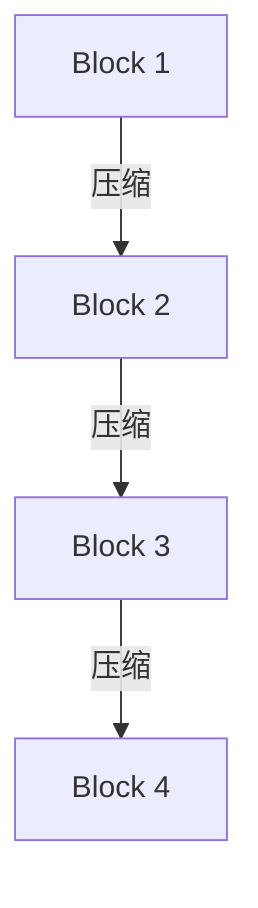

# Prometheus 数据存储机制

Prometheus 是一个开源的监控和告警工具，广泛用于收集和存储时间序列数据。它的数据存储机制是其核心功能之一，直接影响系统的性能和可扩展性。本文将深入探讨 Prometheus 的数据存储机制，帮助初学者理解其工作原理。

## 介绍

Prometheus 通过抓取目标（targets）的指标数据，并将其存储为时间序列（time series）。时间序列是由时间戳和值组成的数据点集合，通常用于表示系统或应用程序的性能指标。Prometheus 的存储机制旨在高效地存储和查询这些时间序列数据。

## 数据存储结构

Prometheus 的数据存储结构可以分为以下几个部分：

1. **内存存储（In-Memory Storage）**：Prometheus 首先将抓取到的数据存储在内存中，以便快速查询和处理。
2. **本地磁盘存储（Local Disk Storage）**：内存中的数据会定期写入本地磁盘，以确保数据的持久性。
3. **远程存储（Remote Storage）**：对于大规模部署，Prometheus 支持将数据写入远程存储系统，如 Thanos 或 Cortex。

### 内存存储

Prometheus 使用一个称为 `head block` 的内存块来存储最近的数据。`head block` 是一个环形缓冲区，当数据量达到一定阈值时，旧数据会被写入磁盘。

```go
type Head struct {
    // 内存中的时间序列数据
    series map[uint64]*memSeries
    // 其他字段...
}
```

### 本地磁盘存储

Prometheus 将数据存储在本地磁盘上的 `blocks` 中。每个 `block` 包含一段时间范围内的数据，通常为 2 小时。这些 `blocks` 是不可变的，一旦写入磁盘，就不会再被修改。



### 远程存储

对于大规模部署，Prometheus 支持将数据写入远程存储系统。这可以通过配置 `remote_write` 和 `remote_read` 来实现。

```yaml
remote_write:
  - url: "http://thanos:10908/api/v1/receive"
remote_read:
  - url: "http://thanos:10908/api/v1/query"
```

## 数据压缩与清理

Prometheus 会定期对磁盘上的 `blocks` 进行压缩，以减少存储空间并提高查询性能。压缩过程会将多个小 `blocks` 合并为一个大 `block`。



此外，Prometheus 还支持数据保留策略，可以配置数据保留的时间长度。超过保留时间的数据会被自动清理。

```yaml
storage:
  retention: 15d
```

## 实际案例

假设我们有一个 Web 应用程序，需要监控其请求延迟和错误率。我们可以使用 Prometheus 来收集这些指标，并将其存储在本地磁盘上。

```yaml
scrape_configs:
  - job_name: 'web_app'
    static_configs:
      - targets: ['localhost:8080']
```

通过配置 `remote_write`，我们还可以将这些数据写入远程存储系统，以便进行长期存储和分析。

```yaml
remote_write:
  - url: "http://thanos:10908/api/v1/receive"
```

## 总结

Prometheus 的数据存储机制是其监控功能的核心。通过内存存储、本地磁盘存储和远程存储的结合，Prometheus 能够高效地存储和查询时间序列数据。理解这些机制有助于优化 Prometheus 的性能和可扩展性。

## 附加资源

- [Prometheus 官方文档](https://prometheus.io/docs/)
- [Thanos 官方文档](https://thanos.io/)
- [Cortex 官方文档](https://cortexmetrics.io/)

## 练习

1. 配置一个 Prometheus 实例，并设置数据保留时间为 7 天。
2. 尝试使用 `remote_write` 将数据写入 Thanos 或 Cortex。
3. 观察 Prometheus 的磁盘存储结构，并理解 `blocks` 的压缩过程。
