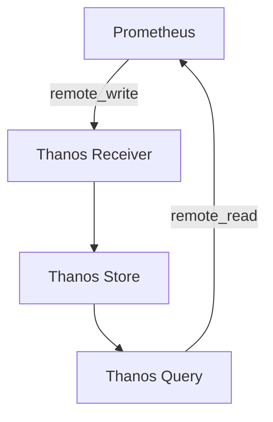

# 远程存储集成

Prometheus 是一个强大的监控和告警工具，但其默认的本地存储机制在处理大规模数据时可能会遇到性能瓶颈。为了克服这些限制，Prometheus 提供了与远程存储系统的集成能力。通过远程存储集成，您可以将监控数据存储在外部系统中，从而扩展 Prometheus 的存储能力和性能。

## 什么是远程存储集成？

远程存储集成是指将 Prometheus 的监控数据发送到外部存储系统（如长期存储数据库）的过程。这些外部存储系统通常具有更高的存储容量和更好的查询性能，能够处理更大规模的数据集。通过远程存储集成，您可以保留历史数据更长时间，并且可以在需要时快速查询这些数据。

## 为什么需要远程存储集成？

1. **存储容量限制**：Prometheus 的本地存储容量有限，无法长期存储大量数据。
2. **性能优化**：远程存储系统通常具有更高效的查询性能，能够更快地处理大规模数据。
3. **数据持久化**：通过远程存储，您可以确保监控数据在 Prometheus 实例故障时不会丢失。

## 如何配置远程存储集成？

Prometheus 通过 `remote_write` 和 `remote_read` 配置项来实现与远程存储系统的集成。以下是一个简单的配置示例：

```yaml
remote_write:
  - url: "http://remote-storage.example.com/api/v1/write"
    queue_config:
      capacity: 10000
      max_shards: 10

remote_read:
  - url: "http://remote-storage.example.com/api/v1/read"
```

### 配置项说明

- `url`: 远程存储系统的 API 地址。
- `queue_config`: 配置远程写入的队列参数，包括容量和最大分片数。

## 实际案例

假设您正在监控一个大型分布式系统，每天生成数百万个监控指标。为了确保这些数据能够长期保存并且能够快速查询，您可以将 Prometheus 配置为将数据写入到远程存储系统（如 Thanos 或 Cortex）。

### 示例配置

```yaml
remote_write:
  - url: "http://thanos-receiver.example.com/api/v1/write"
    queue_config:
      capacity: 20000
      max_shards: 20

remote_read:
  - url: "http://thanos-query.example.com/api/v1/read"
```

### 数据流图



## 总结

通过远程存储集成，您可以显著提升 Prometheus 的存储能力和查询性能。这对于需要长期保存和快速查询大规模监控数据的场景尤为重要。配置远程存储集成相对简单，只需在 Prometheus 配置文件中添加 `remote_write` 和 `remote_read` 配置项即可。

## 附加资源

- [Prometheus 官方文档](https://prometheus.io/docs/prometheus/latest/storage/#remote-storage-integrations)
- [Thanos 项目](https://thanos.io/)
- [Cortex 项目](https://cortexmetrics.io/)

## 练习

1. 配置 Prometheus 将数据写入到远程存储系统，并验证数据是否成功写入。
2. 尝试从远程存储系统读取数据，并比较查询性能与本地存储的差异。
3. 探索不同的远程存储系统（如 Thanos 和 Cortex），并比较它们的优缺点。

:::tip
在配置远程存储集成时，请确保远程存储系统的 API 地址正确，并且网络连接稳定。
:::