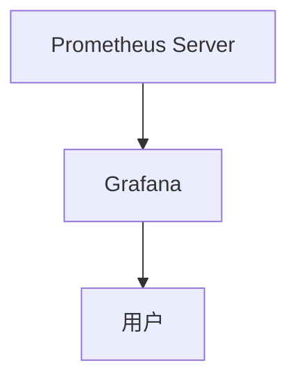

## 什么是Prometheus生态系统？

Prometheus是一个开源的系统监控和警报工具包，最初由SoundCloud开发，现已成为云原生计算基金会（CNCF）的毕业项目。Prometheus生态系统由多个组件构成，这些组件共同协作，帮助用户监控和警报其基础设施和应用程序。

Prometheus的核心功能包括：
- **多维度数据模型**：通过键值对标签（labels）对时间序列数据进行标识。
- **强大的查询语言PromQL**：用于查询和分析时间序列数据。
- **高效的存储引擎**：支持高吞吐量的数据采集和存储。
- **灵活的警报管理**：通过Alertmanager实现警报的分组、去重和路由。

## Prometheus 生态系统的核心组件

### 1. Prometheus Server
Prometheus Server是生态系统的核心组件，负责数据的采集、存储和查询。它通过定期从目标（targets）拉取指标数据，并将其存储在本地的时间序列数据库中。

```yaml
# 示例：Prometheus配置文件
global:
  scrape_interval: 15s

scrape_configs:
  - job_name: 'node_exporter'
    static_configs:
      - targets: ['localhost:9100']
```

### 2. Exporters
Exporters是将第三方系统的指标暴露给Prometheus的工具。常见的Exporters包括：
- **Node Exporter**：用于监控主机的硬件和操作系统指标。
- **Blackbox Exporter**：用于监控网络服务的可用性。
- **MySQL Exporter**：用于监控MySQL数据库的性能。

```bash
# 启动Node Exporter
./node_exporter
```

### 3. Alertmanager
Alertmanager负责处理来自Prometheus Server的警报。它支持警报的分组、去重、静默和路由到不同的接收器（如电子邮件、Slack等）。

```yaml
# 示例：Alertmanager配置文件
route:
  receiver: 'email-notifications'

receivers:
  - name: 'email-notifications'
    email_configs:
      - to: 'admin@example.com'
```

### 4. Pushgateway
Pushgateway用于处理短期任务的指标推送。由于Prometheus是基于拉取模型的，Pushgateway允许短期任务在完成后将指标推送到Prometheus。

```bash
# 示例：使用curl推送指标到Pushgateway
echo "some_metric 3.14" | curl --data-binary @- http://pushgateway.example.org:9091/metrics/job/some_job
```

### 5. Grafana
Grafana是一个开源的可视化工具，通常与Prometheus结合使用，用于创建丰富的仪表盘和图表。



## 实际应用场景

### 场景1：监控Kubernetes集群
在Kubernetes集群中，Prometheus可以监控节点、Pod、服务和应用程序的性能。通过使用`kube-state-metrics`和`node-exporter`，Prometheus可以收集集群的详细指标。

```yaml
# 示例：Kubernetes中的Prometheus配置
scrape_configs:
  - job_name: 'kubernetes-nodes'
    kubernetes_sd_configs:
      - role: node
    relabel_configs:
      - source_labels: [__address__]
        regex: '(.*):10250'
        replacement: '${1}:9100'
        target_label: __address__
```

### 场景2：监控微服务架构
在微服务架构中，Prometheus可以监控每个服务的健康状况和性能。通过在每个服务中嵌入Prometheus客户端库，服务可以暴露自身的指标。

```go
// 示例：Go服务中使用Prometheus客户端库
package main

import (
    "net/http"
    "github.com/prometheus/client_golang/prometheus/promhttp"
)

func main() {
    http.Handle("/metrics", promhttp.Handler())
    http.ListenAndServe(":8080", nil)
}
```

## 总结

Prometheus生态系统提供了一个强大而灵活的工具集，用于监控和警报各种基础设施和应用程序。通过理解其核心组件和实际应用场景，初学者可以逐步掌握Prometheus的使用方法，并将其应用到自己的项目中。

## 附加资源

- [Prometheus官方文档](https://prometheus.io/docs/)
- [Prometheus GitHub仓库](https://github.com/prometheus/prometheus)
- [Grafana官方文档](https://grafana.com/docs/)

## 练习

1. 在你的本地环境中安装Prometheus和Node Exporter，并配置Prometheus监控本地主机的指标。
2. 使用Grafana创建一个仪表盘，展示从Prometheus中获取的CPU和内存使用情况。
3. 配置Alertmanager，当CPU使用率超过80%时发送警报到你的电子邮件。

通过完成这些练习，你将更深入地理解Prometheus生态系统的工作原理和应用方法。