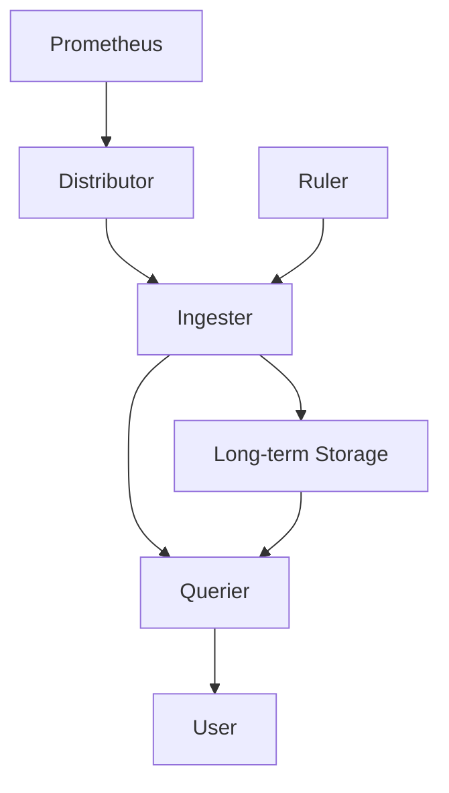

# Cortex解决方案

## 介绍

Cortex是一个开源的、基于Prometheus的分布式系统，旨在为Prometheus提供长期存储和水平扩展能力。Prometheus本身是一个强大的监控和告警工具，但在处理大规模数据时，单节点的Prometheus可能会遇到存储和查询性能的瓶颈。Cortex通过将Prometheus的数据存储在分布式系统中，解决了这些问题。

Cortex的核心功能包括：
- **长期存储**：将Prometheus的数据存储在分布式存储系统（如S3、GCS）中。
- **水平扩展**：通过分片和复制机制，支持大规模数据的存储和查询。
- **多租户支持**：允许多个团队或用户共享同一个Cortex集群，同时保证数据隔离。

## Cortex的架构

Cortex的架构设计非常模块化，主要包括以下几个组件：

1. **Distributor**：负责接收来自Prometheus的写入请求，并将数据分发到多个Ingester实例。
2. **Ingester**：负责将数据写入长期存储，并在内存中缓存最近的数据以加速查询。
3. **Querier**：负责处理查询请求，从Ingester和长期存储中获取数据并返回结果。
4. **Store Gateway**：负责从长期存储中读取数据。
5. **Ruler**：负责执行告警规则和记录规则。



## 安装和配置Cortex

要开始使用Cortex，首先需要安装和配置它。以下是一个简单的安装步骤：

1. **下载Cortex**：可以从Cortex的GitHub仓库下载最新的发布版本。

   ```bash
   wget https://github.com/cortexproject/cortex/releases/download/v1.10.0/cortex-linux-amd64
   chmod +x cortex-linux-amd64
   ```

2. **配置Cortex**：创建一个配置文件`cortex.yaml`，内容如下：

   ```yaml
   target: all
   auth_enabled: false
   server:
     http_listen_port: 9009
   distributor:
     ring:
       kvstore:
         store: inmemory
   ingester:
     lifecycler:
       ring:
         kvstore:
           store: inmemory
         replication_factor: 1
   ```

3. **启动Cortex**：

   ```bash
   ./cortex-linux-amd64 -config.file=cortex.yaml
   ```

## 实际案例

假设你有一个需要监控的微服务架构，每个服务都使用Prometheus进行监控。随着服务的增多，单节点的Prometheus无法处理大量的监控数据。这时，你可以使用Cortex来扩展Prometheus的存储和查询能力。

1. **配置Prometheus远程写入**：在Prometheus的配置文件中添加远程写入配置，将数据发送到Cortex。

   ```yaml
   remote_write:
     - url: "http://cortex:9009/api/v1/push"
   ```

2. **查询数据**：使用Cortex的查询接口来查询历史数据。

   ```bash
   curl -G 'http://cortex:9009/api/v1/query' --data-urlencode 'query=up'
   ```

## 总结

Cortex是Prometheus生态系统中的一个重要组件，它通过提供长期存储和水平扩展能力，解决了Prometheus在大规模监控场景中的瓶颈问题。通过Cortex，你可以轻松地扩展Prometheus的存储和查询能力，同时支持多租户和分布式架构。

## 附加资源

- [Cortex官方文档](https://cortexmetrics.io/docs/)
- [Prometheus官方文档](https://prometheus.io/docs/)
- [Cortex GitHub仓库](https://github.com/cortexproject/cortex)

## 练习

1. 尝试在本地安装和配置Cortex，并将其与Prometheus集成。
2. 使用Cortex查询接口查询历史数据，并分析查询结果。
3. 探索Cortex的多租户功能，配置多个租户并验证数据隔离。

通过以上步骤，你将能够更好地理解Cortex的工作原理，并能够在实际项目中应用它。