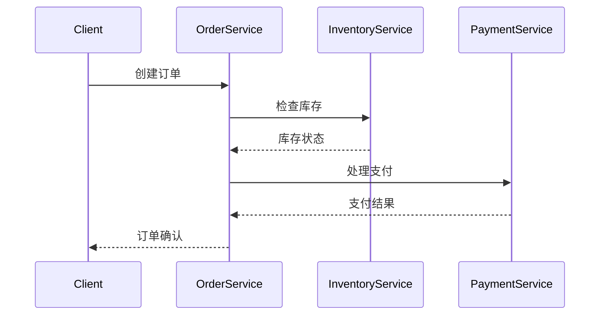

# 分布式追踪集成

在现代分布式系统中，应用程序通常由多个微服务组成，这些微服务可能分布在不同的服务器或容器中。当请求在这些服务之间流动时，如何追踪请求的路径和性能变得尤为重要。**分布式追踪集成**就是为了解决这一问题而设计的技术。

## 什么是分布式追踪？

分布式追踪是一种用于监控和诊断分布式系统中请求流动的技术。它通过为每个请求分配一个唯一的追踪ID，并在请求流经各个服务时记录相关信息，从而帮助开发者理解请求的路径、性能瓶颈和错误来源。

### 为什么需要分布式追踪？

在单体应用中，追踪请求的路径相对简单，因为所有逻辑都在一个进程中运行。然而，在分布式系统中，请求可能经过多个服务，每个服务可能由不同的团队开发和维护。如果没有分布式追踪，排查问题将变得非常困难。

## 分布式追踪的基本概念

### 1. 追踪（Trace）

一个**追踪**代表了一个完整的请求路径，从客户端发起请求到服务器返回响应。一个追踪通常由多个**跨度（Span）**组成。

### 2. 跨度（Span）

一个**跨度**代表了请求在某个服务中的一段执行过程。每个跨度都有一个唯一的ID，并且可以包含以下信息：
- 开始时间和结束时间
- 操作名称
- 父跨度ID（如果有）
- 标签（用于记录额外的元数据）

### 3. 上下文传播（Context Propagation）

为了将追踪信息从一个服务传递到另一个服务，分布式追踪系统需要一种机制来传播上下文信息。这通常通过HTTP头或消息队列中的元数据来实现。

## 分布式追踪的实现

### 1. 选择追踪系统

常见的分布式追踪系统包括：
- **Jaeger**
- **Zipkin**
- **OpenTelemetry**

### 2. 集成追踪库

大多数编程语言都有相应的追踪库，可以轻松集成到应用程序中。以下是一个使用OpenTelemetry的Python示例：

```python
from opentelemetry import trace
from opentelemetry.sdk.trace import TracerProvider
from opentelemetry.sdk.trace.export import ConsoleSpanExporter, SimpleSpanProcessor

# 设置追踪提供者
trace.set_tracer_provider(TracerProvider())

# 添加控制台输出处理器
trace.get_tracer_provider().add_span_processor(SimpleSpanProcessor(ConsoleSpanExporter()))

# 获取追踪器
tracer = trace.get_tracer(__name__)

# 创建一个跨度
with tracer.start_as_current_span("example-span"):
    print("This is a span")
```

### 3. 上下文传播

在分布式系统中，上下文传播是关键。以下是一个使用HTTP头传播上下文的示例：

```python
import requests
from opentelemetry.propagate import inject

# 创建一个请求
with tracer.start_as_current_span("client-span"):
    headers = {}
    inject(headers)  # 注入上下文到HTTP头
    response = requests.get("http://example.com", headers=headers)
    print(response.text)
```

## 实际案例

假设我们有一个电子商务网站，用户下单后，请求会经过以下服务：
1. **订单服务**：处理订单创建
2. **库存服务**：检查库存
3. **支付服务**：处理支付

使用分布式追踪，我们可以清晰地看到请求在这些服务之间的流动，并识别出哪个服务导致了延迟或错误。



## 总结

分布式追踪集成是监控和诊断分布式系统的强大工具。通过为每个请求分配唯一的追踪ID，并在请求流经各个服务时记录相关信息，开发者可以更好地理解系统的行为，快速定位问题。

### 附加资源

- [OpenTelemetry官方文档](https://opentelemetry.io/docs/)
- [Jaeger官方文档](https://www.jaegertracing.io/docs/)
- [Zipkin官方文档](https://zipkin.io/)

### 练习

1. 在你的本地环境中安装并配置一个分布式追踪系统（如Jaeger或Zipkin）。
2. 编写一个简单的微服务应用，并集成分布式追踪库。
3. 使用分布式追踪系统查看请求的流动路径，并尝试识别潜在的性能瓶颈。

通过以上步骤，你将能够更好地理解分布式追踪的概念，并将其应用到实际项目中。