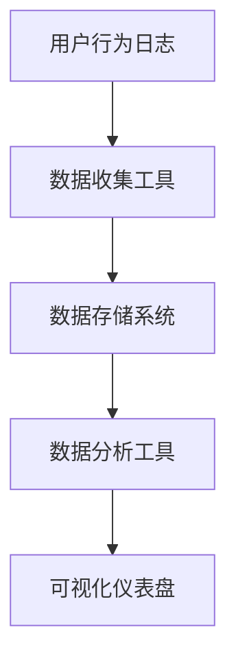

# 业务指标监控

在现代软件开发中，业务指标监控是确保系统健康运行和业务目标达成的关键环节。通过监控关键业务指标，团队可以实时了解系统的表现，快速发现问题并采取相应措施。本文将详细介绍业务指标监控的概念、实现方法以及实际应用场景。

## 什么是业务指标监控？

业务指标监控是指通过收集、分析和展示与业务相关的关键指标（Key Performance Indicators, KPIs），来评估系统的运行状态和业务目标的达成情况。这些指标通常包括用户活跃度、交易量、转化率、收入等。

:::note
**关键业务指标（KPIs）**：这些指标是衡量业务成功与否的重要标准，通常与业务目标直接相关。
:::

## 为什么需要业务指标监控？

1. **实时了解业务状态**：通过监控业务指标，团队可以实时了解业务的运行状态，及时发现潜在问题。
2. **数据驱动决策**：基于监控数据，团队可以做出更加科学和合理的决策，优化业务流程。
3. **提升用户体验**：通过监控用户行为指标，团队可以发现用户体验中的瓶颈，并进行优化。

## 如何实现业务指标监控？

### 1. 确定关键业务指标

首先，需要明确哪些指标对业务至关重要。常见的业务指标包括：

- **用户活跃度**：每日活跃用户数（DAU）、每月活跃用户数（MAU）。
- **交易量**：每日交易量、交易成功率。
- **转化率**：注册转化率、购买转化率。
- **收入**：每日收入、每月收入。

### 2. 数据收集与存储

业务指标的数据通常来源于用户行为日志、交易记录等。可以使用日志收集工具（如 Fluentd、Logstash）将数据收集到数据存储系统（如 Elasticsearch、Prometheus）中。

```python
# 示例：使用 Python 记录用户行为日志
import logging

logging.basicConfig(filename='user_activity.log', level=logging.INFO)
logging.info('User logged in: user_id=123')
```

### 3. 数据分析与可视化

收集到的数据需要进行分析和可视化，以便团队能够直观地了解业务状态。常用的数据分析工具包括 Grafana、Kibana 等。



### 4. 设置告警机制

为了及时发现异常，可以为关键业务指标设置告警机制。当指标超出预设范围时，系统会自动发送告警通知。

```yaml
# 示例：Prometheus 告警规则
groups:
- name: example
  rules:
  - alert: HighErrorRate
    expr: job:request_error_rate > 0.5
    for: 5m
    labels:
      severity: critical
    annotations:
      summary: "High error rate detected"
      description: "The error rate is above 50% for the last 5 minutes."
```

## 实际案例

### 案例：电商平台的业务指标监控

假设我们有一个电商平台，需要监控以下关键业务指标：

1. **每日活跃用户数（DAU）**：监控每日登录的用户数量。
2. **交易成功率**：监控每笔交易的成功率，确保支付系统的稳定性。
3. **转化率**：监控从浏览商品到完成购买的转化率。

通过监控这些指标，团队可以及时发现用户活跃度下降、支付系统故障或转化率降低等问题，并迅速采取行动。

## 总结

业务指标监控是确保系统健康运行和业务目标达成的关键环节。通过明确关键业务指标、收集和分析数据、设置告警机制，团队可以实时了解业务状态，做出数据驱动的决策，并提升用户体验。

## 附加资源

- [Prometheus 官方文档](https://prometheus.io/docs/)
- [Grafana 官方文档](https://grafana.com/docs/)
- [Elasticsearch 官方文档](https://www.elastic.co/guide/index.html)

## 练习

1. 为你的项目确定 3 个关键业务指标，并设计一个简单的数据收集和可视化方案。
2. 使用 Prometheus 和 Grafana 搭建一个简单的监控系统，监控你的应用的 HTTP 请求成功率。
