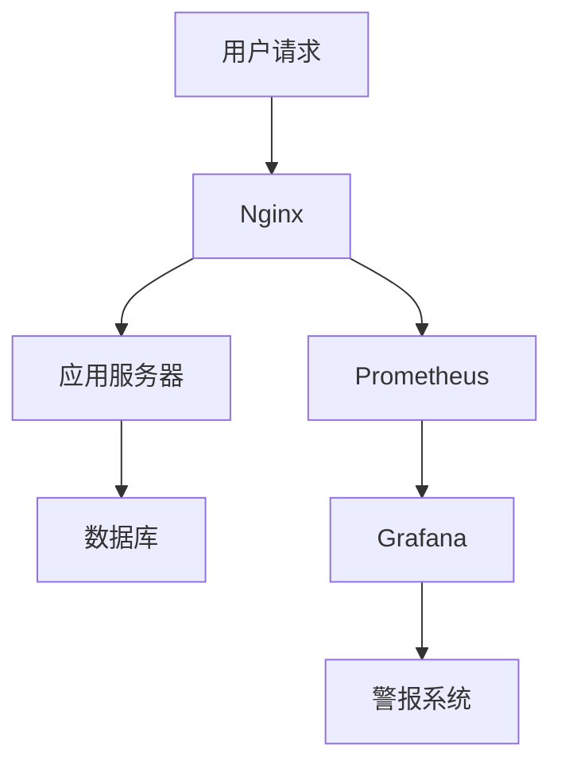

# 中间件监控配置

在现代应用程序开发中，中间件扮演着至关重要的角色。它负责处理请求、管理会话、缓存数据等。为了确保中间件的稳定性和性能，监控是必不可少的。本文将详细介绍如何配置中间件监控，帮助初学者掌握这一关键技能。

## 什么是中间件监控？

中间件监控是指对应用程序中的中间件进行实时监控，以收集性能数据、检测异常并确保系统稳定运行。通过监控，开发人员可以及时发现并解决问题，避免潜在的系统崩溃或性能下降。

## 为什么需要中间件监控？

1. **性能优化**：通过监控中间件的响应时间、吞吐量等指标，可以识别性能瓶颈并进行优化。
2. **故障排查**：当中间件出现故障时，监控数据可以帮助快速定位问题。
3. **资源管理**：监控中间件的资源使用情况，如内存、CPU等，有助于合理分配资源。

## 中间件监控配置步骤

### 1. 选择监控工具

首先，你需要选择一个适合的监控工具。常见的中间件监控工具有：

- **Prometheus**：一个开源的系统监控和警报工具包。
- **Grafana**：用于可视化监控数据的开源平台。
- **New Relic**：提供全面的应用程序性能监控服务。

### 2. 安装和配置监控工具

以 Prometheus 为例，以下是安装和配置的步骤：

```bash
# 下载 Prometheus
wget https://github.com/prometheus/prometheus/releases/download/v2.30.3/prometheus-2.30.3.linux-amd64.tar.gz

# 解压
tar -xzf prometheus-2.30.3.linux-amd64.tar.gz

# 进入目录
cd prometheus-2.30.3.linux-amd64

# 启动 Prometheus
./prometheus --config.file=prometheus.yml
```

### 3. 配置中间件以暴露监控数据

大多数中间件都支持通过 HTTP 端点暴露监控数据。以 Nginx 为例，你可以通过以下配置启用监控：

```nginx
http {
    server {
        listen 8080;

        location /metrics {
            stub_status on;
            access_log off;
        }
    }
}
```

### 4. 配置 Prometheus 抓取中间件数据

在 `prometheus.yml` 配置文件中，添加以下内容以抓取 Nginx 的监控数据：

```yaml
scrape_configs:
  - job_name: 'nginx'
    static_configs:
      - targets: ['localhost:8080']
```

### 5. 可视化监控数据

使用 Grafana 可视化 Prometheus 收集的数据。首先，安装 Grafana：

```bash
# 下载 Grafana
wget https://dl.grafana.com/oss/release/grafana-8.1.5.linux-amd64.tar.gz

# 解压
tar -xzf grafana-8.1.5.linux-amd64.tar.gz

# 进入目录
cd grafana-8.1.5

# 启动 Grafana
./bin/grafana-server
```

然后，在 Grafana 中添加 Prometheus 数据源，并创建仪表盘以可视化 Nginx 的监控数据。

## 实际案例

假设你正在开发一个电子商务网站，使用 Nginx 作为反向代理服务器。通过配置中间件监控，你可以实时监控 Nginx 的请求处理时间、错误率等指标。当某个指标超出预设阈值时，系统会自动发送警报，帮助你及时采取措施。



## 总结

中间件监控是确保应用程序稳定性和性能的关键步骤。通过选择合适的监控工具、配置中间件以暴露监控数据，并使用可视化工具进行分析，你可以及时发现并解决问题。希望本文能帮助你掌握中间件监控配置的基本技能。

## 附加资源

- [Prometheus 官方文档](https://prometheus.io/docs/)
- [Grafana 官方文档](https://grafana.com/docs/)
- [Nginx 监控配置指南](https://nginx.org/en/docs/)

## 练习

1. 在你的开发环境中安装并配置 Prometheus 和 Grafana。
2. 配置 Nginx 以暴露监控数据，并在 Grafana 中创建一个仪表盘来可视化这些数据。
3. 尝试设置一个警报规则，当 Nginx 的错误率超过 5% 时发送通知。

通过完成这些练习，你将更深入地理解中间件监控的配置和应用。