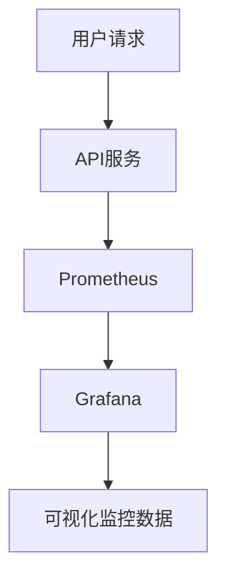
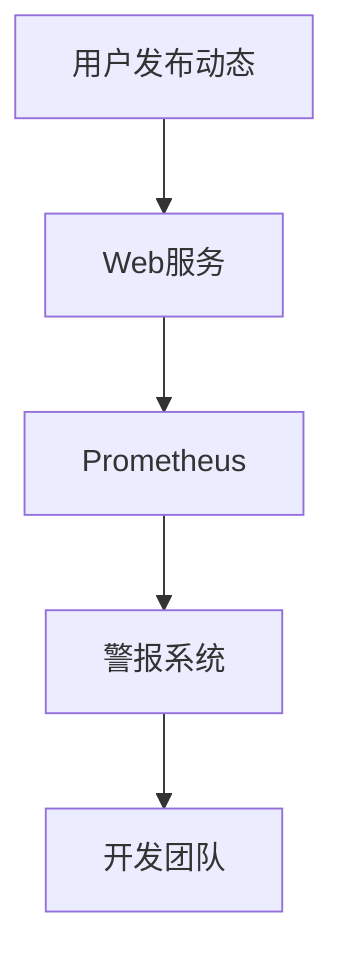

# Web服务监控

在现代互联网应用中，Web服务是核心组件之一。无论是网站、API还是微服务，Web服务的稳定性和性能直接影响用户体验。因此，**Web服务监控**成为了确保服务健康运行的关键任务。本文将带你了解Web服务监控的基本概念、常用工具以及实际应用场景。

## 什么是Web服务监控？

Web服务监控是指通过工具和技术手段，实时或定期检查Web服务的运行状态、性能和可用性。监控的目标是及时发现潜在问题，确保服务能够高效、稳定地运行。常见的监控内容包括：

- **响应时间**：Web服务处理请求所需的时间。
- **错误率**：请求失败的比例。
- **吞吐量**：单位时间内处理的请求数量。
- **资源使用率**：如CPU、内存、磁盘和网络的使用情况。

:::tip
Web服务监控不仅仅是发现问题，更重要的是通过数据分析预测潜在问题，从而提前采取措施。
:::

## 为什么需要Web服务监控？

1. **提高可用性**：通过监控，可以及时发现服务中断或性能下降，快速响应并修复问题。
2. **优化性能**：监控数据可以帮助开发者识别性能瓶颈，优化代码和资源配置。
3. **保障用户体验**：稳定的服务是良好用户体验的基础，监控可以确保用户不会因服务问题而流失。
4. **数据驱动决策**：通过分析监控数据，可以为业务决策提供支持。

## Web服务监控的关键指标

以下是一些常见的Web服务监控指标：

1. **响应时间（Response Time）**：从客户端发送请求到收到响应的时间。
2. **错误率（Error Rate）**：请求失败的比例，通常以HTTP状态码（如500）为判断依据。
3. **请求速率（Request Rate）**：单位时间内接收到的请求数量。
4. **资源使用率（Resource Utilization）**：包括CPU、内存、磁盘和网络的使用情况。

:::note
不同的Web服务可能需要监控不同的指标。例如，API服务可能更关注响应时间和错误率，而文件存储服务可能更关注磁盘使用率。
:::

## 常用Web服务监控工具

以下是一些常用的Web服务监控工具：

1. **Prometheus**：一个开源的监控和警报工具，特别适合监控动态环境中的服务。
2. **Grafana**：一个可视化工具，通常与Prometheus结合使用，用于展示监控数据。
3. **New Relic**：一个商业监控工具，提供全面的应用性能监控（APM）功能。
4. **Datadog**：一个云监控平台，支持多种编程语言和框架。

### 示例：使用Prometheus监控Web服务

以下是一个简单的示例，展示如何使用Prometheus监控一个Web服务的响应时间。

#### 1. 安装Prometheus

首先，下载并安装Prometheus：

```bash
wget https://github.com/prometheus/prometheus/releases/download/v2.30.3/prometheus-2.30.3.linux-amd64.tar.gz
tar -xzf prometheus-2.30.3.linux-amd64.tar.gz
cd prometheus-2.30.3.linux-amd64
```

#### 2. 配置Prometheus

编辑`prometheus.yml`文件，添加一个监控目标：

```yaml
scrape_configs:
  - job_name: 'web_service'
    static_configs:
      - targets: ['localhost:8080']
```

#### 3. 启动Prometheus

启动Prometheus服务：

```bash
./prometheus --config.file=prometheus.yml
```

#### 4. 查看监控数据

打开浏览器，访问`http://localhost:9090`，即可查看Web服务的监控数据。

:::caution
确保你的Web服务已经启动，并且可以通过`localhost:8080`访问。
:::

## 实际应用场景

### 场景1：监控API服务的响应时间

假设你正在开发一个电商平台的API服务，用户可以通过该API查询商品信息。为了确保API的响应时间在可接受范围内，你可以使用Prometheus监控API的响应时间。



### 场景2：监控Web服务的错误率

在一个社交媒体平台中，用户可以通过Web服务发布动态。如果Web服务的错误率突然升高，可能会导致用户无法发布内容。通过监控错误率，可以及时发现并修复问题。



## 总结

Web服务监控是确保Web服务稳定运行的重要手段。通过监控关键指标，如响应时间、错误率和资源使用率，可以及时发现并解决问题，优化服务性能，提升用户体验。本文介绍了Web服务监控的基本概念、常用工具以及实际应用场景，希望能帮助你更好地理解和应用这一技术。

## 附加资源

- [Prometheus官方文档](https://prometheus.io/docs/)
- [Grafana官方文档](https://grafana.com/docs/)
- [New Relic入门指南](https://newrelic.com/resources/guides)
- [Datadog监控教程](https://www.datadoghq.com/learn/)

## 练习

1. 使用Prometheus监控一个简单的Web服务，并记录其响应时间。
2. 在Grafana中创建一个仪表盘，展示Web服务的错误率和请求速率。
3. 尝试配置一个警报规则，当Web服务的错误率超过5%时触发警报。

:::warning
在实际生产环境中，请确保监控工具的配置正确，并定期检查监控数据，以避免误报或漏报。
:::