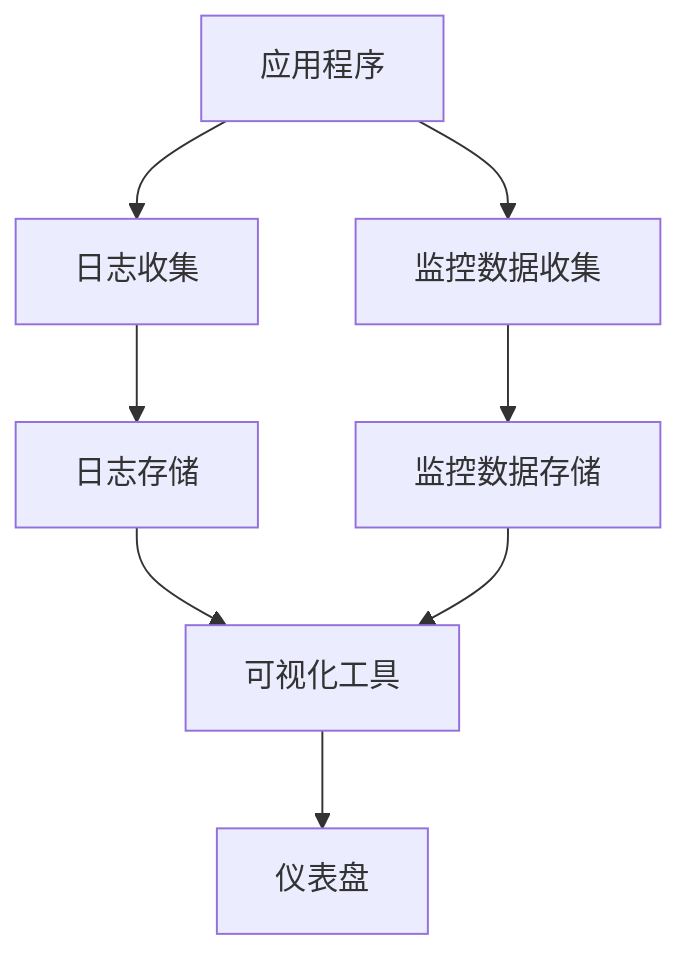

# 日志与监控结合

在现代应用程序开发中，日志和监控是两个至关重要的工具。它们不仅帮助我们了解应用程序的运行状态，还能在出现问题时提供关键的诊断信息。本文将详细介绍如何将日志与监控结合，以提升应用程序的可观察性和可维护性。

## 什么是日志与监控结合？

**日志**是应用程序在运行过程中生成的事件记录，通常用于记录错误、警告、信息等。**监控**则是实时收集和分析应用程序的性能指标，如 CPU 使用率、内存使用情况、请求响应时间等。

将日志与监控结合，意味着将这两种工具的数据整合在一起，以便更全面地了解应用程序的运行状态。通过这种方式，开发者和运维人员可以更快地发现问题、诊断问题并采取相应的措施。

## 为什么需要日志与监控结合？

1. **全面性**：日志提供了详细的上下文信息，而监控则提供了实时的性能指标。结合两者可以提供更全面的应用程序视图。
2. **快速诊断**：当监控系统检测到异常时，日志可以帮助快速定位问题的根源。
3. **优化性能**：通过分析日志和监控数据，可以发现性能瓶颈并进行优化。

## 如何实现日志与监控结合？

### 1. 日志收集与存储

首先，需要确保应用程序生成的日志被有效地收集和存储。常见的日志收集工具包括：

- **ELK Stack**（Elasticsearch, Logstash, Kibana）
- **Fluentd**
- **Prometheus**（主要用于监控，但也可以与日志系统集成）

### 2. 监控数据收集

监控数据通常通过以下工具收集：

- **Prometheus**
- **Grafana**
- **Datadog**

### 3. 日志与监控的集成

将日志与监控集成的方法有很多种，以下是几种常见的方式：

#### 方法一：通过日志中的指标进行监控

可以在日志中嵌入特定的指标，然后通过监控工具收集这些指标。例如：

```python
import logging

logging.basicConfig(level=logging.INFO)
logger = logging.getLogger(__name__)

def process_request(request):
    logger.info(f"Processing request: {request}")
    # 模拟处理请求
    logger.info(f"Request processed in {request['response_time']} ms")
```

在这个例子中，`response_time` 是一个关键的指标，可以通过监控工具收集并分析。

#### 方法二：通过监控工具直接收集日志

一些监控工具可以直接收集日志数据。例如，Prometheus 可以通过 `promtail` 或 `fluentd` 收集日志，并将其与监控指标一起存储。

### 4. 可视化与分析

将日志与监控数据整合后，可以使用可视化工具（如 Grafana）创建仪表盘，实时展示应用程序的运行状态。



## 实际案例

假设我们有一个 Web 应用程序，用户报告说在某些情况下请求响应时间过长。通过日志与监控结合，我们可以快速定位问题。

1. **监控系统**检测到响应时间异常。
2. **日志系统**提供了详细的请求处理信息，包括请求参数、处理时间、错误信息等。
3. 通过分析日志，发现某个特定的数据库查询导致了性能瓶颈。
4. 优化数据库查询后，监控系统显示响应时间恢复正常。

## 总结

日志与监控结合是提升应用程序可观察性和可维护性的关键。通过有效地收集、存储和分析日志与监控数据，可以更快地发现问题、诊断问题并优化应用程序性能。

## 附加资源与练习

- **练习**：尝试在你的应用程序中集成日志与监控工具，并创建一个仪表盘展示关键指标。
- **资源**：
  - [Prometheus 官方文档](https://prometheus.io/docs/)
  - [Grafana 官方文档](https://grafana.com/docs/)
  - [ELK Stack 官方文档](https://www.elastic.co/guide/index.html)

:::tip
在实际应用中，日志与监控的结合需要根据具体需求进行调整和优化。建议定期审查日志和监控数据，以确保应用程序的稳定性和性能。
:::