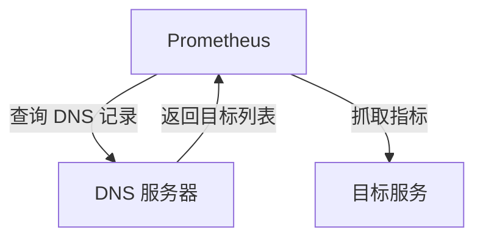

# DNS 服务发现

在 Prometheus 中，**服务发现**是一种动态发现监控目标的机制。DNS 服务发现是其中一种常见的方式，它允许 Prometheus 通过查询 DNS 记录来自动发现需要监控的目标。这种方式特别适用于动态环境，例如 Kubernetes 或云原生应用，其中服务的 IP 地址可能会频繁变化。

## 什么是 DNS 服务发现？

DNS 服务发现是一种通过 DNS 查询来获取目标列表的方法。Prometheus 会定期查询指定的 DNS 记录（如 A 记录、SRV 记录等），并将解析出的 IP 地址或主机名作为监控目标。这种方式非常适合在动态环境中使用，因为 DNS 记录可以随时更新，而 Prometheus 会自动同步这些变化。

## 如何配置 DNS 服务发现？

在 Prometheus 的配置文件 `prometheus.yml` 中，可以通过 `dns_sd_configs` 配置 DNS 服务发现。以下是一个简单的配置示例：

```yaml
scrape_configs:
  - job_name: 'dns_service_discovery'
    dns_sd_configs:
      - names:
          - 'example-service.default.svc.cluster.local'
        type: 'A'
        port: 9100
```

### 配置解析

- `names`: 指定要查询的 DNS 名称列表。可以是单个域名，也可以是多个域名。
- `type`: 指定 DNS 记录类型，常见的有 `A` 记录（返回 IPv4 地址）和 `SRV` 记录（返回服务名称和端口）。
- `port`: 如果使用 `A` 记录，需要指定目标服务的端口号。如果使用 `SRV` 记录，则端口号会从 DNS 记录中获取。

### 示例输出

假设 `example-service.default.svc.cluster.local` 解析出以下 IP 地址：

- `192.168.1.10`
- `192.168.1.11`

Prometheus 会将这两个 IP 地址作为监控目标，并尝试在端口 `9100` 上抓取指标。

## DNS 服务发现的实际应用

### 场景 1：Kubernetes 中的服务发现

在 Kubernetes 中，每个服务都会有一个对应的 DNS 名称。例如，一个名为 `my-service` 的服务在 `default` 命名空间中的 DNS 名称是 `my-service.default.svc.cluster.local`。通过配置 DNS 服务发现，Prometheus 可以自动发现并监控这些服务。

```yaml
scrape_configs:
  - job_name: 'kubernetes_services'
    dns_sd_configs:
      - names:
          - 'my-service.default.svc.cluster.local'
        type: 'A'
        port: 8080
```

### 场景 2：云原生应用中的动态扩展

在云原生环境中，应用实例可能会根据负载动态扩展或缩减。通过 DNS 服务发现，Prometheus 可以自动发现新实例并开始监控，而无需手动更新配置。

```yaml
scrape_configs:
  - job_name: 'cloud_native_app'
    dns_sd_configs:
      - names:
          - 'app-service.cloud.example.com'
        type: 'SRV'
```

## DNS 服务发现的工作原理

Prometheus 会定期查询配置的 DNS 记录，并将解析出的目标列表与当前已知的目标列表进行比较。如果发现新的目标，Prometheus 会将其添加到监控列表中；如果某个目标不再存在于 DNS 记录中，Prometheus 会将其从监控列表中移除。



## 总结

DNS 服务发现是 Prometheus 中一种强大的动态目标发现机制，特别适用于动态环境。通过配置 `dns_sd_configs`，Prometheus 可以自动从 DNS 记录中获取监控目标，并实时同步变化。这种方式减少了手动配置的工作量，提高了监控系统的灵活性和可靠性。

## 附加资源与练习

- **练习 1**: 在你的本地环境中设置一个 DNS 服务器，并配置 Prometheus 使用 DNS 服务发现来监控几个虚拟服务。
- **练习 2**: 在 Kubernetes 集群中部署一个应用，并使用 DNS 服务发现来监控该应用的服务。

:::tip
如果你对 DNS 服务发现还有疑问，可以参考 Prometheus 官方文档中的 [DNS 服务发现](https://prometheus.io/docs/prometheus/latest/configuration/configuration/#dns_sd_config) 部分，了解更多详细信息。
:::