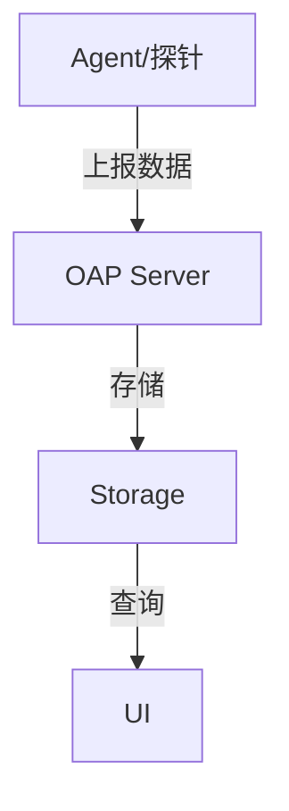

# SkyWalking 简介

## 什么是SkyWalking？

Apache SkyWalking 是一款开源的 **应用性能监控（APM）** 和 **分布式追踪系统**，专为微服务、云原生和容器化架构设计。它能够帮助开发者和运维团队实时监控分布式系统的性能、诊断问题，并优化服务间的调用链路。

SkyWalking 的核心能力包括：
- **分布式追踪**：跟踪请求在多个服务间的流转路径。
- **服务拓扑分析**：可视化展示服务间的依赖关系。
- **指标监控**：收集并展示服务的响应时间、吞吐量等关键指标。
- **告警**：基于预定义规则触发异常通知。

:::tip 为什么选择 SkyWalking？
- **低侵入性**：通过探针（Agent）自动采集数据，无需修改业务代码。
- **多语言支持**：Java、.NET、Node.js、Go 等。
- **可扩展性**：支持与 Prometheus、Zipkin 等生态工具集成。
:::

## 核心架构

SkyWalking 的架构分为以下组件：



1. **Agent**：嵌入到应用中，负责采集性能数据（如调用链路、JVM 指标）。
2. **OAP Server**：接收并处理 Agent 上报的数据，进行聚合和分析。
3. **Storage**：支持 Elasticsearch、H2、MySQL 等存储后端。
4. **UI**：提供可视化仪表盘，展示监控结果。

## 实际应用场景

### 案例：电商系统的订单链路追踪
假设一个电商系统的订单流程涉及以下服务：
1. **用户服务** → 2. **商品服务** → 3. **支付服务** → 4. **物流服务**

通过 SkyWalking，可以：
- 发现 **支付服务** 的延迟过高（例如因第三方 API 超时）。
- 分析 **商品服务** 的数据库查询是否成为瓶颈。

:::note 示例追踪数据
```json
{
  "traceId": "a1b2c3",
  "spans": [
    { "service": "用户服务", "latency": 50ms },
    { "service": "商品服务", "latency": 200ms },
    { "service": "支付服务", "latency": 1500ms }
  ]
}
```
:::

## 快速体验

### 步骤1：启动 SkyWalking 后端
使用 Docker 快速启动 OAP Server 和 UI：
```bash
docker run --name oap -d -p 11800:11800 -p 12800:12800 apache/skywalking-oap-server
docker run --name ui -d -p 8080:8080 --link oap:oap apache/skywalking-ui
```

### 步骤2：配置 Java Agent
启动应用时添加 Agent 参数：
```bash
java -javaagent:/path/to/skywalking-agent.jar \
     -Dskywalking.agent.service_name=my-service \
     -Dskywalking.collector.backend_service=localhost:11800 \
     -jar my-app.jar
```

## 总结

SkyWalking 是分布式系统监控的强大工具，尤其适合微服务环境。通过自动化的数据采集和丰富的可视化能力，它能显著提升运维效率。

### 扩展学习
- 官方文档：[https://skywalking.apache.org](https://skywalking.apache.org)
- 练习：尝试在本地部署 SkyWalking，并监控一个 Spring Boot 应用。

:::caution 注意
生产环境建议使用 Elasticsearch 作为存储后端，而非默认的 H2。
:::