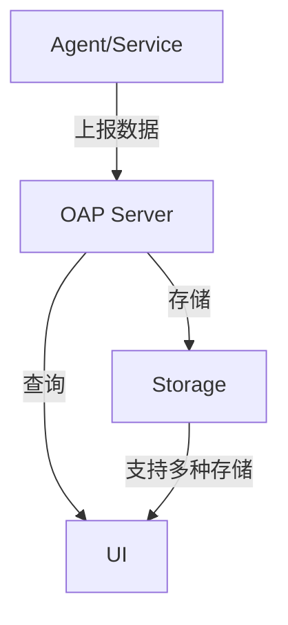

## 引言

Apache SkyWalking 是一款开源的 **应用性能监控（APM）** 和 **分布式追踪系统**，专为微服务、云原生和容器化架构设计。本节将深入解析SkyWalking的核心架构，帮助初学者理解其如何实现全链路监控。

## 架构总览

SkyWalking采用**模块化设计**，主要分为以下核心组件：



### 1. Agent（探针）
- **作用**：嵌入目标应用，收集性能数据（如Trace、Metrics、Logs）。
- **特点**：支持多种语言（Java、Go、Python等），**无侵入式**采集数据。

### 2. OAP Server（Observability Analysis Platform）
- **核心功能**：
  - 接收Agent上报的数据
  - 实时分析（如拓扑图生成、性能告警）
  - 数据聚合与存储
- **关键模块**：
  - `Receiver Module`：处理不同协议（如gRPC/HTTP）的数据
  - `Analysis Module`：实现指标计算（如P99、错误率）

### 3. Storage
- **支持后端**：
  - Elasticsearch（生产推荐）
  - H2（测试用）
  - MySQL/TiDB等
- **存储数据类型**：
  - 链路追踪（Traces）
  - 指标（Metrics）
  - 服务拓扑（Topology）

### 4. UI
- **功能**：
  - 可视化展示拓扑图
  - 查询链路详情
  - 查看服务/实例指标

## 数据流示例

以下是一个Java Agent上报数据的简化流程：

```java
// 示例：Agent自动追踪Spring Boot HTTP请求
@RestController
public class DemoController {
    @GetMapping("/hello")
    public String hello() {
        return "Hello SkyWalking!"; // 自动生成Span
    }
}
```

**上报数据格式**（简化版）：
```json
{
  "traceId": "a1b2c3",
  "spans": [
    {
      "operationName": "/hello",
      "startTime": 1620000000000,
      "duration": 50,
      "tags": {"http.method": "GET"}
    }
  ]
}
```

## 实际案例：电商系统监控

假设有一个电商系统包含以下服务：
1. **用户服务**（User-Service）
2. **订单服务**（Order-Service）
3. **支付服务**（Payment-Service）

当用户下单时，SkyWalking会：
1. 通过Agent收集各服务的Span数据
2. OAP Server构建完整调用链：
   ```
   用户请求 → 订单服务 → 支付服务
   ```
3. UI展示：
   - 拓扑图中各服务依赖关系
   - 每个服务的响应时间/错误率

:::tip 生产环境建议
- 对高流量系统，建议使用**Elasticsearch集群**作为存储后端
- 启用**采样策略**（如随机采样）以减少Agent开销
:::

## 总结

| 核心组件 | 关键能力 |
|----------|----------|
| Agent    | 数据采集，多语言支持 |
| OAP      | 实时分析，聚合计算 |
| Storage  | 高性能持久化 |
| UI       | 可视化交互 |

## 扩展学习

1. **动手实验**：使用Docker快速搭建SkyWalking测试环境：
   ```bash
   docker run --name oap -d -p 11800:11800 apache/skywalking-oap-server
   docker run --name ui -d -p 8080:8080 apache/skywalking-ui
   ```
2. **官方资源**：
   - [SkyWalking GitHub](https://github.com/apache/skywalking)
   - [架构设计文档](https://skywalking.apache.org/docs/main/latest/en/concepts-and-designs/backend-overview/)