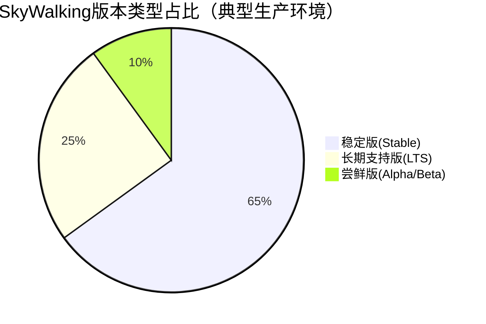

## 介绍

Apache SkyWalking作为分布式系统的应用性能监控工具，其版本选择直接影响功能可用性和系统稳定性。本指南将帮助初学者理解版本号含义、不同版本类型的区别，并提供实际场景下的选择建议。

## SkyWalking 版本类型

SkyWalking提供三种主要版本类型，适用于不同需求场景：



### 1. 稳定版 (Stable Releases)
- 版本号示例：`v9.4.0`
- 特点：
  - 经过完整测试周期
  - 包含所有已验证的新功能
  - 推荐用于生产环境

### 2. 长期支持版 (LTS)
- 版本号示例：`v8.9.1`
- 特点：
  - 提供至少18个月的维护周期
  - 仅包含关键bug修复和安全补丁
  - 适合需要长期稳定的企业环境

### 3. 尝鲜版 (Alpha/Beta)
- 版本号示例：`v10.0.0-alpha2`
- 特点：
  - 包含实验性功能
  - 可能存在不稳定因素
  - 仅推荐测试环境使用

:::tip 版本号语义
遵循`主版本.次版本.修订号`格式：
- 主版本变更：架构级变化
- 次版本变更：新增向后兼容功能
- 修订号变更：bug修复和小幅优化
:::

## 版本选择关键因素

### 1. 环境兼容性
检查所需组件的版本要求：

```yaml
# 示例：skywalking-oap-server的依赖要求
dependencies:
  JDK: ">= 1.8u281"
  ElasticSearch: "6.x/7.x/8.x"
  Storage: "H2/MySQL/TiDB"
```

### 2. 功能需求矩阵

| 版本范围  | 核心功能 | 高级追踪 | 服务网格 | 浏览器监控 |
|-----------|----------|----------|----------|------------|
| v8.x LTS  | ✓        | ✓        | ✗        | ✗          |
| v9.0-9.3  | ✓        | ✓        | ✓        | ✗          |
| v9.4+     | ✓        | ✓        | ✓        | ✓          |

### 3. 实际案例

**场景1**：传统微服务监控
- 推荐版本：`v8.9.1 LTS`
- 原因：不需要服务网格支持，要求长期稳定

**场景2**：Istio服务网格监控
- 推荐版本：`v9.5.0`
- 原因：需要完整的Service Mesh支持

:::caution 升级注意事项
跨主版本升级（如v8→v9）时：
1. 检查[官方升级指南](https://skywalking.apache.org/docs/)
2. 先在小规模测试环境验证
3. 注意存储兼容性（特别是ElasticSearch版本）
:::

## 版本获取与验证

### 官方发布渠道
```bash
# 验证下载文件的完整性
shasum -a 512 apache-skywalking-apm-9.4.0.tar.gz
# 应与发布页面的校验值匹配
```

### 容器镜像选择
```dockerfile
# 推荐使用官方镜像的明确版本标签
FROM apache/skywalking-oap-server:9.4.0
# 避免使用 latest 标签
```

## 总结

选择SkyWalking版本时应考虑：
1. 生产环境优先选择稳定版或LTS版
2. 根据技术栈（如Service Mesh）选择功能匹配的版本
3. 测试环境可尝试新版本评估功能

## 扩展资源

1. [官方版本发布日志](https://github.com/apache/skywalking/releases)
2. [版本兼容性矩阵](https://skywalking.apache.org/docs/main/latest/en/setup/version-compatibility/)
3. 练习：在测试环境对比v8.9.1和v9.4.0的JVM监控差异