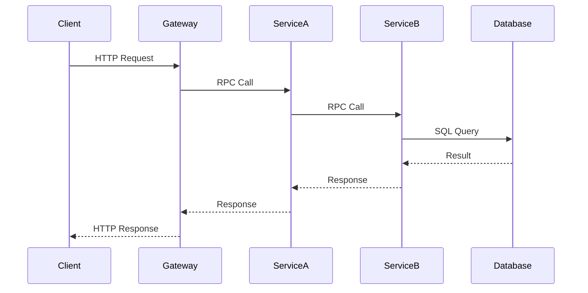
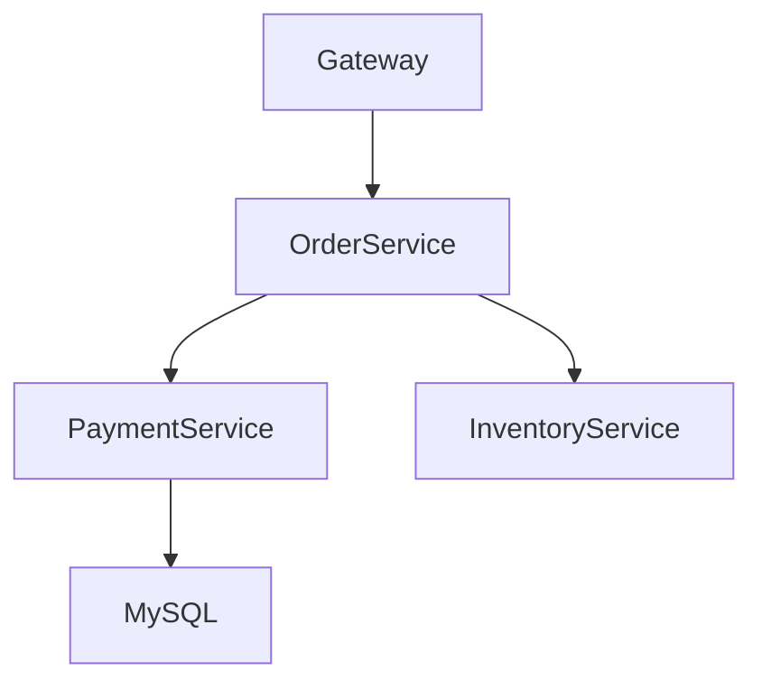

# SkyWalking 使用场景

## 介绍

Apache SkyWalking 是一款开源的 **应用性能监控（APM）** 和 **分布式追踪系统**，专为微服务、云原生和容器化架构设计。它通过收集、分析和可视化数据，帮助开发者快速定位性能瓶颈、优化系统架构。本章将介绍 SkyWalking 的核心使用场景，并通过实际案例展示其价值。

---

## 核心使用场景

### 1. 分布式追踪
SkyWalking 通过 **Trace** 记录请求在分布式系统中的完整流转路径。例如，一个 HTTP 请求可能经过网关、微服务 A、微服务 B 和数据库，SkyWalking 会将这些调用链关联起来。



:::note
**输入示例**：一个用户登录请求。<br />
**输出示例**：SkyWalking 展示该请求经过 `AuthService`、`UserService` 和 `MySQL` 的耗时和状态。
:::

---

### 2. 性能监控
SkyWalking 提供以下关键指标：
- **响应时间（RT）**：服务处理请求的平均时间。
- **吞吐量（TPS/QPS）**：每秒处理的请求数。
- **错误率**：失败请求的占比。

:::tip
通过 `Prometheus` 或 `OpenTelemetry` 集成，可以将这些指标导出到第三方监控工具。
:::

---

### 3. 服务拓扑分析
SkyWalking 自动绘制服务间的依赖关系图，帮助识别：
- 单点故障风险。
- 不合理的依赖调用（如循环依赖）。



---

### 4. 日志关联
将 **Traces** 与 **Logs** 关联，实现端到端问题排查。例如：
```java
// 日志中插入 Trace ID
logger.info("Order created, traceId: {}", ContextManager.getGlobalTraceId());
```

---

## 实际案例

### 案例 1：电商系统性能优化
**问题**：用户下单接口响应慢。<br />
**解决方案**：
1. 通过 SkyWalking 发现 `PaymentService` 调用第三方支付网关耗时过高。
2. 优化为异步支付流程后，RT 从 `2s` 降至 `200ms`。

---

### 案例 2：微服务链路排查
**问题**：某服务频繁报错 `504`。<br />
**解决方案**：
1. 使用 SkyWalking 追踪链路，发现 `InventoryService` 数据库查询超时。
2. 优化 SQL 索引后，错误率降至 `0.1%`。

---

## 总结

SkyWalking 的核心价值在于：
- **可视化**：直观展示分布式系统的运行状态。
- **精准定位**：快速发现性能瓶颈和错误根源。
- **多语言支持**：兼容 Java、Go、Python 等主流语言。

---

## 扩展资源
1. [SkyWalking 官方文档](https://skywalking.apache.org/docs/)
2. 练习：部署 SkyWalking 并监控一个 Spring Boot 应用的 `/health` 接口。