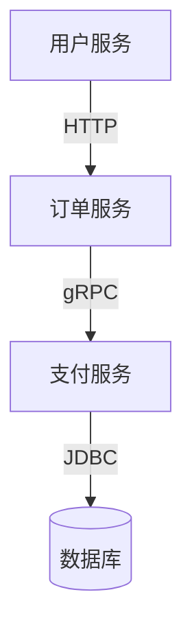

# SkyWalking 优势特点

## 介绍

SkyWalking 是一款开源的 **应用性能监控（APM）** 和 **分布式追踪系统**，专为微服务、云原生和容器化架构设计。它通过收集、分析和可视化分布式系统的链路数据，帮助开发者快速定位性能瓶颈和故障点。以下是 SkyWalking 区别于其他监控工具的显著优势。

---

## 核心优势

### 1. 多语言支持
SkyWalking 支持多种编程语言的自动探针（Agent），包括：
- Java（通过字节码增强技术）
- Go、Python、Node.js、PHP 等（通过原生 SDK）
- .NET（通过 CLR 插件）

:::tip 示例：Java Agent 配置
```bash
# 启动Java应用时加载SkyWalking Agent
java -javaagent:/path/to/skywalking-agent.jar \
     -Dskywalking.agent.service_name=your-service-name \
     -Dskywalking.collector.backend_service=127.0.0.1:11800 \
     -jar your-app.jar
```
:::

### 2. 低侵入性
- **无代码修改**：Java 应用通过字节码增强实现监控，无需修改业务代码。
- **动态开关**：支持运行时调整采样率，降低生产环境开销。

### 3. 强大的拓扑图与可视化
自动生成服务依赖拓扑图，直观展示微服务间调用关系：



### 4. 混合部署支持
- 同时监控虚拟机、容器和 Serverless 环境
- 支持 Kubernetes、Mesos 等编排系统

### 5. 高性能存储方案
默认使用 Elasticsearch 存储数据，支持：
- 水平扩展的集群部署
- 千万级数据秒级查询
- 自动数据分片和滚动清理

---

## 实际案例

### 电商系统故障排查场景
**问题现象**：用户下单延迟高达 5 秒。

**使用 SkyWalking 分析过程**：
1. 通过 **拓扑图** 发现订单服务到库存服务的 gRPC 调用异常
2. 查看 **Trace 详情**，发现库存服务的 SQL 查询耗时 4.8 秒
3. 使用 **日志关联** 功能找到对应的慢查询语句

:::note 关键 Trace 数据
```json
{
  "operation": "/InventoryService/check",
  "duration": 4820,
  "tags": {
    "db.statement": "SELECT * FROM inventory WHERE item_id=?"
  }
}
```
:::

---

## 总结

SkyWalking 的核心优势在于：
- **全栈监控**：覆盖从应用到基础设施的完整链路
- **开发友好**：最小化对业务代码的侵入
- **生产就绪**：支持高并发场景下的稳定运行

---

## 延伸学习
- 官方文档：[SkyWalking 探针开发指南](https://skywalking.apache.org/docs/)
- 动手实验：尝试在本地 Spring Boot 项目中集成 Java Agent
- 进阶话题：SkyWalking 与 Prometheus 的指标数据融合