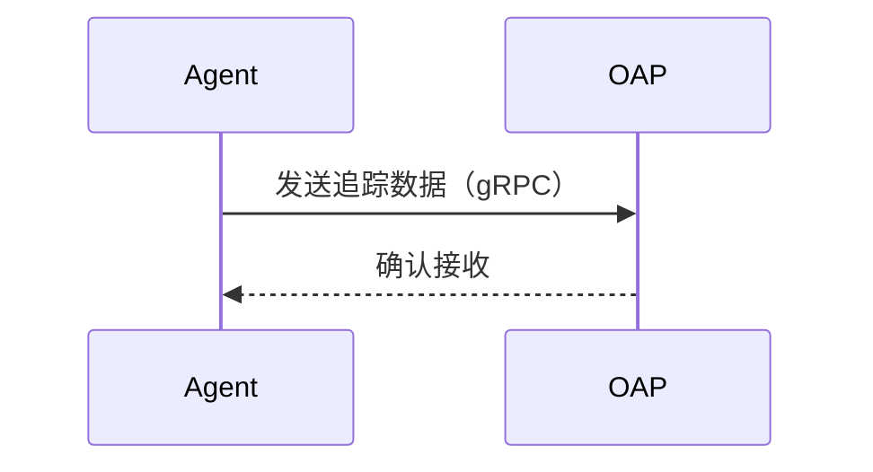
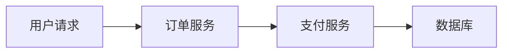

## 介绍

SkyWalking 是一款开源的 **应用性能监控（APM）** 工具，专为分布式系统设计。它通过追踪、分析和可视化服务间的调用关系，帮助开发者快速定位性能瓶颈。本章将详细介绍 SkyWalking 的基本工作流程，包括数据如何被收集、传输、处理并最终展示。

---

## 核心组件

SkyWalking 的工作流程涉及以下核心组件：

1. **探针（Agent）**：嵌入到应用中，负责收集数据（如调用链、指标）。
2. **OAP（Observability Analysis Platform）**：接收并处理探针数据。
3. **存储（Storage）**：保存处理后的数据（如 Elasticsearch、H2）。
4. **UI**：可视化分析结果。

---

## 工作流程详解

### 1. 数据收集
探针通过以下方式自动收集数据：
- **自动埋点**：拦截 HTTP 请求、数据库调用等。
- **手动 API**：通过 `@Trace` 注解或 SDK 手动标记代码段。

**示例（Java 手动埋点）**：
```java
import org.apache.skywalking.apm.toolkit.trace.Trace;
@Trace
public void processOrder() {
    // 业务逻辑
}
```

### 2. 数据传输
探针将数据通过 **gRPC** 或 **HTTP** 发送到 OAP 服务器。默认协议是 gRPC，适合高性能场景。



### 3. 数据处理
OAP 对数据进行：
- **流式分析**：实时计算指标（如平均响应时间）。
- **聚合**：按服务、实例等维度汇总数据。

:::note
OAP 支持集群模式，可通过 `cluster.yaml` 配置横向扩展。
:::

### 4. 存储与查询
处理后的数据存入存储引擎，UI 通过 GraphQL 查询数据。

**支持的存储**：
- Elasticsearch（生产推荐）
- H2（测试用）
- MySQL/TiDB

---

## 实际案例

### 场景：电商订单服务监控
1. **问题**：用户投诉下单延迟。
2. **解决**：
   - SkyWalking 显示订单服务调用支付服务的耗时增加。
   - 定位到支付服务的数据库查询缓慢。
   - 优化 SQL 后，耗时降低 60%。



---

## 总结

SkyWalking 的工作流程分为 **收集→传输→处理→可视化** 四步，通过分布式追踪和指标分析，显著提升系统可观测性。关键优势包括：
- 低侵入性（自动埋点）。
- 支持多种语言（Java、Go、Python等）。
- 灵活的存储后端。

---

## 扩展资源
1. [官方文档](https://skywalking.apache.org/docs/)
2. **练习**：部署 SkyWalking 并监控一个 Spring Boot 应用的 `/hello` 接口。
3. **进阶**：尝试集成告警功能，当响应时间 >1s 时触发通知。