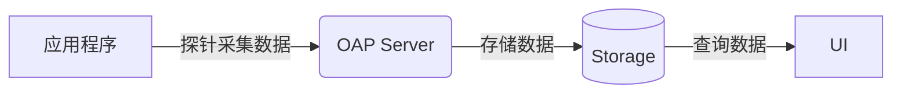
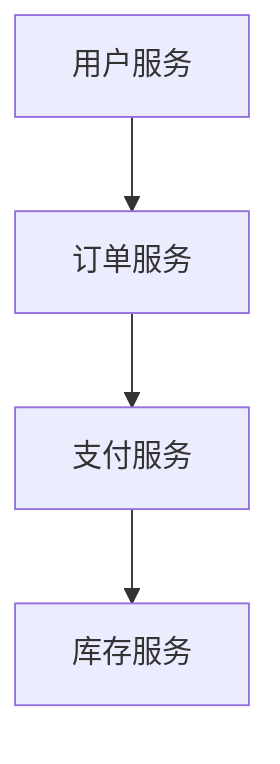

# SkyWalking 核心概念

## 介绍

Apache SkyWalking 是一款开源的 **应用性能监控（APM）** 和 **分布式追踪系统**，专为微服务、云原生和容器化架构设计。它帮助开发者和运维团队监控、诊断和优化分布式系统的性能问题。  

在开始学习 SkyWalking 之前，掌握其核心概念至关重要。本章将介绍 SkyWalking 的关键术语、架构和基本组件，帮助你理解其工作原理。

---

## 1. SkyWalking 架构概述

SkyWalking 采用 **分布式架构**，主要由以下组件构成：

- **探针（Agent）**：嵌入到应用程序中，负责收集数据并发送给 SkyWalking 后端。
- **后端（OAP Server）**：接收、分析和存储来自探针的数据。
- **存储（Storage）**：支持多种数据库（如 Elasticsearch、MySQL、H2 等）存储监控数据。
- **用户界面（UI）**：提供可视化仪表盘，展示监控和分析结果。

---

## 2. 关键术语

### 2.1 追踪（Tracing）
**追踪** 是 SkyWalking 的核心功能，用于记录请求在分布式系统中的流转路径。每个请求会生成一个唯一的 **Trace ID**，并在经过不同服务时记录 **Span**（即单个操作的记录）。

:::note
- **Trace**：表示一个完整的请求链路，包含多个 Span。
- **Span**：表示单个操作（如 HTTP 请求、数据库查询等）。
:::

### 2.2 指标（Metrics）
SkyWalking 收集多种 **指标**，如：
- 请求响应时间（Response Time）
- 吞吐量（Throughput）
- 错误率（Error Rate）

这些指标帮助分析系统性能瓶颈。

### 2.3 服务（Service）与实例（Instance）
- **Service**：表示一个独立的业务逻辑单元（如订单服务、用户服务）。
- **Instance**：表示服务的运行实例（如订单服务的某个 Pod 或容器）。

### 2.4 拓扑图（Topology）
SkyWalking 自动生成 **服务拓扑图**，展示服务之间的依赖关系和流量流向。

---

## 3. 实际案例

### 场景：电商系统监控
假设你有一个电商系统，包含以下服务：
1. **用户服务**：处理用户登录和注册。
2. **订单服务**：处理订单创建和查询。
3. **支付服务**：处理支付请求。

使用 SkyWalking，你可以：
- 追踪用户从登录到支付的完整链路。
- 监控每个服务的响应时间和错误率。
- 发现性能瓶颈（如支付服务响应过慢）。

---

## 4. 总结

SkyWalking 的核心概念包括：
1. **架构**：探针、OAP Server、存储和 UI。
2. **关键术语**：追踪（Tracing）、指标（Metrics）、服务与实例、拓扑图。
3. **应用场景**：分布式系统监控和性能优化。

掌握这些概念后，你可以更高效地使用 SkyWalking 分析和优化你的系统。

---

## 附加资源与练习

### 练习
1. 部署 SkyWalking 并接入一个简单的 Spring Boot 应用。
2. 观察生成的拓扑图和追踪数据。

### 进一步学习
- [SkyWalking 官方文档](https://skywalking.apache.org/docs/)
- 学习如何配置 SkyWalking 探针（Agent）。

:::tip
尝试在本地搭建 SkyWalking 环境，并模拟一个分布式请求链路，观察 SkyWalking 如何记录和展示数据。
:::