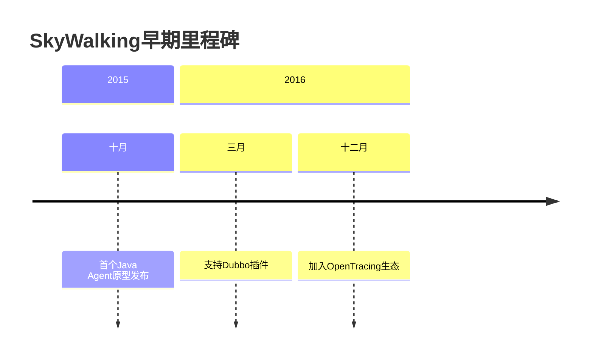

## 介绍

Apache SkyWalking 是一款开源的 **应用性能监控（APM）** 和 **分布式追踪系统**，专为微服务、云原生和容器化架构设计。本节将带你穿越SkyWalking的发展时间线，理解其设计哲学和技术演进背后的故事。

:::note 为什么学习历史？
了解工具的发展历程能帮助你：
- 理解其核心设计目标
- 更合理地选择版本
- 预判未来技术方向
:::

## 起源阶段（2015-2017）

### 1. 项目诞生
- **2015年**：由吴晟（Sheng Wu）在个人GitHub仓库创建初始版本
- **初期目标**：解决分布式系统下的调用链追踪问题
- **命名由来**：灵感来源于"天空行走"，象征对系统运行状态的全局俯瞰能力



### 2. 关键特性（v1.x）
- 基于Java Agent的非侵入式探针
- 支持Dubbo、Spring MVC等主流框架
- 使用H2作为默认存储

## Apache孵化期（2017-2019）

### 1. 进入Apache孵化器
- **2017年12月**：项目进入Apache孵化器
- **2018年4月**：发布首个Apache版本2.0.0-alpha

:::tip 社区成长
在此期间，项目：
- 贡献者数量增长300%
- 新增Python、NodeJS探针支持
- 引入可插拔存储架构
:::

### 2. 版本突破（v5-v6）
```text
v5.0.0-alpha (2018)：
- 全新UI界面
- 服务拓扑图自动发现

v6.0.0 (2019)：
- 指标分析引擎
- 告警功能引入
```

## 顶级项目时期（2019至今）

### 1. 毕业成为顶级项目
- **2019年4月**：正式毕业成为Apache顶级项目
- **2020年**：成立商业化公司Tetrate

### 2. 现代版本特性
| 版本   | 重大改进                          |
|--------|---------------------------------|
| v8.0   | 支持Service Mesh监控             |
| v9.0   | 原生OpenTelemetry协议兼容        |
| v10.0  | 日志分析功能强化                 |

## 实际案例：某电商平台的演进

**2017年**：采用SkyWalking v5监控单体应用
```java
// 早期Java Agent配置示例
-javaagent:/path/skywalking-agent.jar
-Dskywalking.agent.service_name=order-service
```

**2023年**：升级到v10监控云原生架构
```yaml
# 现代Kubernetes部署片段
otel-collector:
  exporters:
    skywalking:
      endpoint: "${SW_OTLP_ENDPOINT}"
```

## 总结

SkyWalking的发展历程体现了APM技术的演进趋势：
1. 从单一语言支持到多语言生态
2. 从调用链追踪到全栈可观测性
3. 从工具到平台的转变

:::warning 版本选择建议
生产环境建议：
- 传统架构：v8.x LTS版本
- 云原生环境：v10.x最新稳定版
:::

## 扩展资源

1. [Apache官方博客](https://skywalking.apache.org/blog/)
2. GitHub仓库的`CHANGELOG.md`文件
3. 吴晟在QCon的架构演进演讲

**练习任务**：
1. 对比v5和v10的架构图差异
2. 查阅最新Release Notes找出3个新增功能