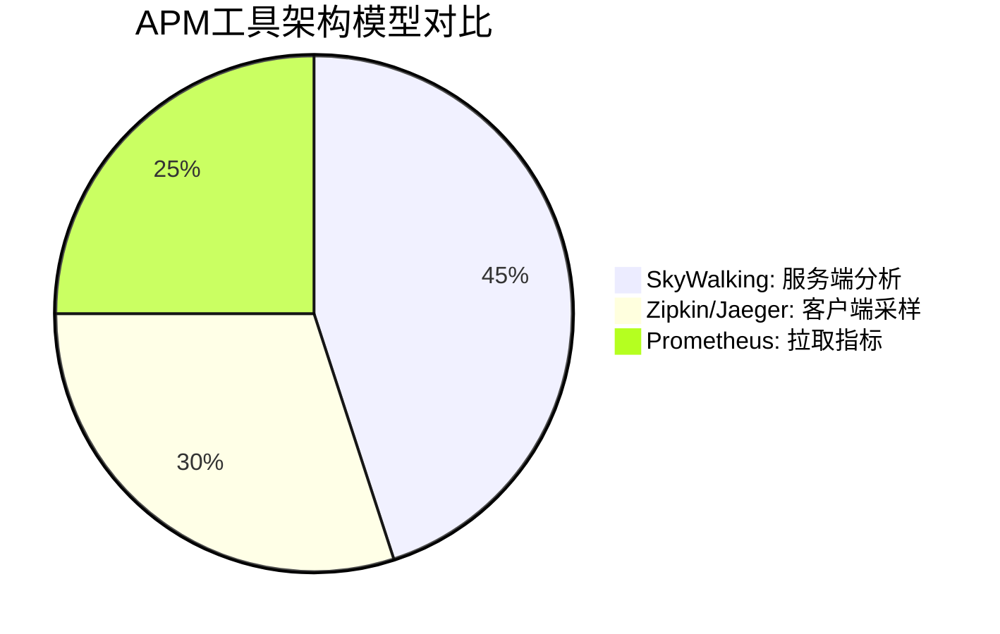

## 介绍

在分布式系统和微服务架构中，应用性能监控（APM）工具是确保系统稳定性的关键组件。SkyWalking作为开源APM工具，与其他工具（如Zipkin、Jaeger、Prometheus）相比，在架构设计、数据采集方式和功能特性上有显著差异。本章将帮助初学者理解这些差异，并为技术选型提供参考。

## 核心对比维度

我们从以下维度对比SkyWalking与其他APM工具：

1. **架构模型**  
2. **数据采集方式**  
3. **性能开销**  
4. **可视化能力**  
5. **社区生态**  

### 1. 架构模型对比



- **SkyWalking**：采用服务端分析模型，依赖探针（Agent）采集数据，由OAP（Observability Analysis Platform）服务器集中处理。
- **Zipkin/Jaeger**：基于客户端采样，数据直接上报到收集器，适合追踪但不擅长指标分析。
- **Prometheus**：专注于指标拉取（Pull模式），需配合其他工具实现分布式追踪。

:::tip
SkyWalking的架构更适合需要**全量数据分析**的场景，而Zipkin/Jaeger更适合**高吞吐量但允许采样丢失**的场景。
:::

### 2. 数据采集方式

| 工具         | 数据协议       | 采样策略    | 典型延迟       |
|------------|------------|---------|------------|
| SkyWalking | gRPC/HTTP  | 全量或动态采样 | `<100ms`   |
| Zipkin     | HTTP/Kafka | 固定比例采样  | `1-5s`     |
| Jaeger     | UDP/Thrift | 自适应采样   | `50-500ms` |

示例：SkyWalking Agent配置动态采样  
```java
// agent.config
agent.sample_n_per_3_secs=10  // 每3秒采样10次
```

### 3. 性能开销实测

通过模拟测试对比各工具在**吞吐量=1000 TPS**时的资源占用：

```mermaid
bar
    title 资源占用对比（CPU%）
    SkyWalking : 12
    Zipkin : 8
    Jaeger : 15
    Prometheus : 5
```

:::caution
SkyWalking的OAP服务器可能成为瓶颈，建议生产环境使用集群模式。
:::

### 4. 功能特性差异

#### 实际案例：微服务链路追踪
- **SkyWalking**：自动识别跨进程调用，展示拓扑图和服务依赖。
  ```bash
  # 查看拓扑关系
  curl http://OAP_Server/graphql -d 'query={getTopology{services}}'
  ```
- **Zipkin**：需手动传递`traceId`，依赖`Brave`库注入上下文。
  ```java
  // Java代码示例
  tracer.nextSpan().name("serviceCall").start().finish();
  ```

## 总结与建议

| 场景                | 推荐工具       | 理由                     |
|---------------------|---------------|--------------------------|
| 全链路分析+监控告警  | SkyWalking    | 一体化解决方案            |
| 简单分布式追踪       | Zipkin        | 部署轻量                  |
| 云原生指标监控       | Prometheus    | 与Kubernetes深度集成      |

## 扩展练习
1. 使用Docker同时部署SkyWalking和Zipkin，对比两者的追踪数据差异。
2. 尝试通过SkyWalking的`Alarm`功能配置一条CPU使用率告警规则。

## 附加资源
- [SkyWalking官方基准测试报告](https://skywalking.apache.org/benchmark)
- [OpenTelemetry兼容性对比表](https://opentelemetry.io/docs/concepts/components/)