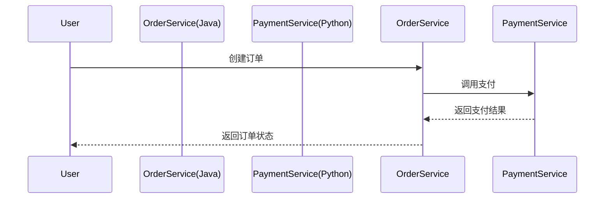

## 介绍

Apache SkyWalking 是一款开源的分布式系统性能监控工具，支持多种编程语言的自动探针（Agent）和手动探针（SDK）。通过探针，SkyWalking 可以收集应用的性能指标、分布式链路追踪数据等。本章将详细介绍 SkyWalking 支持的编程语言及其核心特性。

:::note
SkyWalking 的探针分为两类：
1. **自动探针**：通过字节码增强技术无侵入式集成（如 Java Agent）。
2. **手动探针**：需依赖语言特定的 SDK 手动编码（如 Python、Go）。
:::

## 支持的语言列表

以下是 SkyWalking 官方支持的编程语言及其探针类型：

| 语言       | 探针类型       | 主要特性                                                                 |
|------------|----------------|--------------------------------------------------------------------------|
| Java       | 自动探针       | 支持字节码增强，兼容大多数框架（Spring Boot、Dubbo 等）。                |
| Python     | 手动探针       | 提供 `skywalking-python` SDK，支持 Flask、Django 等框架。                |
| Go         | 手动探针       | 通过 `skywalking-go` SDK 集成，支持 Gin、gRPC 等。                       |
| Node.js    | 手动探针       | 提供 `skywalking-nodejs` SDK，支持 Express、Koa 等。                     |
| .NET       | 自动/手动探针  | 支持 CLR 字节码增强（自动）或 `SkyAPM-dotnet` SDK（手动）。              |
| PHP        | 自动探针       | 通过 PHP 扩展实现，支持 Laravel、Swoole 等。                             |

## 语言集成示例

### Java 自动探针
Java 是 SkyWalking 支持最完善的语言。以下是一个快速启动示例：

1. **下载探针**：
   ```bash
   wget https://archive.apache.org/dist/skywalking/java-agent/{version}/apache-skywalking-java-agent-{version}.tgz
   ```

2. **启动应用时附加探针**：
   ```bash
   java -javaagent:/path/to/skywalking-agent.jar -Dskywalking.agent.service_name=my-service -jar my-app.jar
   ```

:::tip
探针会自动捕获 Spring Boot、Tomcat 等框架的请求链路，无需修改代码！
:::

### Python 手动探针
Python 需通过 SDK 手动集成：

1. **安装 SDK**：
   ```bash
   pip install apache-skywalking
   ```

2. **在 Flask 应用中配置**：
   ```python
   from skywalking import agent, config

   config.init(service_name='my-python-service', oap_server='http://localhost:11800')
   agent.start()

   from flask import Flask
   app = Flask(__name__)

   @app.route('/')
   def hello():
       return "Hello, SkyWalking!"

   if __name__ == '__main__':
       app.run()
   ```

## 实际案例

### 场景：微服务链路追踪
假设一个电商系统使用 Java（订单服务）和 Python（支付服务），SkyWalking 可以追踪跨语言的请求链路：



在 SkyWalking UI 中，你可以看到完整的跨语言调用链，包括每个服务的耗时和状态码。

## 总结

- SkyWalking 支持 **Java、Python、Go、Node.js、.NET、PHP** 等主流语言。
- 自动探针（如 Java）无需代码修改，手动探针（如 Python）需集成 SDK。
- 跨语言追踪能力是 SkyWalking 的核心优势之一。

## 扩展资源

1. [官方探针文档](https://skywalking.apache.org/docs/)
2. 练习：尝试为你的 Java 或 Python 项目集成 SkyWalking 并查看监控数据。