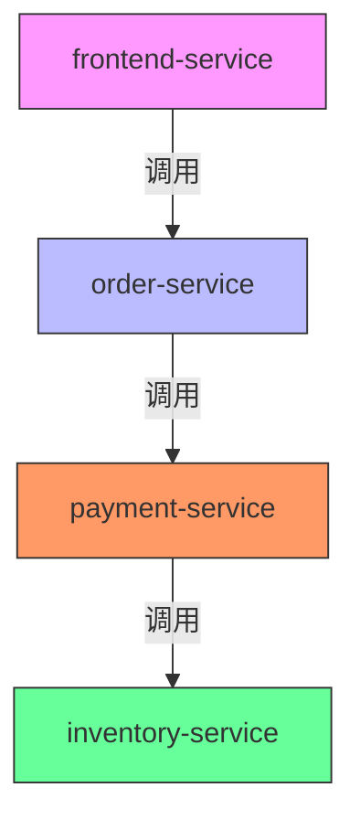

# SkyWalking 命名规范

## 介绍

在分布式系统监控中，良好的命名规范是确保数据可读性和一致性的关键。SkyWalking作为一款优秀的APM（应用性能监控）工具，对服务（Service）、实例（Instance）、端点（Endpoint）等核心元素有明确的命名约定。本文将详细介绍这些规范，并通过实际案例展示如何应用它们。

## 核心命名规则

### 1. 服务（Service）命名
服务代表一组功能相同的实例集合，通常是你的应用名称。

**规范要求：**
- 使用**全小写字母**和**短横线分隔**（如 `order-service`）
- 避免特殊字符（如 `@`, `#`, `空格`）
- 推荐格式：`<业务域>-<功能>`（如 `payment-gateway`）

**示例：**
```text
✅ 合规命名：
- user-service
- inventory-management

❌ 不推荐命名：
- UserService (大小写混合)
- payment@gateway (特殊字符)
```

### 2. 实例（Instance）命名
实例代表服务的单个运行时（如JVM进程、Kubernetes Pod）。

**规范要求：**
- 推荐包含**主机/IP**和**进程信息**
- 默认格式：`<服务名>@<IP>:<端口>`
- Kubernetes中建议：`<pod-name>.<namespace>`

**示例：**
```text
✅ 典型实例名：
- order-service@192.168.1.10:8080
- user-service-5f7b4d6c-abc123@10.2.3.4

❌ 模糊命名：
- instance-1 (缺少定位信息)
```

### 3. 端点（Endpoint）命名
端点表示服务暴露的接口（如HTTP URI、gRPC方法）。

**HTTP服务规范：**
- 使用**全大写**的HTTP方法前缀
- 包含完整路径（无域名）
- 路径参数用 `:` 标记

**示例：**
```text
✅ 标准端点：
- GET:/api/users
- POST:/orders/{id}/cancel
- /websocket (默认方法为GET)

❌ 非标准端点：
- getUser (缺少HTTP方法)
- http://api.example.com/users (包含域名)
```

## 实际案例

### 电商系统命名示例


**对应命名实例：**
- 服务：`frontend-service`, `order-service`, `payment-service`
- 实例：`order-service@10.0.0.1:8080`, `payment-service@10.0.0.2:9090`
- 端点：
  - `GET:/products/{id}`
  - `POST:/orders`
  - `PUT:/payments/{id}/status`

## 最佳实践

:::tip 一致性原则
1. **跨团队统一前缀**（如所有财务服务使用 `finance-` 开头）
2. **环境标识分离**：通过SkyWalking的[服务组](https://skywalking.apache.org/docs/)区分环境，而非修改服务名
3. **避免动态生成**：不要在名称中使用时间戳或随机ID
:::

## 总结

SkyWalking的命名规范通过：

- 分层定义（服务→实例→端点）
- 明确的格式要求
- 上下文信息嵌入

确保监控数据的可读性和可关联性。实际应用中，建议结合组织内部的命名公约制定更详细的实施细则。

## 扩展练习

1. 为你的个人博客系统设计SkyWalking监控命名方案
2. 对比以下两组命名，指出问题并改进：
   - 服务名: `Auth_Server`
   - 端点: `deleteUser`
3. 尝试通过SkyWalking UI查询不同命名风格的端点响应时间差异

## 常见问题

:::caution 注意
Q: 能否在服务名中使用中文？<br />
A: 技术上可行，但强烈不建议，可能导致查询兼容性问题。
:::