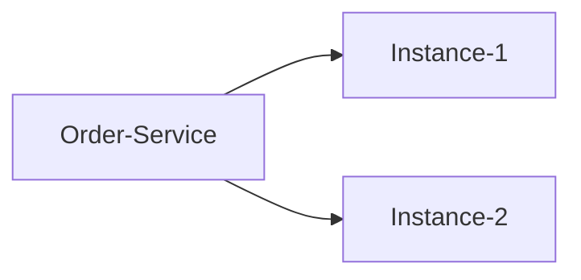
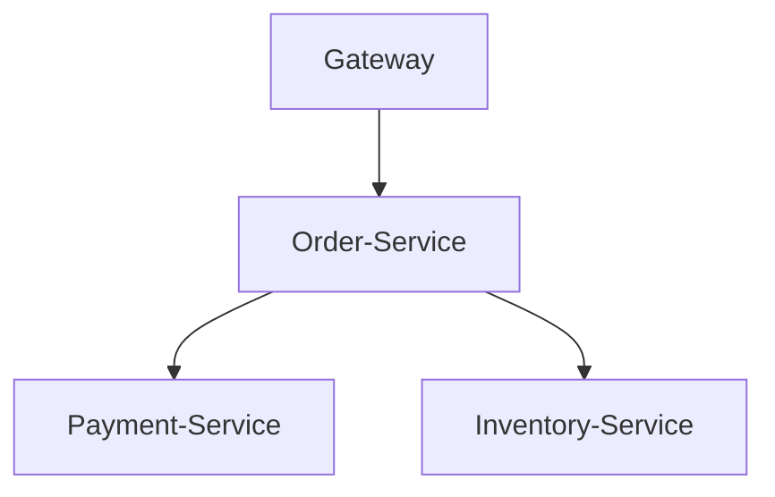

# SkyWalking 术语表

## 简介

SkyWalking是一款开源的**应用性能监控(APM)**工具，专注于分布式系统的观测与分析。理解其核心术语是掌握SkyWalking的基础。本文将系统介绍SkyWalking的关键概念，并通过实际案例帮助您建立清晰的知识框架。

## 核心术语

### 1. Service（服务）
表示一个独立运行的业务单元，通常对应一个微服务或应用。例如：
```yaml
# 示例：订单服务配置
service_name: "order-service"
```

### 2. Service Instance（服务实例）
服务的具体运行实例，如Kubernetes中的一个Pod：


### 3. Endpoint（端点）
服务对外暴露的接口，如HTTP API或gRPC方法：
```java
// 示例：Spring Boot端点
@GetMapping("/orders/{id}")
public Order getOrder(@PathVariable String id) {
  //...
}
```

### 4. Trace（追踪）
分布式请求的完整调用链，由多个Span组成：
```
Trace: /order → /payment → /inventory
```

### 5. Span（跨度）
Trace中的单个操作单元，包含：
- 开始/结束时间
- 操作名称
- 上下文信息

:::tip 实际案例
用户下单请求会生成包含以下Span的Trace：
1. 网关接收请求
2. 订单服务处理
3. 支付服务调用
:::

### 6. Segment（段）
特定语言探针收集的Span集合，是SkyWalking的特有概念：
```json
{
  "segment_id": "a1b2...",
  "spans": [
    {"operation_name": "/order/create"},
    {"operation_name": "DB/Order/insert"}
  ]
}
```

### 7. Context Carrier（上下文载体）
用于跨进程传递追踪信息的载体对象：
```java
// Java代码示例
ContextCarrier carrier = new ContextCarrier();
ContextManager.extract(carrier);
```

### 8. OAP（Observability Analysis Platform）
SkyWalking的后端分析平台，负责：
- 数据聚合
- 拓扑分析
- 告警处理

### 9. Storage（存储）
支持多种存储后端：
- Elasticsearch
- H2（默认）
- MySQL

## 高级概念

### 1. Topology（拓扑图）
可视化服务间依赖关系：


### 2. Alarm（告警）
基于指标的自动告警规则：
```yaml
rules:
  - name: high_error_rate
    expression: endpoint_resp_code = '500' / all > 0.1
```

### 3. Meter System（指标系统）
收集JVM/CPU等系统指标：
```
process_cpu_usage{service="order"} 0.78
```

## 实际应用场景

**电商系统监控示例：**
1. 用户访问 → 生成Trace
2. 各微服务记录Span
3. OAP聚合数据并生成：
   - 服务拓扑图
   - 慢请求分析
   - 异常告警

## 总结

| 术语 | 说明 | 类比 |
|------|------|------|
| Service | 业务服务 | 微服务 |
| Span | 单个操作 | 方法调用 |
| Trace | 完整调用链 | 用户请求生命周期 |

## 延伸学习

推荐练习：
1. 部署SkyWalking并观察示例应用的术语对应关系
2. 尝试在代码中手动创建Span
3. 配置简单的告警规则

:::note 学习建议
建议结合SkyWalking UI实时观察这些术语的实际表现，将抽象概念具象化。
:::