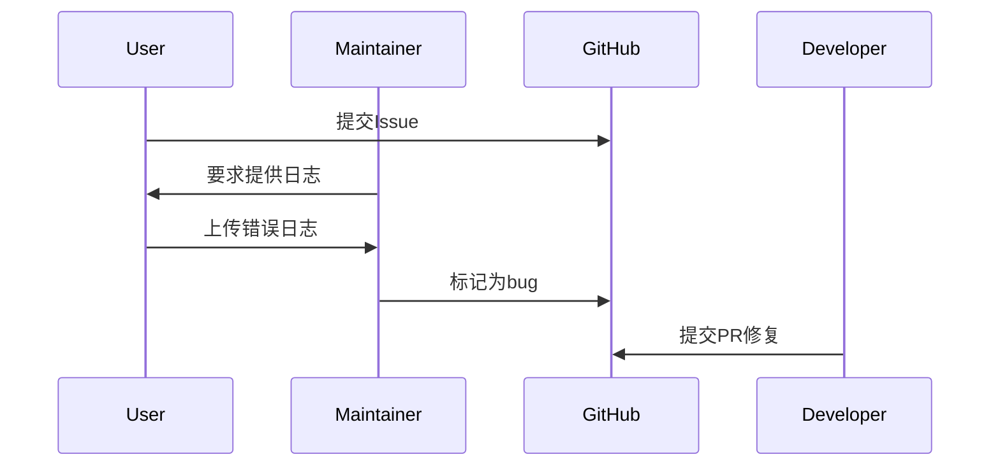

## 介绍

SkyWalking作为一款开源的APM（应用性能监控）工具，其社区是学习和解决问题的核心场所。本章将介绍如何利用官方文档、GitHub仓库、邮件列表等资源，并演示如何参与社区贡献。

## 官方资源列表

### 1. 官方网站与文档
- **官网地址**: [https://skywalking.apache.org/](https://skywalking.apache.org/)  
  提供最新版本下载、博客和核心功能介绍。
- **文档中心**:  
  包含[英文文档](https://skywalking.apache.org/docs/)和[中文翻译](https://skywalking.apache.org/zh/docs/)，涵盖从安装到高级配置的所有细节。

:::tip
使用文档搜索功能（快捷键 `Ctrl+K`）快速定位问题，例如搜索 `Java agent setup`。
:::

### 2. GitHub仓库
- **主仓库**: [apache/skywalking](https://github.com/apache/skywalking)  
  提交Issue前请先：
  1. 检查[现有Issue](https://github.com/apache/skywalking/issues)是否已解决
  2. 使用模板规范描述问题（包括环境版本、日志片段）

```bash
# 克隆仓库示例
git clone https://github.com/apache/skywalking.git
```

### 3. 邮件列表
- **开发者列表**: dev@skywalking.apache.org  
  订阅方式：发送邮件至 `dev-subscribe@skywalking.apache.org`

## 社区协作流程

### 提交Pull Request
1. Fork主仓库到个人账号
2. 创建特性分支：
   ```bash
   git checkout -b feature/add-mysql-plugin
   ```
3. 遵循[代码风格指南](https://github.com/apache/skywalking/blob/master/docs/en/guides/code-style.md)提交代码

:::caution
重大改动需先在邮件列表讨论，参考[RFC流程](https://github.com/apache/skywalking/blob/master/docs/en/guides/RFC.md)。
:::

### 社区会议
- **公开例会**: 每月第一个周三 UTC 14:00  
  会议链接在[官网日历](https://skywalking.apache.org/events/)公布

## 实际案例：解决插件兼容性问题

**场景**：用户报告MySQL监控插件在8.0版本失效  
1. 在GitHub提交[ISSUE-1234](https://github.com/apache/skywalking/issues/1234)  
2. 社区成员复现后标记为`bug`  
3. 开发者提交修复PR并附带测试用例：
   ```java
   // 示例测试代码片段
   @Test
   public void testMySQL8Connection() throws SQLException {
       Connection connection = DriverManager.getConnection("jdbc:mysql://127.0.0.1:3306/test?useSSL=false", "root", "");
       assertNotNull(connection);
   }
   ```



## 总结与练习

### 关键要点
- 官方文档是首选学习资源
- GitHub Issue需提供完整环境信息
- 代码贡献需遵循Apache协议规范

### 练习任务
1. 在本地搭建SkyWalking环境并提交一份安装问题报告（模拟）
2. 阅读[贡献指南](https://github.com/apache/skywalking/blob/master/docs/en/guides/README.md)并尝试修复文档错别字

### 扩展资源
- [Bilibili官方频道](https://space.bilibili.com/390683219)：中文教程视频
- `#skywalking`频道 on [ASF Slack](https://s.apache.org/slack-invite)