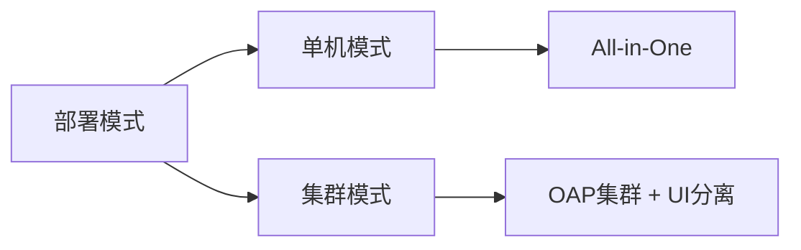

## 简介

在开始安装Apache SkyWalking之前，确保系统满足基本要求并完成必要的准备工作至关重要。本节将指导您检查硬件/软件需求、配置依赖环境，并规划部署架构。

---

## 系统要求

### 硬件需求
- **最低配置**（测试环境）：
  - CPU：2核
  - 内存：4GB
  - 磁盘：50GB（用于存储监控数据）
- **生产环境推荐**：
  - CPU：4核以上
  - 内存：8GB以上
  - 磁盘：SSD存储，200GB以上（根据数据保留策略调整）

:::note
如果启用分布式追踪和高频采样，资源需求会显著增加。
:::

### 软件依赖
- **Java**：SkyWalking后端需要JDK 8/11/17（推荐LTS版本）：
  ```bash
  # 检查Java版本
  java -version
  ```
  预期输出：
  ```
  openjdk version "11.0.15"
  ```

- **数据库**（可选）：
  - **嵌入式数据库**：H2（默认，仅适合测试）
  - **外部数据库**：MySQL/PostgreSQL/TiDB（生产环境必需）

---

## 环境准备

### 1. 选择部署模式


### 2. 数据库配置（以MySQL为例）
```bash
# 创建数据库用户
CREATE USER 'swuser'@'%' IDENTIFIED BY 'skywalking';
CREATE DATABASE skywalking;
GRANT ALL PRIVILEGES ON skywalking.* TO 'swuser'@'%';
```

### 3. 网络规划
- **端口要求**：
  - OAP服务：11800（gRPC）、12800（HTTP）
  - UI：8080
- **防火墙规则**：
  ```bash
  sudo ufw allow 11800/tcp
  sudo ufw allow 12800/tcp
  ```

---

## 实际案例：电商系统监控准备

假设要为电商平台部署SkyWalking：
1. **组件清单**：
   - 前端：Nginx（需Nginx Agent）
   - 后端：Spring Boot服务（Java Agent）
   - 数据库：MySQL（Slow Query监控）
2. **配置示例**：
   ```yaml
   # agent/config/agent.config
   agent.service_name=order-service
   collector.backend_service=192.168.1.100:11800
   ```

:::caution
生产环境务必修改默认密码！检查`webapp.yml`中的`admin.password`。
:::

---

## 总结

完成以下检查表后再开始安装：
- [ ] 验证Java版本
- [ ] 数据库已就绪（生产环境）
- [ ] 网络端口开放
- [ ] 磁盘空间充足
- [ ] 已获取最新发布包（[官网下载](https://skywalking.apache.org/downloads/)）

---

## 扩展资源
1. [官方部署文档](https://skywalking.apache.org/docs/main/latest/en/setup/backend/backend-setup/)
2. 练习：在Docker中预配置MySQL作为存储库
   ```bash
   docker run -p 3306:3306 -e MYSQL_ROOT_PASSWORD=root -d mysql:8.0
   ```