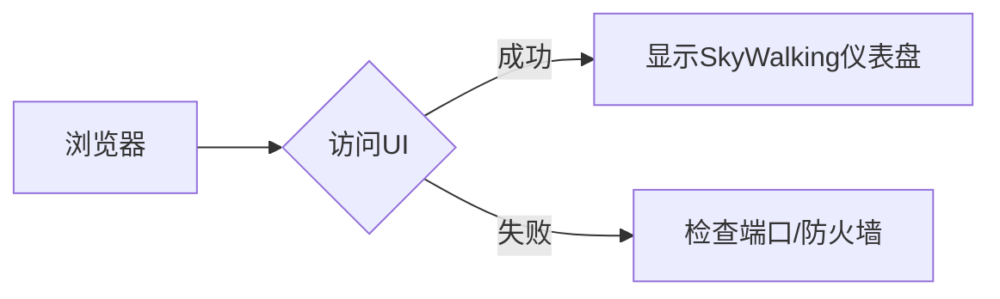

# SkyWalking 安装验证

在完成SkyWalking的安装与部署后，验证其是否正常运行是至关重要的步骤。本指南将带领你逐步检查SkyWalking的核心组件，确保你的安装是成功的。

## 介绍

SkyWalking是一个开源的APM（应用性能监控）系统，用于监控、追踪和诊断分布式系统。安装验证包括检查SkyWalking的各个组件（如OAP Server、Storage、UI）是否正常运行，并能够处理基本的追踪请求。

## 基础检查

### 1. 检查OAP Server日志

OAP（Observability Analysis Platform）Server是SkyWalking的核心组件。首先检查其日志，确认无错误：

```bash
# 查看OAP Server日志（假设使用默认日志路径）
tail -n 50 /var/log/skywalking/oap.log
```

预期输出应包含类似以下内容，表明服务已启动：

```
INFO  org.apache.skywalking.oap.server.starter.OAPServerBootstrap - OAP starts up in cluster mode...
INFO  org.apache.skywalking.oap.server.core.CoreModuleProvider - Storage provider: Elasticsearch
```

:::caution
如果日志中出现 `ERROR` 或 `Exception`，需根据提示解决存储（如Elasticsearch）或网络配置问题。
:::

### 2. 检查UI服务状态

SkyWalking UI默认运行在 `8080` 端口。验证UI服务是否活跃：

```bash
curl -I http://localhost:8080
```

预期响应：

```
HTTP/1.1 200 OK
```

## 实际验证步骤

### 步骤1：访问SkyWalking UI

通过浏览器访问 `http://<your-server-ip>:8080`，若看到以下界面，说明UI部署成功：



### 步骤2：发送测试追踪数据

使用SkyWalking提供的示例Agent或手动发送数据验证追踪功能。

#### 示例：通过cURL模拟请求

```bash
# 发送一个简单的追踪数据到OAP（假设OAP监听11800端口）
curl -X POST http://localhost:11800/v3/segment -H 'Content-Type: application/json' -d '{
  "traceId": "abc123",
  "service": "your-service",
  "spans": [{
    "operationName": "test-span",
    "startTime": 1620000000000,
    "endTime": 1620000001000
  }]
}'
```

预期响应为空的HTTP 200，表示数据已被接收。

### 步骤3：验证数据存储

1. **Elasticsearch用户**：检查索引是否创建：
   ```bash
   curl -X GET "localhost:9200/_cat/indices?v" | grep skywalking
   ```
   应看到类似 `skywalking-segment-20200101` 的索引。

2. **UI数据展示**：在SkyWalking UI的 `Trace` 页面搜索刚才发送的 `traceId: abc123`。

## 常见问题排查

:::warning
若UI无法访问：
1. 确认OAP和UI服务进程是否运行：`ps -ef | grep skywalking`。
2. 检查防火墙规则：`sudo ufw status`（Ubuntu）。
3. 验证端口监听：`netstat -tulnp | grep 8080`。
:::

## 总结

通过本指南，你已学会：
- 检查OAP Server和UI的运行状态。
- 发送测试追踪数据并验证其存储。
- 基础故障排查方法。

## 附加练习

1. 尝试部署SkyWalking Agent到一个Spring Boot应用，并验证追踪数据是否出现在UI中。
2. 修改OAP的存储配置（如切换至H2内存数据库），重复验证步骤。

:::tip
深入学习：参考[官方文档](https://skywalking.apache.org/docs/)探索高级配置，如集群部署或TLS加密。
:::