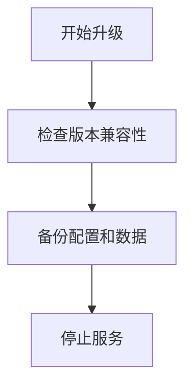

# SkyWalking 升级指南

## 介绍

SkyWalking作为分布式系统的应用性能监控工具，定期升级可以获取新功能、性能优化和安全补丁。本指南将详细介绍升级流程，帮助初学者完成平滑升级。

:::note
升级前请确保已阅读[官方发布说明](https://skywalking.apache.org/release-notes/)，了解版本间的重大变更。
:::

## 升级前准备

### 1. 版本兼容性检查
使用以下命令检查当前版本与目标版本的兼容性：
```bash
# 查看当前版本
./bin/oapService.sh --version
```

### 2. 数据备份
推荐备份以下关键数据：
- 配置文件（`config/application.yml`）
- 存储数据（如Elasticsearch索引或MySQL数据库）
- 探针配置



## 升级步骤

### 1. 二进制包升级（以Linux为例）
```bash
# 下载新版本
wget https://archive.apache.org/dist/skywalking/{VERSION}/apache-skywalking-apm-{VERSION}.tar.gz

# 解压并迁移配置
tar -zxvf apache-skywalking-apm-{VERSION}.tar.gz
cp -r old_version/config/application.yml new_version/config/
```

### 2. 容器化部署升级
```dockerfile
# 更新docker-compose.yml中的镜像版本
version: '3'
services:
  oap:
    image: apache/skywalking-oap-server:{NEW_VERSION}
```

:::caution
Kubernetes用户需注意StatefulSet的滚动更新策略，避免数据丢失。
:::

## 配置迁移示例

旧版配置（v8.4.0）：
```yaml
storage:
  elasticsearch:
    nameSpace: ${SW_NAMESPACE:"skywalking"}
```

新版配置（v9.0.0）变更：
```yaml
storage:
  elasticsearch:
    namespace: ${SW_STORAGE_ES_NAMESPACE:"skywalking"}
```

## 验证升级

1. 启动服务后检查日志：
```bash
tail -f logs/skywalking-oap-server.log
```

2. 确认无错误日志后，访问Web UI验证功能：
```bash
curl http://localhost:8080/version
```

## 常见问题解决

### 案例：指标数据不显示
**现象**：升级后Dashboard无数据<br />
**解决方案**：
1. 检查存储兼容性
2. 重建Elasticsearch索引模板：
```bash
curl -XPUT http://elasticsearch:9200/_template/skywalking_metrics \
  -H 'Content-Type: application/json' \
  -d @/skywalking/config/elasticsearch/metrics-template.json
```

## 总结

升级流程关键点：
1. 始终先测试升级流程
2. 保留回滚方案
3. 监控升级后系统表现

## 扩展学习

- [官方升级文档](https://skywalking.apache.org/docs/main/latest/en/setup/backend/backend-upgrade/)
- 练习：在测试环境模拟从v8.9.1升级到v9.2.0
- 社区支持：订阅dev@skywalking.apache.org邮件列表