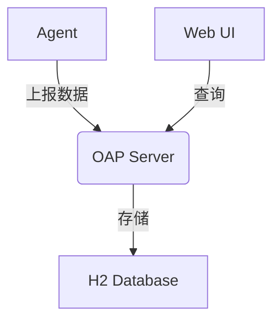

# SkyWalking 最小化部署方案

## 介绍

SkyWalking最小化部署方案是指在**资源消耗最低**的前提下，部署SkyWalking核心功能模块的配置方式。这种方案特别适合：

- 本地开发测试环境
- 资源受限的机器
- 快速验证功能的场景

与生产环境部署相比，最小化部署会牺牲部分性能和高可用性，但保留了所有核心监控功能。

:::tip 最小化 vs 生产部署
- 使用内置H2数据库替代ES/MySQL
- 单节点无集群模式
- 关闭非必要组件
:::

## 前置条件

在开始前请确保：

1. 已安装JDK 8/11/17
2. 内存≥2GB
3. 磁盘空间≥1GB

## 部署步骤

### 1. 下载SkyWalking发行版

从[官网](https://skywalking.apache.org/downloads/)下载最新版本：

```bash
wget https://archive.apache.org/dist/skywalking/9.4.0/apache-skywalking-apm-9.4.0.tar.gz
tar -zxvf apache-skywalking-apm-9.4.0.tar.gz
cd apache-skywalking-apm-bin
```

### 2. 配置存储模式

编辑 `config/application.yml`，修改存储部分：

```yaml
storage:
  selector: ${SW_STORAGE:h2}
  h2:
    driver: org.h2.jdbcx.JdbcDataSource
    url: jdbc:h2:mem:skywalking-oap-db
    user: sa
```

### 3. 启动OAP服务

使用内置H2和最小化配置启动：

```bash
# Linux/Mac
bin/oapService.sh

# Windows
bin\oapService.bat
```

### 4. 启动Web UI

```bash
# Linux/Mac
bin/webappService.sh

# Windows
bin\webappService.bat
```

访问 `http://localhost:8080` 即可看到UI界面。

## 配置说明

### 关键参数调优

在 `config/application.yml` 中可调整以下参数降低资源消耗：

```yaml
core:
  default:
    # 减少采样率
    sampleRate: ${SW_SAMPLE_RATE:1000} 
    # 缩短指标聚合周期
    metricsDataTTL: ${SW_METRICS_DATA_TTL:2}
    # 缩短原始数据保留时间
    recordDataTTL: ${SW_RECORD_DATA_TTL:1}
```

### 组件关系图



## 实际案例

### 场景：本地Java应用监控

1. 下载Java Agent：

```bash
wget https://archive.apache.org/dist/skywalking/java-agent/8.16.0/apache-skywalking-java-agent-8.16.0.tgz
```

2. 启动应用时挂载Agent：

```bash
java -javaagent:/path/to/skywalking-agent.jar \
     -Dskywalking.agent.service_name=my-service \
     -Dskywalking.collector.backend_service=localhost:11800 \
     -jar my-app.jar
```

3. 在SkyWalking UI中即可看到应用拓扑和指标。

## 总结

最小化部署方案特点：

| 特性 | 最小化部署 | 生产部署 |
|------|-----------|----------|
| 存储 | H2内存数据库 | ES/MySQL集群 |
| 节点 | 单节点 | 集群模式 |
| 资源 | 低消耗 | 高可用 |
| 适用场景 | 开发测试 | 生产环境 |

## 扩展学习

- [SkyWalking官方文档](https://skywalking.apache.org/docs/)
- 尝试将存储切换为MySQL
- 探索更多Agent配置选项

:::warning 注意事项
1. H2数据库重启后数据会丢失
2. 不要在高负载场景使用此方案
3. 监控数据保留时间较短
:::