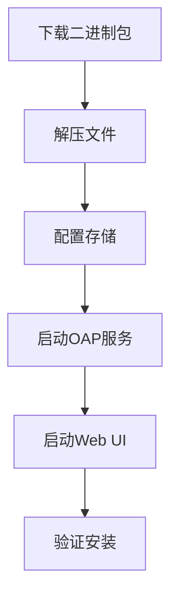

# SkyWalking 二进制包安装

Apache SkyWalking 是一款开源的分布式系统监控和追踪工具，支持多种部署方式。本指南将详细介绍如何使用二进制包进行安装，适合初学者快速搭建本地开发或生产环境。

## 前置条件

在开始之前，请确保您的系统满足以下要求：
- 操作系统：Linux/Unix/macOS（Windows需使用WSL）
- Java环境：JDK 8/11/17（推荐OpenJDK）
- 内存：至少2GB可用内存
- 磁盘空间：至少1GB可用空间

:::tip
使用 `java -version` 命令验证Java环境，输出应类似：
```bash
openjdk version "11.0.15" 2022-04-19
```
:::

## 下载二进制包

1. 访问 [SkyWalking官方下载页面](https://skywalking.apache.org/downloads/)
2. 选择最新稳定版（例如 `v9.4.0`）的 **Binary Distribution** 包
3. 复制下载链接或直接使用wget命令：

```bash
wget https://downloads.apache.org/skywalking/9.4.0/apache-skywalking-apm-9.4.0.tar.gz
```

## 安装步骤

### 步骤1：解压安装包

```bash
tar -zxvf apache-skywalking-apm-9.4.0.tar.gz
cd apache-skywalking-apm-bin
```

目录结构说明：
```
bin/      # 启动脚本
config/   # 配置文件
webapp/   # Web UI前端
oap-libs/ # 后端核心库
```

### 步骤2：配置存储（以H2为例）

默认使用嵌入式H2数据库，适合测试环境。编辑 `config/application.yml`：

```yaml
storage:
  selector: ${SW_STORAGE:h2}
  h2:
    driver: org.h2.jdbcx.JdbcDataSource
    url: jdbc:h2:mem:skywalking-oap-db
    user: sa
```

:::caution
生产环境建议切换为Elasticsearch/MySQL等存储，需额外配置。
:::

### 步骤3：启动后端服务

```bash
bin/oapService.sh
```

成功启动后会显示：
```
OAP started successfully!
```

### 步骤4：启动Web UI

```bash
bin/webappService.sh
```

访问 `http://localhost:8080` 即可看到仪表盘。

## 验证安装

通过API检查服务状态：
```bash
curl http://localhost:12800/version
```
预期输出：
```json
{"version":"9.4.0"}
```

## 实际案例：监控Spring Boot应用

1. 下载Java Agent：
```bash
wget https://downloads.apache.org/skywalking/java-agent/8.12.0/apache-skywalking-java-agent-8.12.0.tgz
```

2. 启动应用时添加Agent参数：
```bash
java -javaagent:/path/to/skywalking-agent/skywalking-agent.jar \
-DSW_AGENT_NAME=your-application-name \
-DSW_AGENT_COLLECTOR_BACKEND_SERVICES=127.0.0.1:11800 \
-jar your-app.jar
```

## 常见问题解决

1. **端口冲突**：修改 `config/application.yml` 中的 `restPort` 和 `gRPCPort`
2. **内存不足**：调整 `bin/oapService.sh` 中的 `-Xmx` 参数
3. **UI无法访问**：检查 `webapp.yml` 中的 `server.port` 配置

## 总结

通过本指南，您已经完成：
- 下载并解压SkyWalking二进制包
- 配置基础存储（H2）
- 启动OAP后端和Web UI服务
- 验证安装并监控示例应用

## 扩展学习

1. [官方文档：存储配置选项](https://skywalking.apache.org/docs/main/latest/en/setup/backend/backend-storage/)
2. [生产环境部署建议](https://skywalking.apache.org/docs/main/latest/en/deployment/deploy-manual/)
3. 练习：尝试将存储切换为Elasticsearch

