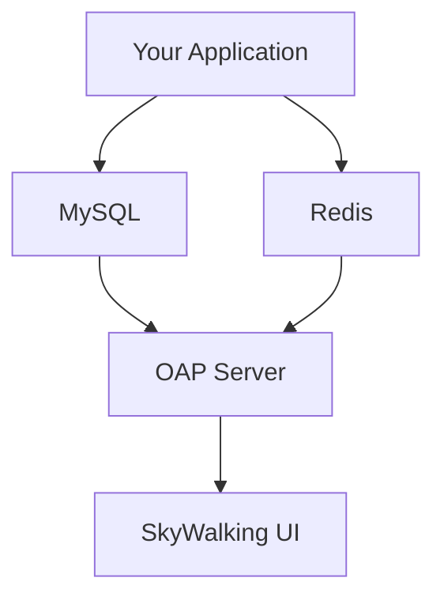

## 介绍

Apache SkyWalking是一个开源的分布式系统性能监控工具，而Docker则是目前最流行的容器化平台。通过Docker部署SkyWalking，可以快速搭建监控环境，避免复杂的依赖配置。本章将指导你完成以下内容：

- SkyWalking Docker镜像的选择
- 单节点部署（适合开发/测试环境）
- 集成ElasticSearch存储
- 常见问题排查

:::tip 为什么选择Docker部署？
- **环境一致性**：避免"在我机器上能运行"的问题
- **快速启动**：一条命令即可启动全套服务
- **资源隔离**：组件间互不干扰
- **版本管理**：方便切换不同版本
:::

## 准备工作

确保你的系统已安装：
- Docker 20.10+
- Docker Compose 1.29+（可选）
- 至少4GB可用内存

检查Docker是否正常运行：
```bash
docker --version
docker-compose --version
```

## 快速启动（开发模式）

使用官方提供的`docker-compose.yml`快速启动：

1. 创建`docker-compose.yml`文件：
```yaml
version: '3'
services:
  oap:
    image: apache/skywalking-oap-server:9.4.0
    container_name: skywalking-oap
    restart: always
    ports:
      - "11800:11800"  # gRPC API
      - "12800:12800"  # HTTP API
    environment:
      SW_STORAGE: h2
      SW_HEALTH_CHECKER: default

  ui:
    image: apache/skywalking-ui:9.4.0
    container_name: skywalking-ui
    depends_on:
      - oap
    links:
      - oap
    restart: always
    ports:
      - "8080:8080"
    environment:
      SW_OAP_ADDRESS: http://oap:12800
```

2. 启动服务：
```bash
docker-compose up -d
```

3. 访问UI：
```
http://localhost:8080
```

## 生产环境部署

对于生产环境，建议使用ElasticSearch作为存储后端：

```yaml
version: '3'
services:
  elasticsearch:
    image: docker.elastic.co/elasticsearch/elasticsearch:7.16.3
    container_name: elasticsearch
    environment:
      - discovery.type=single-node
      - bootstrap.memory_lock=true
      - "ES_JAVA_OPTS=-Xms2g -Xmx2g"
    ulimits:
      memlock:
        soft: -1
        hard: -1
    ports:
      - "9200:9200"
    volumes:
      - es_data:/usr/share/elasticsearch/data

  oap:
    image: apache/skywalking-oap-server:9.4.0
    container_name: skywalking-oap
    depends_on:
      - elasticsearch
    links:
      - elasticsearch
    restart: always
    ports:
      - "11800:11800"
      - "12800:12800"
    environment:
      SW_STORAGE: elasticsearch
      SW_STORAGE_ES_CLUSTER_NODES: elasticsearch:9200
      SW_HEALTH_CHECKER: default
      JAVA_OPTS: "-Xms2g -Xmx2g"

  ui:
    image: apache/skywalking-ui:9.4.0
    container_name: skywalking-ui
    depends_on:
      - oap
    links:
      - oap
    restart: always
    ports:
      - "8080:8080"
    environment:
      SW_OAP_ADDRESS: http://oap:12800

volumes:
  es_data:
```

:::warning 生产环境注意事项
- 为ElasticSearch分配足够内存（建议8GB+）
- 考虑使用集群模式而非单节点
- 配置持久化卷防止数据丢失
- 设置适当的网络策略和安全组
:::

## 配置详解

### OAP Server环境变量

| 变量名 | 说明 | 示例值 |
|--------|------|--------|
| `SW_STORAGE` | 存储类型 | `h2`, `elasticsearch` |
| `SW_STORAGE_ES_CLUSTER_NODES` | ES节点地址 | `elasticsearch:9200` |
| `SW_HEALTH_CHECKER` | 健康检查 | `default` |
| `JAVA_OPTS` | JVM参数 | `-Xms4g -Xmx4g` |

### UI配置项

| 变量名 | 说明 | 示例值 |
|--------|------|--------|
| `SW_OAP_ADDRESS` | OAP服务地址 | `http://oap:12800` |
| `SW_TIMEOUT` | 请求超时(ms) | `30000` |

## 实际案例：监控Spring Boot应用

1. 为Java应用添加Agent：
```bash
java -javaagent:/path/to/skywalking-agent.jar \
     -Dskywalking.agent.service_name=your-application \
     -Dskywalking.collector.backend_service=localhost:11800 \
     -jar your-app.jar
```

2. 在SkyWalking UI中查看拓扑图：



## 常见问题

### 1. UI无法连接OAP
检查：
- OAP容器日志：`docker logs skywalking-oap`
- 网络连通性：`docker network inspect bridge`
- 端口映射是否正确

### 2. ElasticSearch启动失败
尝试：
```bash
docker run --rm --privileged --pid=host justincormack/nsenter1 /bin/sh -c "echo never > /sys/kernel/mm/transparent_hugepage/enabled"
```

## 总结

通过Docker部署SkyWalking，我们实现了：
- 快速搭建监控环境
- 灵活的存储配置
- 便捷的版本管理
- 资源隔离的运行环境

## 扩展学习

- 官方Docker镜像文档：[https://hub.docker.com/r/apache/skywalking-oap-server](https://hub.docker.com/r/apache/skywalking-oap-server)
- 尝试为你的微服务项目添加SkyWalking Agent
- 研究SkyWalking的告警配置功能

:::exercise 动手实践
1. 使用Docker Compose部署SkyWalking + ElasticSearch
2. 监控一个简单的Spring Boot应用
3. 在UI中查看服务的响应时间分布
:::