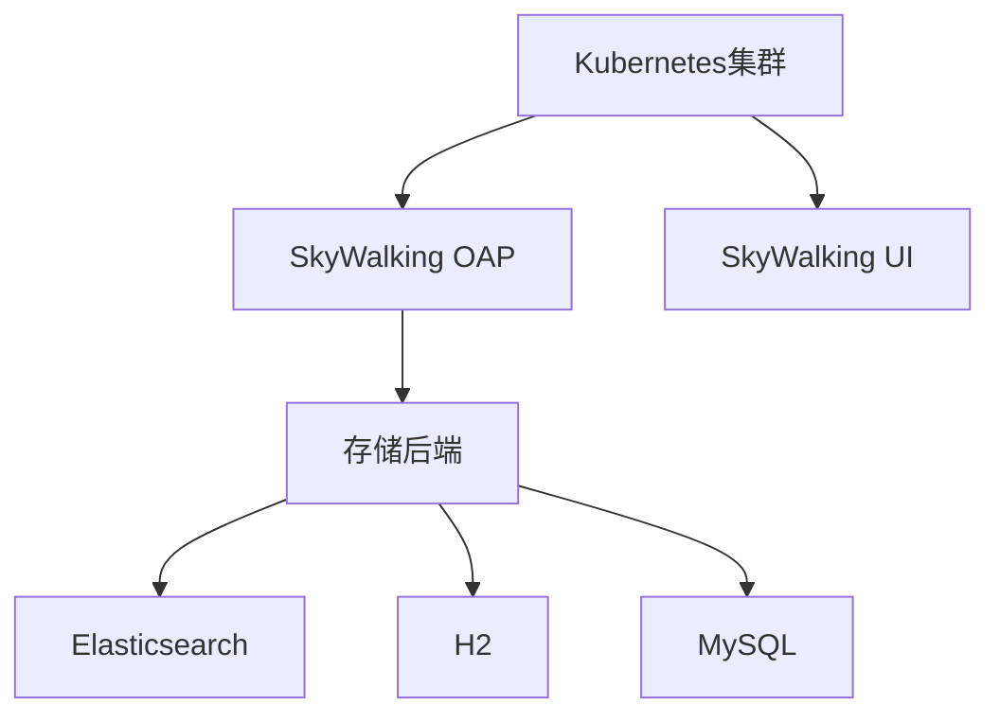

# SkyWalking Kubernetes部署

## 介绍

Apache SkyWalking是一个开源的分布式系统监控和追踪平台，特别适合云原生环境。在Kubernetes中部署SkyWalking可以充分利用其弹性伸缩和自动化管理的特性。本指南将带你完成从零开始的完整部署流程。

## 前置条件

- 运行中的Kubernetes集群（Minikube、Kind或生产级集群）
- `kubectl` 已配置并可以访问集群
- Helm 3（推荐方式）或直接使用YAML清单

## 部署架构



## 步骤1：添加Helm仓库

推荐使用Helm进行部署，首先添加官方chart仓库：

```bash
helm repo add skywalking https://apache.jfrog.io/artifactory/skywalking-helm
helm repo update
```

## 步骤2：基础部署（使用内置H2存储）

创建`values.yaml`基础配置文件：

```yaml
oap:
  image:
    tag: 9.4.0
  storageType: h2

ui:
  image:
    tag: 9.4.0
  service:
    type: NodePort
```

执行部署命令：

```bash
helm install skywalking skywalking/skywalking -n skywalking --create-namespace -f values.yaml
```

:::note
H2仅适用于测试环境，生产环境请使用Elasticsearch或MySQL
:::

## 步骤3：验证部署

检查Pod状态：

```bash
kubectl get pods -n skywalking
```

预期输出应显示所有Pod状态为`Running`：

```
NAME                              READY   STATUS    RESTARTS   AGE
skywalking-oap-5f7b8c6c58-abc12   1/1     Running   0          2m
skywalking-ui-7d5f8b4d4f-xyz34    1/1     Running   0          2m
```

## 步骤4：访问UI

获取UI服务访问地址：

```bash
kubectl get svc -n skywalking skywalking-ui
```

通过NodePort或配置Ingress访问Web界面。

## 生产级部署（使用Elasticsearch）

### 配置Elasticsearch

更新`values.yaml`：

```yaml
oap:
  storageType: elasticsearch
  env:
    SW_STORAGE_ES_CLUSTER_NODES: elasticsearch-master:9200

elasticsearch:
  enabled: true
  replicas: 3
```

部署命令：

```bash
helm upgrade --install skywalking skywalking/skywalking -n skywalking -f values.yaml
```

:::warning
生产环境建议使用独立的Elasticsearch集群而非内置实例
:::

## 高级配置

### 配置采样率

在`values.yaml`中调整：

```yaml
oap:
  env:
    SW_TRACING_SAMPLE_RATE: 0.5 # 50%采样率
```

### 启用告警

```yaml
oap:
  env:
    SW_CORE_ALARM: "true"
```

## 实际案例：微服务监控

假设你有一个包含以下组件的系统：

1. 前端服务（Node.js）
2. 订单服务（Java Spring Boot）
3. 支付服务（Go）

使用SkyWalking Agent注入的部署示例：

```yaml
# 订单服务示例
apiVersion: apps/v1
kind: Deployment
metadata:
  name: order-service
spec:
  template:
    spec:
      containers:
      - name: order-service
        env:
        - name: SW_AGENT_NAME
          value: "order-service"
        - name: SW_AGENT_COLLECTOR_BACKEND_SERVICES
          value: "skywalking-oap.skywalking:11800"
```

## 总结

通过本指南，你已经学会了：
- 在Kubernetes中部署SkyWalking的基础和高级配置
- 不同存储后端的配置方法
- 如何集成到现有微服务架构

## 后续学习

1. 尝试配置自定义告警规则
2. 学习SkyWalking的指标和追踪数据分析
3. 探索Service Mesh（如Istio）集成

## 故障排除

常见问题解决方案：
- OAP Pod崩溃：检查存储连接配置
- UI无法访问：验证Service类型和端口
- 数据不显示：确认Agent配置正确

## 官方资源

- [SkyWalking Kubernetes Helm Charts](https://github.com/apache/skywalking-helm)
- [官方文档](https://skywalking.apache.org/docs/)