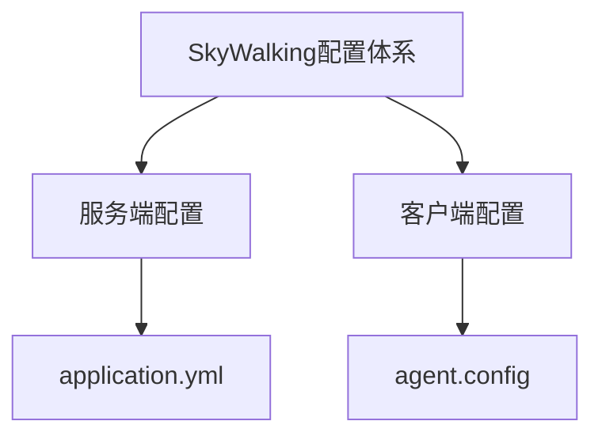

## 介绍

SkyWalking的配置文件是控制其运行时行为的核心，通过调整这些配置可以实现数据采集策略、存储方式、集群通信等关键功能的定制。本文将详细解析 `config/application.yml` 和 `config/agent.config` 两大核心配置文件的结构与常用配置项。

## 核心配置文件概览

SkyWalking的配置主要分为两部分：
1. **服务端配置** (`application.yml`) - 控制OAP Server和WebUI的行为
2. **客户端配置** (`agent.config`) - 控制探针(Agent)的数据采集和上报



## 服务端配置详解 (application.yml)

### 基础结构示例

```yaml
core:
  default:
    restHost: 0.0.0.0
    restPort: 12800
    gRPCHost: 0.0.0.0
    gRPCPort: 11800

storage:
  selector: ${SW_STORAGE:h2}
  h2:
    driver: org.h2.jdbcx.JdbcDataSource
    url: jdbc:h2:mem:skywalking-oap-db
    user: sa
```

:::note 关键模块说明
- `core`: 基础服务配置（网络端口、集群等）
- `storage`: 数据存储配置
- `receiver-*`: 各种数据接收器配置
- `query`: 查询服务配置
:::

### 常用配置项说明

#### 1. 存储配置（以Elasticsearch为例）

```yaml
storage:
  selector: ${SW_STORAGE:elasticsearch}
  elasticsearch:
    nameSpace: ${SW_NAMESPACE:""}
    clusterNodes: ${SW_STORAGE_ES_CLUSTER_NODES:localhost:9200}
    protocol: ${SW_STORAGE_ES_HTTP_PROTOCOL:"http"}
    user: ${SW_ES_USER:""}
    password: ${SW_ES_PASSWORD:""}
```

:::tip 环境变量覆盖
配置支持通过环境变量动态覆盖，格式为 `${VAR_NAME:default_value}`
:::

#### 2. 采样率控制

```yaml
agent-analyzer:
  default:
    sampleRate: ${SW_AGENT_ANALYZER_SAMPLE_RATE:10000} # 采样率=1/10000
```

## 客户端配置详解 (agent.config)

### 基础配置示例

```properties
# 服务名称
agent.service_name=${SW_AGENT_NAME:Your_ApplicationName}

# 后端服务地址
collector.backend_service=${SW_AGENT_COLLECTOR_BACKEND_SERVICES:127.0.0.1:11800}

# 采样率
agent.sample_n_per_3_secs=${SW_AGENT_SAMPLE:-1} # -1表示不采样
```

### 关键配置项

| 配置项 | 说明 | 默认值 |
|--------|------|--------|
| `agent.namespace` | 项目隔离命名空间 | 空 |
| `agent.authentication` | 与服务端的认证token | 空 |
| `logging.level` | 日志级别 | DEBUG |

:::caution 注意事项
修改agent配置后需要**重启应用**才能生效
:::

## 实际案例

### 案例1：多环境配置管理

```yaml
# 开发环境
storage:
  selector: h2

# 生产环境
storage:
  selector: elasticsearch
  elasticsearch:
    clusterNodes: es-prod1:9200,es-prod2:9200
```

### 案例2：安全配置

```properties
# 启用TLS通信
collector.backend_service=127.0.0.1:11800
agent.authentication=your-auth-token
agent.ssl_trusted_path=./ca.crt
```

## 总结

通过本文你应该掌握：
- SkyWalking配置文件的整体结构
- 服务端与客户端核心配置项的作用
- 常见生产环境配置方案
- 环境变量覆盖配置的技巧

## 进阶练习

1. 尝试将存储从H2切换到Elasticsearch
2. 配置一个低采样率（如1/1000）的环境
3. 为不同服务设置不同的命名空间

## 附加资源

- [官方配置文档](https://skywalking.apache.org/docs/main/latest/en/setup/backend/backend-configuration/)
- [配置项完整参考](https://github.com/apache/skywalking/blob/master/docs/en/setup/backend/configuration.md)