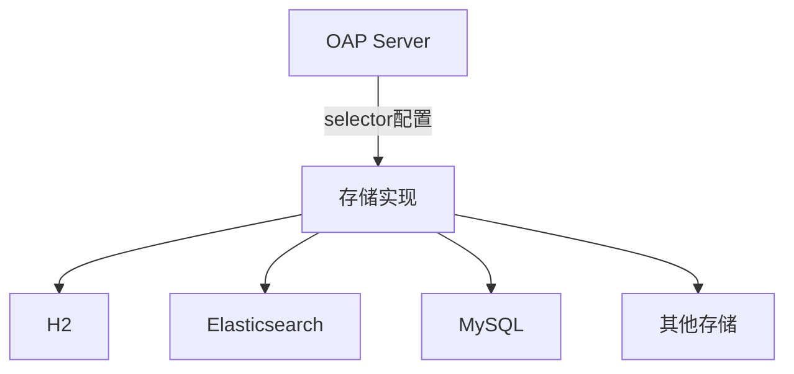

# SkyWalking 后端存储配置

SkyWalking是一个优秀的应用性能监控(APM)系统，其后端存储配置决定了监控数据的持久化和查询效率。本节将详细介绍如何为SkyWalking配置不同的存储后端。

## 存储选项概述

SkyWalking支持多种存储后端，主要包括：

1. **H2（嵌入式数据库，默认选项）**
2. **Elasticsearch（生产推荐）**
3. **MySQL**
4. **TiDB**
5. **PostgreSQL**
6. **InfluxDB**

:::note 生产环境建议
对于生产环境，我们推荐使用Elasticsearch集群作为存储后端，它能提供更好的性能和可扩展性。
:::

## 配置文件位置

所有存储配置都在 `config/application.yml` 文件中。主要配置段如下：

```yaml
storage:
  selector: ${SW_STORAGE:elasticsearch}
  elasticsearch:
    nameSpace: ${SW_NAMESPACE:""}
    clusterNodes: ${SW_STORAGE_ES_CLUSTER_NODES:localhost:9200}
    protocol: ${SW_STORAGE_ES_HTTP_PROTOCOL:"http"}
    # 其他Elasticsearch配置...
```

## 详细配置示例

### 1. H2存储配置（默认）

H2是内置的嵌入式数据库，适合开发和测试环境：

```yaml
storage:
  selector: h2
  h2:
    driver: org.h2.jdbcx.JdbcDataSource
    url: jdbc:h2:mem:skywalking-oap-db
    user: sa
    metadataQueryMaxSize: 5000
```

:::caution H2限制
H2仅适用于小规模测试，不推荐生产使用，因为：
- 数据不会持久化
- 性能有限
- 不支持集群部署
:::

### 2. Elasticsearch配置（生产推荐）

Elasticsearch是最常用的生产级存储方案：

```yaml
storage:
  selector: elasticsearch
  elasticsearch:
    nameSpace: ${SW_NAMESPACE:""}
    clusterNodes: ${SW_STORAGE_ES_CLUSTER_NODES:localhost:9200}
    protocol: ${SW_STORAGE_ES_HTTP_PROTOCOL:"http"}
    user: ${SW_ES_USER:""}
    password: ${SW_ES_PASSWORD:""}
    indexShardsNumber: ${SW_STORAGE_ES_INDEX_SHARDS_NUMBER:1}
    indexReplicasNumber: ${SW_STORAGE_ES_INDEX_REPLICAS_NUMBER:1}
    # 高级配置
    bulkActions: ${SW_STORAGE_ES_BULK_ACTIONS:1000} # 批量操作大小
    flushInterval: ${SW_STORAGE_ES_FLUSH_INTERVAL:10} # 刷新间隔(秒)
    concurrentRequests: ${SW_STORAGE_ES_CONCURRENT_REQUESTS:2} # 并发请求数
```

### 3. MySQL配置

MySQL适合中小规模部署：

```yaml
storage:
  selector: mysql
  mysql:
    properties:
      jdbcUrl: ${SW_JDBC_URL:"jdbc:mysql://localhost:3306/swtest"}
      dataSource.user: ${SW_DATA_SOURCE_USER:root}
      dataSource.password: ${SW_DATA_SOURCE_PASSWORD:root@1234}
      dataSource.cachePrepStmts: true
      dataSource.prepStmtCacheSize: 250
      dataSource.prepStmtCacheSqlLimit: 2048
      dataSource.useServerPrepStmts: true
    metadataQueryMaxSize: 5000
```

:::tip 数据库准备
使用MySQL前需要：
1. 创建数据库（如swtest）
2. 确保用户有足够权限
3. 表结构会在SkyWalking启动时自动创建
:::

## 存储选择器工作机制

SkyWalking通过`selector`配置项决定使用哪种存储实现：



## 实际案例：电商平台配置

假设一个电商平台需要监控其微服务架构，以下是他们的Elasticsearch生产配置：

```yaml
storage:
  selector: elasticsearch
  elasticsearch:
    clusterNodes: es-node1:9200,es-node2:9200,es-node3:9200
    protocol: https
    user: skywalking
    password: "secure_password_123"
    indexShardsNumber: 3
    indexReplicasNumber: 2
    bulkActions: 2000
    flushInterval: 15
    concurrentRequests: 4
    resultWindowMaxSize: 10000
    metadataQueryMaxSize: 5000
```

:::warning 安全提示
1. 永远不要在配置文件中硬编码密码
2. 使用环境变量或配置中心管理敏感信息
3. 生产环境应该使用HTTPS协议
:::

## 高级配置选项

### 索引管理

SkyWalking在Elasticsearch中会创建多种索引：

- `sw_segment-{日期}`：存储追踪数据
- `sw_metrics-{指标名}-{日期}`：存储指标数据
- `sw_service_*`：服务相关元数据

可以通过以下配置调整索引策略：

```yaml
elasticsearch:
  # 索引滚动策略
  dayStep: ${SW_STORAGE_DAY_STEP:1} # 表示以1天为周期创建新索引
  indexShardsNumber: ${SW_STORAGE_ES_INDEX_SHARDS_NUMBER:2}
  indexReplicasNumber: ${SW_STORAGE_ES_INDEX_REPLICAS_NUMBER:0}
  
  # 索引保留策略
  recordDataTTL: ${SW_STORAGE_ES_RECORD_DATA_TTL:90} # 追踪数据保留90天
  metricsDataTTL: ${SW_STORAGE_ES_METRICS_DATA_TTL:45} # 指标数据保留45天
```

## 常见问题排查

1. **连接问题**：
   - 检查网络连通性
   - 验证认证信息
   - 确认存储服务是否正常运行

2. **性能问题**：
   - 增加`bulkActions`和`concurrentRequests`
   - 优化Elasticsearch集群配置
   - 考虑增加分片数量

3. **数据不显示**：
   - 检查OAP日志是否有错误
   - 确认存储选择器配置正确
   - 验证数据是否成功写入存储

## 总结

SkyWalking的后端存储配置是系统稳定运行的关键。通过本节学习，你应该能够：

- 理解不同存储后端的适用场景
- 配置H2、Elasticsearch和MySQL存储
- 调整高级参数优化性能
- 解决常见的存储相关问题

## 延伸学习

1. 尝试在不同存储后端之间迁移数据
2. 研究SkyWalking的存储扩展机制
3. 监控存储性能指标，优化配置参数
4. 探索ShardingSphere等分布式数据库方案

:::tip 练习建议
1. 在本地环境配置Elasticsearch存储
2. 导入测试数据并观察索引创建情况
3. 尝试调整bulkActions参数，观察性能变化
:::