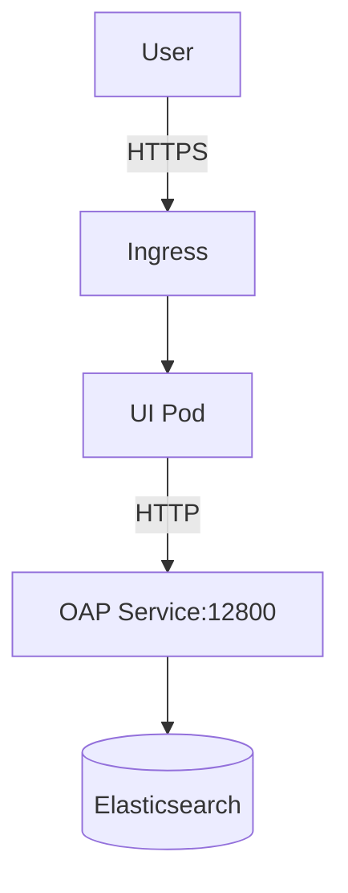

# SkyWalking UI服务配置

## 介绍

SkyWalking UI是Apache SkyWalking的可视化组件，用于展示从服务端收集的分布式追踪、指标和拓扑数据。通过合理配置UI服务，您可以定制数据展示方式、调整可视化效果，并确保与后端数据源的稳定连接。本章将详细介绍UI服务的核心配置项及其应用场景。

---

## 基础配置

UI服务的主要配置文件为 `webapp.yml`，通常位于 `config` 目录下。以下为关键配置项：

```yaml
server:
  port: 8080  # UI服务监听端口

collector:
  path: /graphql  # 后端GraphQL接口路径
  ribbon:
    ReadTimeout: 10000  # 请求超时时间(ms)
    listOfServers: 127.0.0.1:12800  # 后端OAP服务地址

security:
  user:
    admin:  # 默认管理员账号
      password: "admin"  # 建议生产环境修改
```

:::tip 多节点配置
若OAP服务有多个实例，可通过逗号分隔地址：
`listOfServers: 127.0.0.1:12800,127.0.0.2:12800`
:::

---

## 数据源连接

### 1. OAP服务地址配置

确保 `listOfServers` 指向正确的OAP集群地址。若使用域名，需配置DNS解析：

```yaml
collector:
  ribbon:
    listOfServers: skywalking-oap.svc.cluster.local:12800
```

### 2. 跨域配置（CORS）

若UI与OAP不在同域，需在OAP服务端启用CORS：

```yaml
# OAP服务的application.yml
core:
  restHost: 0.0.0.0
  restPort: 12800
  restContextPath: /
  allowOrigin: "*"  # 生产环境应指定具体域名
```

---

## 可视化定制

### 1. 拓扑图配置

调整拓扑图展示参数：

```yaml
ui:
  topology:
    maxNodeSize: 50  # 最大节点显示数量
    defaultMetric: "avg_response_time"  # 默认指标
```

### 2. 时间范围预设

自定义首页时间选择器的默认选项：

```yaml
ui:
  selector:
    duration: 
      - name: "Last 15 Minutes"
        value: "15m"
      - name: "Last 1 Hour"
        value: "1h"
```

---

## 安全配置

### 1. 用户认证

启用基础认证（生产环境推荐使用OAuth）：

```yaml
security:
  enabled: true
  user:
    admin:
      password: "${SW_ADMIN_PASSWORD}"  # 从环境变量读取
```

### 2. HTTPS启用

通过反向代理配置HTTPS（Nginx示例）：

```nginx
server {
    listen 443 ssl;
    server_name skywalking.example.com;
    ssl_certificate /path/to/cert.pem;
    ssl_certificate_key /path/to/key.pem;
    
    location / {
        proxy_pass http://127.0.0.1:8080;
    }
}
```

---

## 实际案例

### 场景：Kubernetes环境部署



对应配置示例：

```yaml
collector:
  ribbon:
    listOfServers: skywalking-oap:12800  # K8s Service名称

ui:
  selector:
    duration: 
      - name: "Last 1 Hour"
        value: "1h"
      - name: "Last 3 Days"
        value: "3d"
```

---

## 总结

关键配置要点：
1. 确保 `listOfServers` 指向有效的OAP服务地址
2. 生产环境必须配置安全认证
3. 通过 `ui` 节点定制可视化效果
4. 分布式环境注意网络连通性和CORS配置

---

## 扩展练习

1. 尝试将UI默认时区改为UTC+8
2. 配置OAuth2.0认证集成
3. 创建一个自定义的指标展示面板

参考资源：
- [SkyWalking官方配置文档](https://skywalking.apache.org/docs/)
- [GraphQL API参考](https://skywalking.apache.org/docs/main/latest/en/api/query-protocol/)