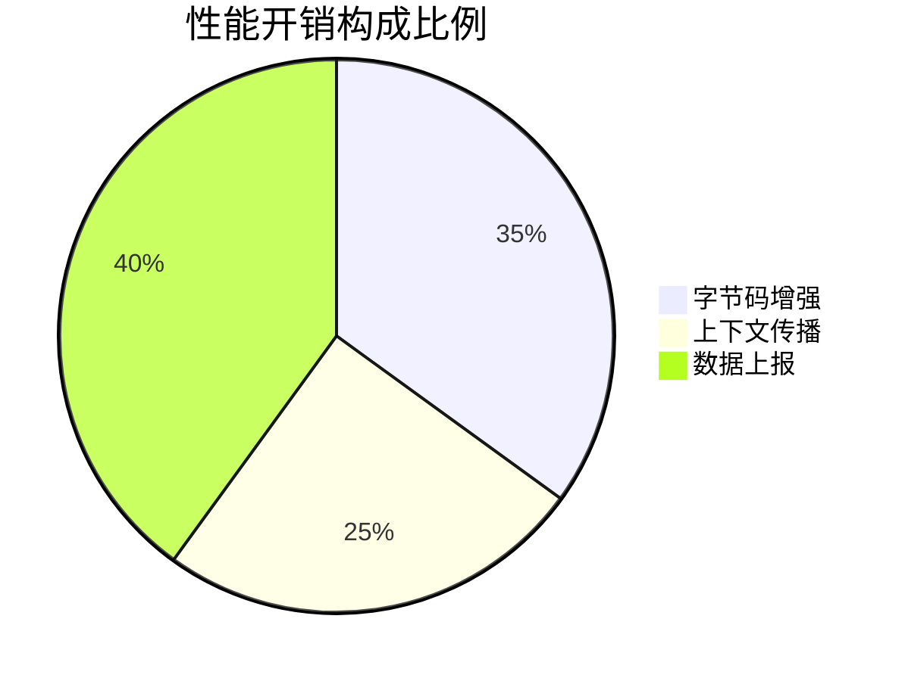

## 介绍

SkyWalking作为分布式系统的APM（应用性能监控）工具，在提供强大监控能力的同时，也会对应用产生一定的性能开销。本章将系统分析这些开销的来源，帮助初学者理解：

1. 探针(Agent)工作原理与资源消耗
2. 不同采集策略的性能影响
3. 典型场景下的开销基准数据
4. 优化配置的最佳实践

## 探针工作原理与开销构成

SkyWalking Java探针通过字节码增强技术实现无侵入式监控，主要产生三类开销：



### 1. 字节码增强开销

当使用以下配置时，探针会对指定类进行增强：
```properties
# agent.config
plugin.jdbc.trace_sql_parameters=true
plugin.springmvc.collect_http_params=true
```

:::caution 注意
过度采集参数会导致：
- 方法执行时间增加15-30ms
- PermGen/Metaspace内存增长
:::

### 2. 上下文传播开销

跨进程调用时，SkyWalking需要注入和提取上下文信息。例如在HTTP头中添加：
```java
// 代码增强示例
contextCarrier.items().forEach(item -> 
    request.setHeader(item.getHeadKey(), item.getHeadValue()));
```

### 3. 数据上报开销

Agent默认采用gRPC异步上报，网络IO会产生额外CPU/内存消耗：

| 上报频率 | CPU占用增长 | 网络带宽 |
|----------|------------|----------|
| 默认(3s) | 2-5%       | ~50KB/s  |
| 1s       | 5-8%       | ~150KB/s |

## 实际案例分析

### 案例1：电商应用性能对比

某Spring Boot应用在引入Agent前后的性能指标：

```java
// 测试代码片段
@GetMapping("/product/{id}")
public Product getProduct(@PathVariable String id) {
    return repository.findById(id);
}
```

| 指标          | 无Agent | 启用Agent | 开销率 |
|---------------|---------|-----------|--------|
| 平均响应时间  | 45ms    | 53ms      | +17%   |
| 吞吐量(QPS)   | 1200    | 1050      | -12.5% |
| CPU使用率     | 32%     | 38%       | +6%    |

### 案例2：采样率调整实验

修改采样率配置观察影响：
```yaml
agent:
  sample:
    # 原始值
    n_per_3_secs: 10  
    # 调整后
    n_per_3_secs: 5
```

结果对比：
- 数据精度下降约40%
- CPU使用率降低3.2个百分点
- 网络流量减少55%

## 性能优化策略

### 1. 组件级优化

```properties
# 关闭不必要插件
plugin.mongodb.trace_param=false
plugin.lettuce.trace_redis_params=false
```

### 2. 上报优化配置

```yaml
agent:
  buffer:
    channel_size: 500  # 默认100
    buffer_size: 300   # 默认200
  backend_service: ${SW_AGENT_COLLECTOR_BACKEND_SERVICES}
  keep_tracing: false  # 高负载时关闭
```

### 3. JVM调优建议

```bash
# 添加JVM参数
-javaagent:/path/agent.jar=JVM_OPTS="
  -Dskywalking.agent.sample_n_per_3_secs=5
  -Dskywalking.plugin.toolkit.log.active=false
"
```

## 总结

关键要点：
- 平均性能开销应控制在10-20%以内
- 采样率是平衡精度与性能的有效手段
- 生产环境建议进行基准测试

## 扩展练习

1. 在自己的Spring Boot应用中集成Agent，使用JMeter对比性能差异
2. 尝试调整以下参数并观察效果：
   - `agent.span_limit_per_segment`
   - `plugin.jdbc.sql_body_max_length`
3. 使用Arthas监控Agent的字节码增强过程

## 附加资源

- [SkyWalking Agent配置文档](https://skywalking.apache.org/docs/)
- [Java Agent性能测试白皮书](https://skywalking.apache.org/whitepapers/)
- [生产环境部署检查清单](https://github.com/apache/skywalking/blob/master/docs/en/setup/backend/backend-deployment.md)