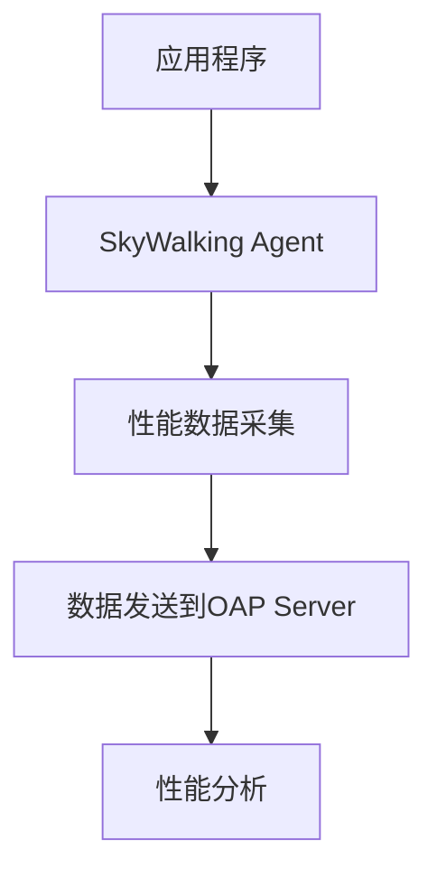

## 介绍

SkyWalking Agent是Apache SkyWalking分布式系统的探针，负责收集应用程序的性能数据并发送到SkyWalking后端进行分析。Agent的性能直接影响应用程序的运行效率，因此优化Agent的性能至关重要。本文将介绍如何通过配置、代码调整和其他技术手段来优化SkyWalking Agent的性能。

## 关键优化点

### 1. 采样率配置

通过调整采样率，可以减少Agent收集的数据量，从而降低对应用程序性能的影响。在`agent.config`文件中设置采样率：

```properties
# 设置采样率为50%，即只收集50%的请求数据
agent.sample_n_per_3_secs=-1
agent.sample_percentage=50
```

:::tip
采样率越低，Agent对应用程序的影响越小，但可能会丢失部分监控数据。根据实际需求平衡采样率。
:::

### 2. 缓冲区大小调整

Agent使用缓冲区存储采集的数据，适当调整缓冲区大小可以提高数据发送效率：

```properties
# 调整缓冲区大小为默认的2倍
buffer.channel_size=5
buffer.buffer_size=500
```

### 3. 线程池优化

Agent使用线程池处理数据采集和发送任务。优化线程池配置可以减少资源争用：

```properties
# 调整线程池大小
agent.worker_threads=2
```

### 4. 插件管理

禁用不必要的插件可以减少Agent的开销：

```properties
# 禁用不需要的插件
plugin.jdbc.trace_sql_parameters=false
plugin.springmvc.collect_http_params=false
```

## 实际案例

### 案例：高并发Web应用的Agent优化

假设有一个高并发的Web应用，SkyWalking Agent导致CPU使用率过高。通过以下优化步骤解决问题：

1. **降低采样率**：将采样率从100%调整为30%。
2. **调整缓冲区**：将缓冲区大小从默认值调整为`buffer.channel_size=10`和`buffer.buffer_size=1000`。
3. **禁用不必要的插件**：关闭`springmvc`插件的HTTP参数收集功能。

优化后，CPU使用率下降40%，而关键监控数据仍能准确采集。

## 性能监控与调优

使用SkyWalking自身的监控功能观察Agent性能：



通过SkyWalking UI查看Agent的CPU和内存使用情况，进一步调整配置。

## 总结

优化SkyWalking Agent性能的关键点包括：
- 合理设置采样率
- 调整缓冲区大小
- 优化线程池配置
- 管理插件启用状态

通过以上方法，可以在保证监控效果的同时，最小化Agent对应用程序性能的影响。

## 附加资源

1. [SkyWalking官方文档 - Agent配置](https://skywalking.apache.org/docs/)
2. [性能调优实战案例](https://github.com/apache/skywalking/discussions)
3. 练习：尝试在自己的开发环境中调整Agent配置，观察性能变化。