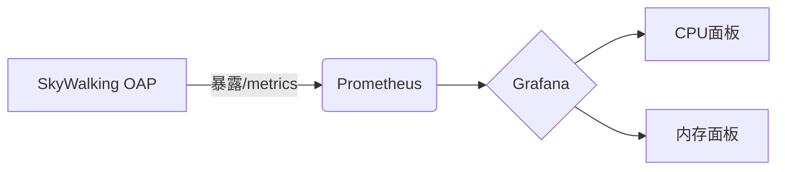

## 介绍

SkyWalking作为分布式系统的APM（应用性能监控）工具，其自身的资源占用情况直接影响监控的稳定性和准确性。本章将介绍如何监控SkyWalking各组件的资源消耗（如CPU、内存、磁盘I/O等），并通过实际案例展示调优方法。

:::note
资源占用监控是性能调优的基础，帮助定位瓶颈并避免因资源不足导致的服务中断。
:::

---

## 关键监控指标

SkyWalking的核心组件（OAP Server、Storage、UI）需监控以下资源：

1. **CPU使用率**：处理追踪数据的计算负载。
2. **内存占用**：JVM堆内存与非堆内存的使用情况。
3. **磁盘I/O**：写入查询日志和指标数据的吞吐量。
4. **网络带宽**：Agent与OAP Server之间的数据传输量。

---

## 监控方法

### 1. 使用内置指标
SkyWalking OAP Server暴露了Prometheus格式的指标，可通过以下配置启用：

```yaml
# config/application.yml
core:
  default:
    prometheusRule:
      enabled: true
      endpoint: "/metrics"
```

访问 `http://<oap-server>:12800/metrics` 获取实时数据，示例输出片段：
```text
# HELP jvm_memory_bytes_used Used bytes of a given JVM memory area.
# TYPE jvm_memory_bytes_used gauge
jvm_memory_bytes_used{area="heap"} 1.2e+08
```

### 2. JVM监控
通过JVM参数记录GC日志，分析内存波动：
```bash
# 启动OAP时添加参数
java -XX:+UseG1GC -Xloggc:gc.log -XX:+PrintGCDetails -jar oap-service.jar
```

---

## 实际案例

### 场景：OAP Server内存泄漏
**现象**：UI展示延迟，`jvm_memory_bytes_used`持续增长。

**排查步骤**：
1. 通过 `jstat -gc <pid>` 确认老年代内存未释放：
   ```bash
   S0C    S1C    ...   OGCMN    OGCMX     OGC      OC       YGC   FGC
   0.0    1024   ...   86016    172032    172032   172032   15    5
   ```
2. 使用 `jmap -histo:live <pid>` 发现大量 `TraceSegment` 对象未释放。

**解决方案**：调整OAP的接收缓冲区大小：
```yaml
# config/application.yml
receiver-buffer:
  size: 4096 # 默认8192，减少缓冲队列长度
```

---

## 可视化监控

通过Grafana集成Prometheus数据，创建仪表盘：



关键面板配置：
- **JVM内存**：`sum(jvm_memory_bytes_used{area="heap"}) by (instance)`
- **线程数**：`jvm_threads_current`

---

## 总结

- 定期检查OAP Server的GC日志和Prometheus指标。
- 根据负载动态调整JVM参数和缓冲区配置。
- 使用可视化工具（如Grafana）建立长期监控机制。

---

## 扩展练习

1. 部署Prometheus并采集SkyWalking的`/metrics`端点数据。
2. 模拟高负载场景（使用JMeter发送大量追踪数据），观察资源变化曲线。
3. 尝试调整 `receiver-buffer.size`，对比内存占用差异。

:::tip
进阶学习：研究SkyWalking的[动态配置功能](https://skywalking.apache.org/docs/)，实现资源阈值的自动告警。
:::