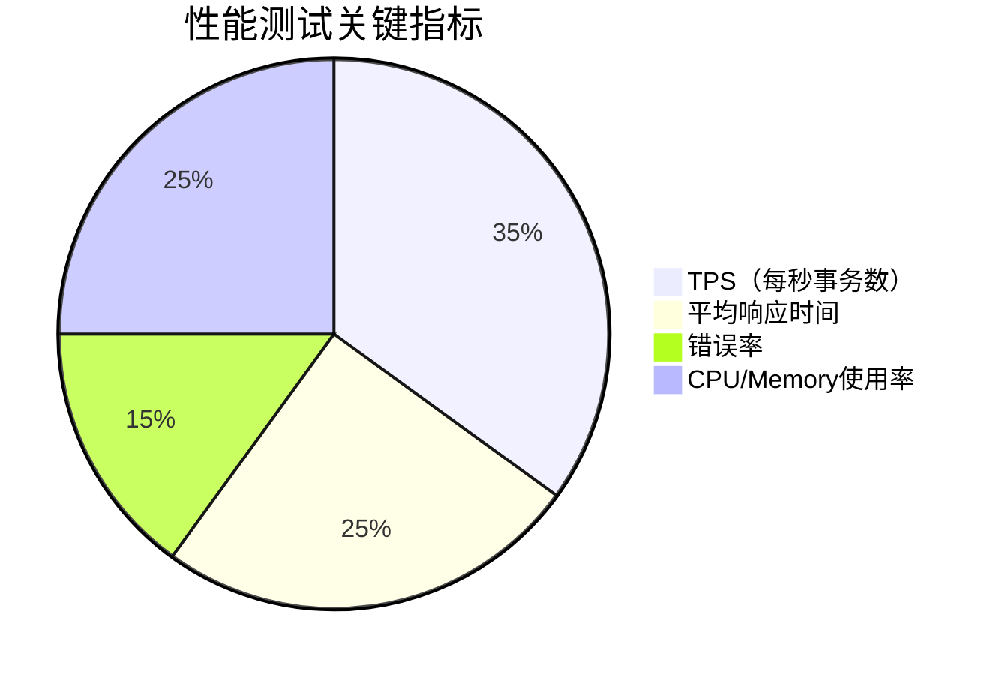

# SkyWalking 性能基准测试

## 介绍

SkyWalking作为一款分布式系统的应用性能监控（APM）工具，其自身性能直接影响监控数据的准确性和系统开销。性能基准测试（Benchmark Testing）是通过模拟真实场景，量化评估SkyWalking在不同负载下的表现（如吞吐量、延迟、资源占用等），为调优提供数据支撑。

:::tip 为什么需要基准测试？
- 验证SkyWalking在高并发场景下的稳定性
- 发现潜在的性能瓶颈（如存储层、网络通信）
- 为生产环境容量规划提供依据
:::

## 核心测试指标



## 测试工具与方法

### 1. 使用SkyWalking官方测试工具

SkyWalking提供[skywalking-client-tool](https://github.com/apache/skywalking-client-tool)模拟Agent上报数据：

```bash
# 启动压测（模拟100个Agent，持续10分钟）
./swctl profile --agent=100 --duration=10m
```

典型输出报告：
```text
TPS: 12500
Avg Latency: 45ms
Error Rate: 0.2%
Storage CPU Usage: 68%
```

### 2. 结合JMeter测试

示例测试计划：
1. 配置HTTP请求到SkyWalking OAP服务
2. 使用CSV数据文件模拟不同服务的数据
3. 添加聚合报告监听器

```java
// 示例JMeter Groovy脚本片段
sampler.addArgument("serviceName", "模拟服务_${__Random(1,100)}")
sampler.addArgument("latency", "${__Random(500,2000)}")
```

## 实际测试案例

### 案例：存储层性能对比

| 存储类型 | 写入TPS | 查询延迟 | 资源占用 |
|---------|--------|----------|----------|
| H2      | 8,000  | 120ms    | 低       |
| ES 7.x  | 15,000 | 65ms     | 中       |
| TiDB    | 12,000 | 80ms     | 中高     |

:::caution 测试环境一致性
确保所有测试在相同硬件配置下进行，建议使用Docker容器固定环境变量：
```dockerfile
environment:
  - SW_STORAGE=elasticsearch
  - SW_ES_URIS=elasticsearch:9200
```
:::

## 结果分析与优化

### 常见瓶颈点
1. **网络带宽不足**：Agent与OAP间大量数据传输
   - 优化：启用gzip压缩
   ```yaml
  agent.config:
    protocol: grpc
    gRPC:
      enable_compression: true
  ```

2. **ES索引性能下降**
   - 优化：调整分片数和刷新间隔
   ```json
  PUT _template/sw_template
  {
    "index.refresh_interval": "30s",
    "number_of_shards": 3
  }
  ```

## 总结与练习

### 关键总结
- 基准测试应覆盖典型生产场景
- 重点关注TPS、延迟、错误率三要素
- 存储选择对性能影响显著

### 扩展练习
1. 使用Docker Compose搭建测试环境
2. 对比不同采样率(10% vs 100%)的性能差异
3. 测试OAP集群扩展后的线性提升比例

### 附加资源
- [SkyWalking Benchmark Config](https://github.com/apache/skywalking/tree/master/oap-server/server-bootstrap/src/main/resources/benchmark)
- [JMeter官方文档](https://jmeter.apache.org/)