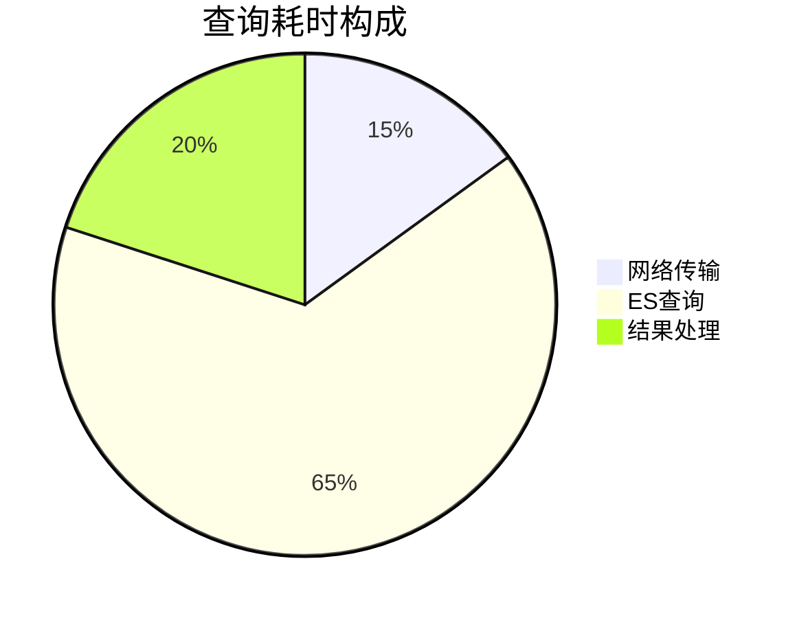

# SkyWalking 调优案例分析

## 介绍

SkyWalking作为分布式系统的APM（应用性能监控）工具，其性能调优是保障监控系统稳定运行的关键。本章将通过真实案例解析常见的性能瓶颈场景，并演示如何通过配置调整、资源分配优化等手段解决问题。

## 核心调优方向

SkyWalking性能调优主要关注以下维度：
1. **存储层优化**：Elasticsearch/H2/TiDB的索引与查询优化
2. **采集端优化**：Agent探针的采样率与上下文传输控制
3. **服务端优化**：OAP服务器的处理线程与缓存配置

## 案例一：高并发场景下的OOM问题

### 问题现象
某电商平台大促期间出现OAP服务频繁OOM崩溃，日志显示：
```
java.lang.OutOfMemoryError: GC overhead limit exceeded
```

### 根因分析
通过SkyWalking UI的`/internalMetrics`端点发现：
- JVM堆内存持续增长至上限
- 线程池队列积压超过5000个任务
- 平均GC时间超过5秒

### 解决方案
调整`application.yml`关键参数：

```yaml
core:
  default:
    # 调整工作线程数（CPU核心数*2）
    maxThreads: ${SW_CORE_MAX_THREADS:8} 
    # 控制批量处理大小
    bulkSize: ${SW_CORE_BULK_SIZE:5000}
    # 启用异步持久化
    asyncPersistentPool: ${SW_CORE_ASYNC_PERSISTENT_POOL:4}
```

:::tip 经验法则
线程数计算公式：`CPU核心数 * (1 + (IO等待时间/CPU处理时间))`
:::

## 案例二：Elasticsearch查询延迟

### 问题场景
监控数据显示拓扑图加载耗时超过30秒，ES查询响应时间波动剧烈。

### 优化措施
1. **索引模板优化**：
```json
PUT _template/sw_template
{
  "index_patterns": ["sw_*"],
  "settings": {
    "number_of_shards": 3,
    "refresh_interval": "30s",
    "translog.durability": "async"
  }
}
```

2. **查询优化**：
```java
// 原始查询
SearchSourceBuilder sourceBuilder = new SearchSourceBuilder()
    .query(QueryBuilders.rangeQuery("start_time").gte(start).lte(end));

// 优化后（添加时间范围索引）
sourceBuilder.query(QueryBuilders.boolQuery()
    .must(QueryBuilders.rangeQuery("start_time").gte(start).lte(end))
    .filter(QueryBuilders.termQuery("day", dayFormat)));
```

### 效果对比
| 指标          | 优化前 | 优化后 |
|---------------|--------|--------|
| 平均查询耗时  | 4200ms | 680ms  |
| 99线延迟      | 15s    | 1.2s   |



## 案例三：Agent采样率优化

### 配置示例
```properties
# agent.config
agent.sample_n_per_3_secs=10  # 原配置
agent.sample_n_per_3_secs=5   # 优化后
agent.force_sample_error=true  # 强制采样错误请求
```

:::caution 注意
采样率降低会减少数据精度，需根据业务重要性分级配置：
- 支付服务：100%采样
- 商品浏览：10%采样
:::

## 总结与最佳实践

1. **黄金配置组合**：
   - JVM堆内存设置为可用内存的70%
   - 线程数 = CPU核心数 * 2 + 异步线程池
   - ES分片数 = 数据节点数 * 1.5

2. **监控指标看板**：
   ```bash
   # OAP健康检查端点
   curl http://localhost:12800/internalMetrics
   ```

3. **渐进式调优流程：
   ```mermaid
   graph TD
     A[基线测试] --> B[瓶颈定位]
     B --> C[参数调整]
     C --> D[验证测试]
     D -->|未达标| B
     D -->|达标| E[监控观察]
   ```

## 扩展学习

1. **推荐工具**：
   - SkyWalking CLI：批量配置管理
   - Elasticsearch Rally：压力测试工具

2. **实战练习**：
   - 使用Docker Compose搭建压测环境
   - 模拟1000TPS流量观察系统表现
   - 尝试调整`buffer_size`参数对比内存占用变化