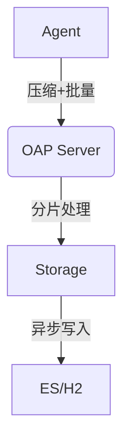

## 简介

SkyWalking作为分布式系统的APM（应用性能监控）工具，其网络传输性能直接影响监控数据的实时性和系统整体负载。本章将介绍如何通过优化网络传输配置、选择合适的协议以及调整数据采样策略来提升SkyWalking的性能。

## 网络传输基础

SkyWalking的网络传输主要包括以下组件：
1. **Agent与OAP Server**：探针将监控数据发送到后端服务。
2. **OAP Server集群节点间通信**：分布式部署时的内部数据传输。
3. **Storage与OAP Server**：监控数据存储时的网络交互。

## 关键优化点

### 1. 协议选择与压缩

SkyWalking默认使用gRPC协议传输数据，支持以下优化手段：

```yaml
# agent.config示例
agent.protocol=grpc
agent.grpc.enable_compression=true  # 启用gRPC压缩
```

:::tip
压缩虽会增加少量CPU开销，但在高延迟网络中可显著减少传输时间。
:::

### 2. 批量传输配置

调整Agent的批量上报策略：

```properties
# 控制每批Trace数据的最大数量
agent.trace.max_message_size=10240
# 批量上报间隔（毫秒）
agent.buffer.channel_size=5000
```

### 3. 网络缓冲与超时

OAP Server的gRPC配置优化（`application.yml`）：

```yaml
core:
  default:
    gRPC:
      # 接收窗口大小（字节）
      netty.receive.window_size: 32MB
      # 连接超时（秒）
      max_connection_age: 600
```

## 实际案例

### 案例：电商大促期间的优化

**问题场景**：
- 每秒10万级Span数据
- OAP Server节点出现TCP重传

**解决方案**：
1. 启用gzip压缩，网络流量减少60%：
   ```yaml
   agent.grpc.compression_type=gzip
   ```
2. 调整批处理窗口从5秒降至3秒，降低内存压力
3. 增加OAP Server的gRPC工作线程：
   ```yaml
   core:
     default:
       gRPC:
         worker_threads: 16
   ```



## 高级调优

### 4. 内核参数调优（Linux）

对于生产环境，建议调整OS参数：
```bash
# 增加TCP缓冲区大小
sysctl -w net.core.rmem_max=16777216
sysctl -w net.core.wmem_max=16777216
```

### 5. 网络拓扑优化

通过部署架构减少网络跳数：
- 将OAP Server与Agent部署在同一可用区
- 使用专线连接跨区域节点

:::caution
避免将OAP Server暴露在公网，应通过内网负载均衡分发流量。
:::

## 总结

| 优化方向       | 典型配置项                     | 预期效果               |
|----------------|-------------------------------|-----------------------|
| 协议压缩       | `agent.grpc.enable_compression` | 减少30%-70%网络流量   |
| 批量处理       | `agent.buffer.channel_size`    | 降低50%的RPC调用次数  |
| 资源分配       | `gRPC.worker_threads`          | 提升20%吞吐量         |

## 延伸学习

1. **实践练习**：
   - 使用Wireshark抓包分析gRPC流量
   - 对比启用压缩前后的网络带宽占用

2. **推荐工具**：
   - `iftop` 实时监控网络流量
   - `grpc_health_probe` 测试gRPC服务状态

3. **后续学习路径**：
   - SkyWalking存储引擎优化
   - 分布式追踪采样策略