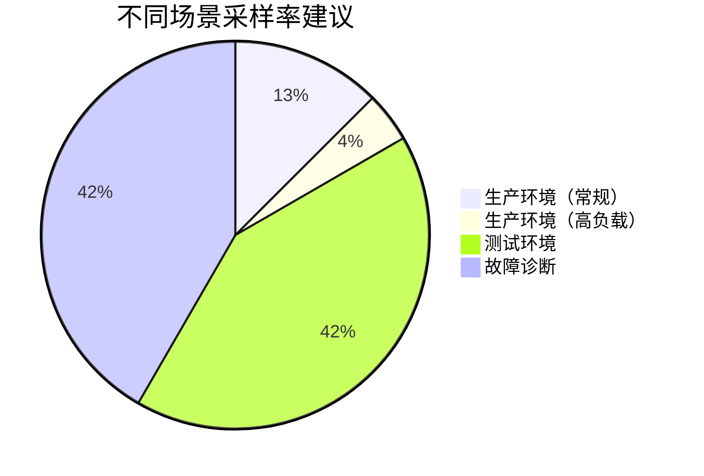

## 介绍

在分布式系统监控中，**采样率（Sampling Rate）**决定了SkyWalking收集和上报数据的频率。高采样率能提供更精确的监控数据，但会增加系统负载；低采样率则相反。本文将指导你如何根据业务需求调整采样率。

:::tip 关键概念
采样率 = 采集的请求数 / 总请求数 × 100%（例如 30% 表示每10个请求采样3次）
:::

---

## 采样率配置方式

### 1. 动态配置（推荐）
通过SkyWalking的**动态配置API**或**配置文件**调整采样率：

```yaml
# agent.config 示例
agent.sample_n_per_3_secs=10  # 每3秒最多采样10次
```

或通过环境变量：
```bash
export SW_AGENT_SAMPLE_N_PER_3_SECS=5
```

### 2. 静态配置
在服务启动时指定JVM参数：
```bash
-javaagent:/path/to/skywalking-agent.jar=agent.sample_n_per_3_secs=15
```

---

## 实战场景

### 场景1：高并发电商系统
**需求**：大促期间需降低监控开销  
**方案**：将采样率从100%调整为20%  
```yaml
agent.sample_n_per_3_secs=200  # 假设QPS=1000，则采样率≈20%
```

### 场景2：调试低延迟金融系统
**需求**：需要完整追踪关键交易  
**方案**：对特定服务设置100%采样  
```java
// 使用@Trace注解强制采样
@Trace(operationName = "payment_process", tags = {"amount"})
public void processPayment(double amount) {
    // 业务逻辑
}
```

---

## 采样策略对比



---

## 性能影响测试

通过`wrk`压测对比不同采样率的CPU占用：

| 采样率 | CPU占用 | 存储消耗 |
|--------|---------|----------|
| 100%   | 18%     | 120MB/s  |
| 50%    | 12%     | 60MB/s   |
| 10%    | 8%      | 12MB/s   |

:::caution 注意
采样率低于5%可能导致监控数据不具统计意义！
:::

---

## 总结

1. **常规生产环境**：建议10%-30%采样率  
2. **调试期间**：可临时提高至100%  
3. 使用`agent.sample_n_per_3_secs`实现动态调整  

---

## 扩展练习

1. 在测试环境尝试修改采样率并观察监控数据变化  
2. 使用SkyWalking的`/sampling`端点实时调整采样率  
3. 对比不同采样率下的追踪数据完整性  

:::note 附加资源
- [SkyWalking官方采样配置文档](https://skywalking.apache.org/docs/)
- 《分布式系统观测性》第4章
:::