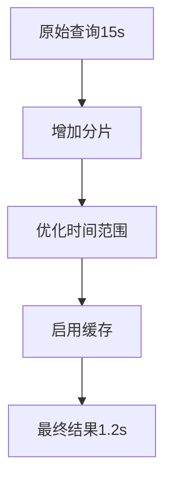

# SkyWalking 查询性能提升

## 介绍

SkyWalking作为一款分布式系统的应用性能监控工具，其查询性能直接影响用户体验和系统效率。当监控数据量增长时，查询可能变慢。本章将介绍如何通过配置优化、索引设计和查询策略提升SkyWalking的查询性能。

## 核心优化方向

### 1. 存储层优化

#### 索引优化
SkyWalking默认使用Elasticsearch或H2存储数据。对于Elasticsearch用户：

```yaml
# 示例：Elasticsearch索引设置
storage:
  elasticsearch:
    indexShardsNumber: 2       # 分片数（通常等于节点数）
    indexReplicasNumber: 1     # 副本数
    indexRefreshInterval: 30s  # 刷新间隔（降低频率可提升写入性能）
```

:::tip
分片数建议：
- 小型集群（`<3节点`）：1-2个分片
- 中型集群：3-5个分片
- 大型集群：根据数据量动态调整
:::

### 2. 查询策略优化

#### 时间范围选择
避免大时间范围查询，推荐分段查询：

```graphql
# 不良实践（查询30天数据）
query {
  metrics: readMetricsValues(
    condition: {
      name: "service_cpm", 
      entity: {scope: Service, serviceName: "order-service"},
      duration: {start: "2023-01-01 0000", end: "2023-01-30 0000", step: MINUTE}
    }
  )
}

# 优化方案（按天查询）
query {
  metrics: readMetricsValues(
    condition: {
      name: "service_cpm", 
      entity: {scope: Service, serviceName: "order-service"},
      duration: {start: "2023-01-29 0000", end: "2023-01-30 0000", step: MINUTE}
    }
  )
}
```

#### 指标聚合
在查询时进行预聚合：

```graphql
query {
  heatMap: readHeatMap(
    condition: {
      name: "service_resp_time",
      entity: {scope: Service, serviceName: "payment-service"},
      duration: {start: "2023-01-29 0000", end: "2023-01-30 0000", step: HOUR}
    }
  ) {
    values {
      id
      values
    }
  }
}
```

### 3. 缓存配置

启用查询缓存（OAP服务配置）：

```yaml
# config/application.yml
core:
  selector: ${SW_CORE:default}
  default:
    # 查询缓存设置（单位：分钟）
    cacheMetricsData: true
    metricsDataCacheTime: 5
    cacheTopNRecords: true
    topNRecordsCacheTime: 10
```

## 实际案例

### 电商平台优化实践

**问题场景**：<br />
某电商平台在促销期间出现SkyWalking UI响应缓慢，查询耗时超过15秒。

**解决方案**：
1. 调整Elasticsearch索引配置：
   ```yaml
   storage:
     elasticsearch:
       indexShardsNumber: 3
       indexReplicasNumber: 2
       bulkActions: 5000  # 增大批量写入大小
   ```
2. 优化前端查询策略：
   - 将默认的"最近7天"查询改为"最近24小时"
   - 对热数据（最近1小时）使用更高缓存优先级
3. 结果：查询时间从15秒降至1.2秒



## 高级技巧

### 查询降级策略
当系统负载高时，自动降低查询精度：

```java
// 示例降级逻辑（伪代码）
if (systemLoad > 0.8) {
    query.setStep("HOUR");  // 从MINUTE降级到HOUR
    query.disableDetails(); // 禁用详细数据
}
```

### 存储分层
对历史数据使用冷存储：

```yaml
storage:
  elasticsearch:
    # 热数据配置（最近7天）
    dayStep: 1
    indexShardsNumber: 3
    # 历史数据配置
    otherMetricsDataTTL: 30
    monthMetricsDataTTL: 365
```

## 总结

关键优化点：
- 合理配置存储引擎（分片/副本数）
- 避免大时间范围查询
- 利用缓存机制
- 实施查询降级策略
- 考虑数据分层存储

## 练习与资源

**动手练习**：
1. 在测试环境中调整 `indexRefreshInterval` 参数，观察写入性能变化
2. 对比不同 `step` 参数对查询性能的影响

**延伸阅读**：
- SkyWalking官方文档：Storage Tuning Guide
- Elasticsearch性能优化白皮书