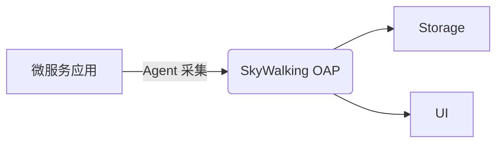
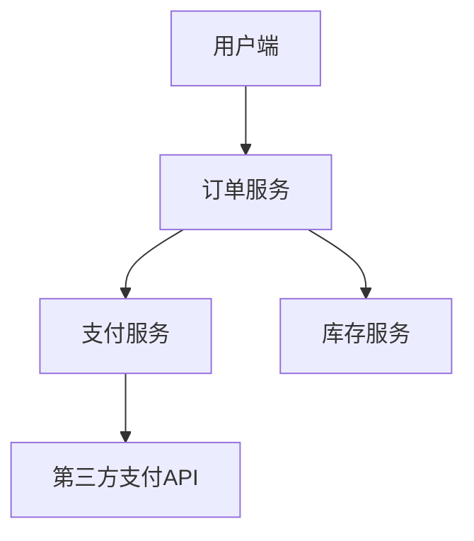

## 介绍

SkyWalking 是一款开源的 **应用性能监控（APM）** 工具，专为微服务、云原生和容器化架构设计。它通过分布式追踪、服务拓扑分析和指标聚合，帮助开发者快速定位性能瓶颈。本章将介绍如何在实际微服务项目中落地 SkyWalking 的最佳实践。

## 核心概念

### 1. 架构概览
SkyWalking 的核心组件包括：
- **探针（Agent）**：集成到应用中收集数据。
- **OAP（Observability Analysis Platform）**：处理和分析数据。
- **UI**：可视化监控结果。



### 2. 关键监控指标
- **请求响应时间**（P99/P95）
- **服务依赖拓扑**
- **JVM/CLR 运行时指标**
- **数据库调用追踪**

---

## 最佳实践步骤

### 步骤1：Agent 集成
以 Spring Boot 应用为例，通过 `JVM 参数` 启动 Agent：

```bash
java -javaagent:/path/to/skywalking-agent.jar \
     -Dskywalking.agent.service_name=your-service-name \
     -Dskywalking.collector.backend_service=127.0.0.1:11800 \
     -jar your-app.jar
```

:::tip 命名规范
服务名（`service_name`）建议使用 `{部门}-{项目}-{环境}` 格式，例如 `payment-service-prod`。
:::

### 步骤2：配置采样率
在 `agent.config` 中调整采样率，避免高流量下的性能开销：

```properties
agent.sample_n_per_3_secs=10  # 每3秒最多采样10条
```

### 步骤3：自定义追踪
手动记录业务方法（Java 示例）：

```java
@GetMapping("/order")
public String createOrder() {
    // 创建自定义追踪 span
    Span span = ContextManager.createLocalSpan("business/createOrder");
    try {
        // 业务逻辑...
        return "success";
    } finally {
        span.tag("status", "completed");
        span.end();
    }
}
```

---

## 实际案例

### 场景：电商订单链路追踪
**问题**：用户投诉“下单缓慢”，但无法定位是支付、库存还是物流服务导致延迟。

**解决方案**：
1. 通过 SkyWalking UI 查看 **服务拓扑图**，发现支付服务 P99 响应时间高达 2 秒。
2. 下钻分析支付服务的 **Trace 详情**，定位到某个第三方 API 调用超时。
3. 优化该 API 的熔断策略后，整体延迟下降 60%。



---

## 总结

### 关键要点
- 合理规划服务命名和采样率
- 结合自动追踪与手动埋点
- 优先关注 **黄金指标**（延迟、错误率、吞吐量）

### 扩展练习
1. 尝试在本地启动 SkyWalking Docker 环境并接入一个 Spring Boot 应用。
2. 使用 `@Trace` 注解标记一个方法，观察其在 UI 中的展示效果。

### 附加资源
- [SkyWalking 官方文档](https://skywalking.apache.org/docs/)
- 《微服务监控实战》电子书（第 4 章）