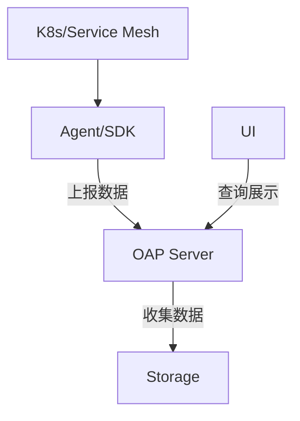
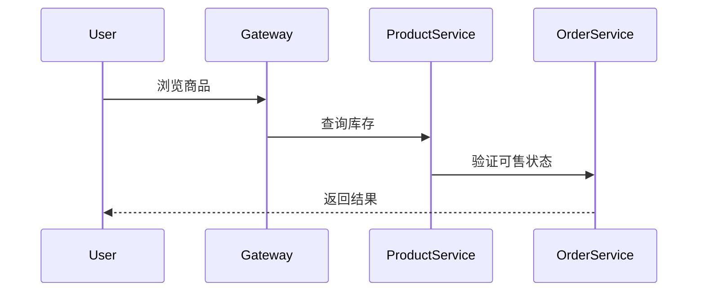

## 概述

SkyWalking作为一款开源的APM（应用性能监控）系统，在容器化环境中能够有效监控微服务架构的性能指标和调用链路。本章将指导您完成从基础部署到高级配置的全流程实践，重点解决容器环境下的监控挑战。

## 容器环境监控的核心组件



:::note 组件说明
- **OAP Server**：数据处理和分析中心
- **Storage**：支持Elasticsearch/H2/TiDB等存储后端
- **Agent**：自动埋点的探针组件
- **UI**：可视化控制台
:::

## 部署实践

### 1. 使用Helm部署OAP集群

```bash
helm repo add skywalking https://apache.jfrog.io/artifactory/skywalking-helm
helm install skywalking skywalking/skywalking \
  --set oap.replicas=3 \
  --set storage.type=elasticsearch
```

典型输出：
```
NAME: skywalking
STATUS: deployed
```

### 2. 容器应用接入Agent

Java应用Dockerfile示例：
```dockerfile
FROM openjdk:11-jre
COPY skywalking-agent/ /skywalking/agent/
ENTRYPOINT ["java", "-javaagent:/skywalking/agent/skywalking-agent.jar", 
           "-Dskywalking.agent.service_name=my-service",
           "-Dskywalking.collector.backend_service=oap:11800",
           "-jar", "/app.jar"]
```

:::caution 注意事项
- 确保Agent版本与OAP Server兼容
- 生产环境建议使用环境变量动态配置
:::

## 关键配置项

### 服务发现配置（K8s环境）

`agent.config` 片段：
```properties
agent.namespace=${SW_AGENT_NAMESPACE:default}
agent.service_name=${SW_AGENT_NAME:${K8S_POD_NAME:-unknown}}
collector.backend_service=${SW_OAP_ADDRESS:$(OAP_SERVICE_HOST):11800}
```

### 采样率控制
```yaml
# values.yaml 配置片段
oap:
  env:
    SW_TRACING_SAMPLE_RATE: 0.5  # 50%采样
```

## 真实案例：电商系统监控



监控要点：
1. 网关层延迟监控
2. 服务间调用成功率
3. 容器资源使用率关联

## 高级技巧

### 自动注入Sidecar（Istio环境）
```yaml
# Annotation配置示例
template:
  metadata:
    annotations:
      sidecar.skywalking.apache.org/inject: "true"
      sidecar.skywalking.apache.org/initcontainer: "true"
```

### 自定义指标采集
Java Agent插件配置：
```xml
<!-- skywalking-agent/plugins/your-plugin.xml -->
<plugin name="your_plugin">
    <metrics>
        <metric name="custom_metric" type="GAUGE">
            <property name="source" value="your.source"/>
        </metric>
    </metrics>
</plugin>
```

## 总结与资源

### 关键收获
- 掌握容器化部署的三种模式：Sidecar/Agent/Service Mesh
- 理解环境变量配置的最佳实践
- 学会关联容器指标与业务指标

### 延伸学习
1. [SkyWalking官方Docker指南](https://skywalking.apache.org/docs/)
2. Kubernetes Operator部署模式
3. eBPF无侵入式监控方案

### 练习建议
1. 在Minikube环境中部署完整监控栈
2. 对比H2与ES存储的性能差异
3. 实现自定义业务指标的采集和告警