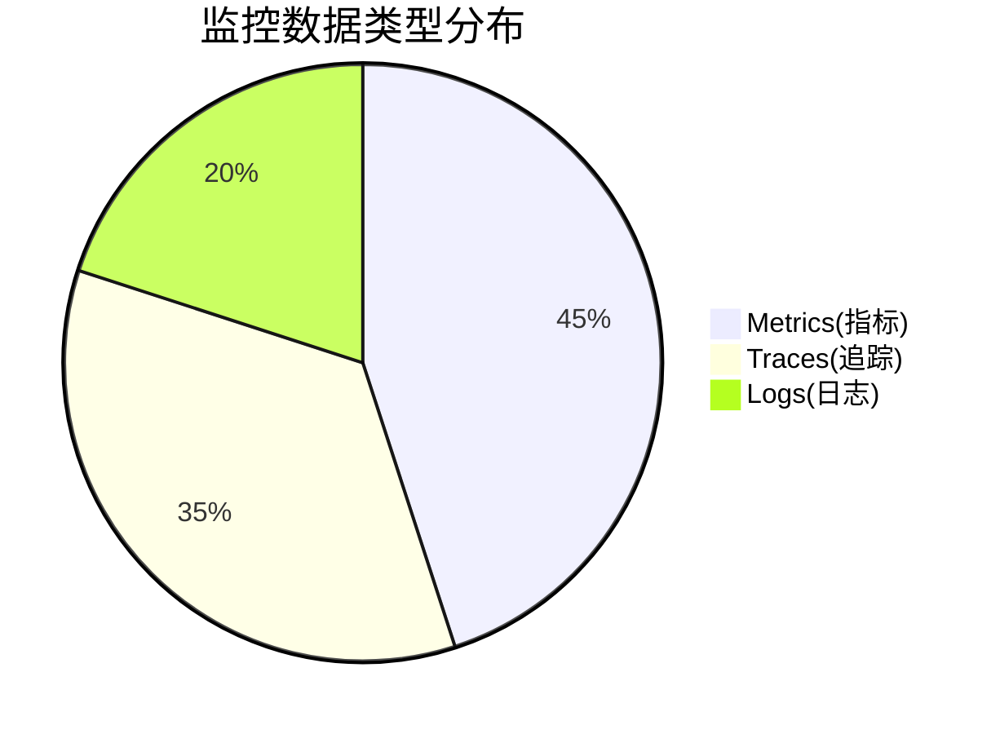

# SkyWalking 监控数据分析方法

## 介绍

Apache SkyWalking是一个开源的**应用性能监控(APM)**系统，专门为微服务、云原生和容器化架构设计。本节将重点讲解如何分析SkyWalking收集的监控数据，帮助您从海量指标中提取有价值的信息。

监控数据分析的核心目标包括：
- 识别系统性能瓶颈
- 追踪分布式事务链路
- 诊断异常和错误根源
- 预测容量需求

## 基础数据分析方法

### 1. 指标类型解读

SkyWalking主要收集三类监控数据：



#### 关键指标说明：
- **服务指标**：QPS、响应时间、错误率
- **实例指标**：CPU、内存、线程数
- **端点指标**：HTTP API的吞吐量和延迟
- **JVM指标**：堆内存、GC次数、类加载数

### 2. 数据查询基础

使用SkyWalking UI的查询界面：

```graphql
# 示例：查询服务的平均响应时间
query {
    readMetricsValues(condition: {
        name: "service_resp_time",
        entity: {scope: Service, serviceName: "payment-service"},
        duration: {start: "2023-07-01 0000", end: "2023-07-01 2359", step: MINUTE}
    }) {
        label values { values }
    }
}
```

输出示例：
```json
{
    "data": {
        "readMetricsValues": {
            "label": "avg",
            "values": [
                {"values": [12.3, 15.2, 11.8...]}
            ]
        }
    }
}
```

## 高级分析技巧

### 1. 拓扑图分析

服务依赖拓扑图能直观展示：
- 服务间调用关系
- 流量方向与强度
- 异常节点高亮

:::tip 实践建议
1. 关注突然出现的红色节点（表示错误率升高）
2. 检查单向箭头（可能缺少健康检查）
3. 对比历史拓扑发现架构变化
:::

### 2. 追踪数据分析

典型追踪数据包含：
- **Trace ID**：全局唯一标识
- **Spans**：调用链片段
- **Tags**：上下文信息

分析示例：
```
[ServiceA] --HTTP GET /order--> [ServiceB]
           --DB SELECT orders--> [MySQL]
           --RPC StockService--> [ServiceC]
```

### 3. 告警规则配置

创建有效的告警规则：
```yaml
rules:
  - name: high_error_rate
    expression: endpoint_resp_time > 1000 && endpoint_success_rate < 90%
    duration: 5m
    severity: CRITICAL
    silence-period: 10m
```

## 实战案例：电商系统分析

**场景**：用户投诉支付流程缓慢

1. **定位问题服务**：
   - 在拓扑图中发现`payment-service`响应时间突增
   - 错误率从0.5%升至8%

2. **分析追踪数据**：
   ```json
   {
     "traceId": "abc123",
     "duration": 3200,
     "spans": [
       {
         "operation": "POST /pay",
         "duration": 3100,
         "tags": {"db.instance": "payment_db"}
       }
     ]
   }
   ```

3. **发现根本原因**：
   - 数据库查询占用了97%的时间
   - 检查发现缺少订单表的索引

## 总结与练习

### 关键要点
- 掌握指标、追踪、日志的关联分析
- 学会使用SkyWalking UI的查询功能
- 建立从监控到诊断的系统化思路

### 进阶练习
1. 在测试环境部署SkyWalking并接入示例应用
2. 模拟高并发场景，观察指标变化规律
3. 创建自定义告警规则并测试触发条件

### 扩展资源
- [SkyWalking官方文档](https://skywalking.apache.org/docs/)
- [分布式追踪标准](https://opentracing.io/)
- [PromQL与监控分析](https://prometheus.io/docs/prometheus/latest/querying/basics/)