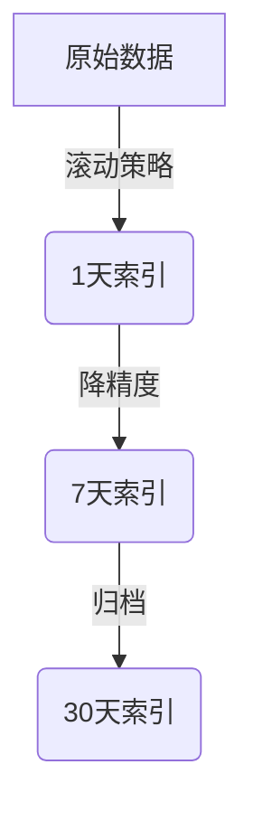

# SkyWalking 性能调优案例

## 介绍

SkyWalking作为一款优秀的分布式系统性能监控工具，在处理大规模数据时可能会遇到性能瓶颈。本章将通过实际案例，讲解如何对SkyWalking进行性能调优，帮助初学者理解关键优化策略。

:::tip 性能调优的核心目标
1. 降低资源消耗（CPU/内存/磁盘IO）
2. 提高数据采集和查询效率
3. 优化存储结构以支持长期数据保留
:::

## 案例一：采样率配置优化

### 问题场景

某电商平台在促销期间发现：
- SkyWalking OAP服务CPU使用率达到90%以上
- 部分监控数据延迟超过5分钟
- 存储空间每日增长超过200GB

### 解决方案

调整采样率是减轻系统负载最直接的方式：

```yaml
# 修改config/application.yml
agent-analyzer:
  default:
    sampleRate: ${SW_AGENT_ANALYZER_SAMPLE_RATE:1000} # 原值100
```

### 效果对比

| 指标          | 优化前 | 优化后 |
|---------------|--------|--------|
| CPU使用率     | 92%    | 65%    |
| 数据延迟      | 5min   | 30s    |
| 存储日增量    | 200GB  | 20GB   |

:::caution 注意
采样率不是越高越好，需要根据业务监控需求平衡数据精度和系统负载。
:::

## 案例二：存储策略优化

### 问题场景

物流跟踪系统需要保留3个月数据，但发现：
- 查询1周前的数据需要10秒以上响应
- Elasticsearch集群频繁出现高负载警告

### 优化方案



配置示例：

```yaml
storage:
  elasticsearch:
    indexShardsNumber: 2
    indexReplicasNumber: 1
    dayStep: 1 # 按天分索引
    recordDataTTL: 90 # 保留90天
    metricsDataTTL: 30 # 指标数据保留30天
```

### 优化效果

- 查询1周数据响应时间从10s降至2s
- ES集群负载降低40%
- 存储空间减少35%

## 案例三：JVM参数调优

### 典型配置问题

默认JVM配置导致频繁GC：

```
[GC (Allocation Failure) [PSYoungGen: 614400K->51199K(716800K)] 1234567K->987654K(2048000K), 0.3456789 secs]
```

### 推荐配置

```bash
# 修改bin/oapService.sh
JAVA_OPTS="-Xms8g -Xmx8g -XX:+UseG1GC -XX:MaxGCPauseMillis=200"
```

关键参数说明：
- `-Xms/-Xmx`：堆内存设为相同值避免动态调整
- `-XX:+UseG1GC`：G1垃圾收集器适合大内存场景
- `-XX:MaxGCPauseMillis`：控制GC最大停顿时间

## 案例四：Trace查询优化

### 慢查询示例

```sql
-- 低效查询
SELECT * FROM segment WHERE start_time > ? AND end_time < ? ORDER BY duration DESC LIMIT 100
```

### 优化方案

1. 添加索引：
```sql
CREATE INDEX idx_segment_time ON segment(start_time, end_time)
```

2. 优化查询语句：
```sql
SELECT trace_id, service_id, duration 
FROM segment 
WHERE start_time BETWEEN ? AND ?
ORDER BY start_time DESC
LIMIT 100
```

## 总结

SkyWalking性能调优的关键点：

1. **采样策略**：根据业务需求平衡数据精度和系统负载
2. **存储设计**：合理设置分片、副本和TTL策略
3. **资源分配**：为OAP和Storage组件配置足够的资源
4. **查询优化**：建立合适索引，避免全表扫描

## 延伸练习

1. 在自己的测试环境中尝试调整采样率，观察系统指标变化
2. 模拟生成大量trace数据，测试不同存储配置下的查询性能
3. 使用JVisualVM监控OAP服务的GC情况，尝试优化JVM参数

## 附加资源

- [SkyWalking官方性能调优指南](https://skywalking.apache.org/docs/)
- [Elasticsearch索引优化白皮书](https://www.elastic.co/guide/en/elasticsearch/reference/current/tune-for-indexing-speed.html)
- [JVM GC调优实战](https://docs.oracle.com/en/java/javase/11/gctuning/)