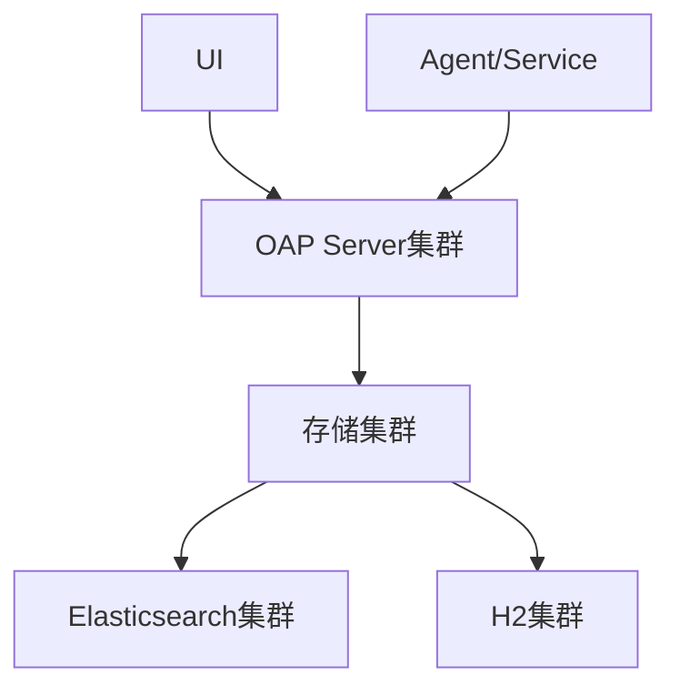
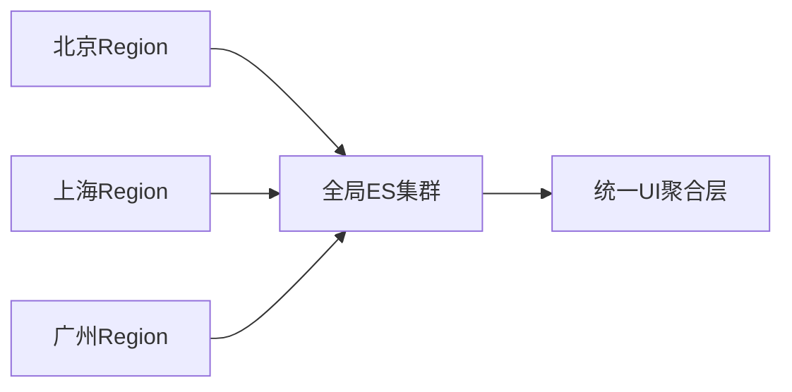

# SkyWalking 高可用部署方案

## 引言

SkyWalking作为分布式系统的APM（应用性能监控）工具，在生产环境中需要保证服务的高可用性。高可用部署方案的核心目标是：**避免单点故障**、**实现负载均衡**和**快速故障恢复**。本文将介绍基于SkyWalking 9.x的集群化部署方案。

## 基础架构组成

SkyWalking的高可用架构主要依赖以下组件：



:::note
关键组件说明：
- **OAP Server**：负责数据处理和分析
- **Storage**：支持Elasticsearch/H2/TiDB等
- **UI**：可视化界面
- **Agent**：部署在被监控服务中
:::

## 详细部署步骤

### 1. OAP Server集群配置

修改`config/application.yml`：

```yaml
cluster:
  selector: ${SW_CLUSTER:standalone}
  standalone:
  kubernetes:
    namespace: ${SW_NAMESPACE:default}
    labelSelector: ${SW_LABEL_SELECTOR:app=skywalking}
    uidEnvName: ${SW_UID_ENV_NAME:SKYWALKING_COLLECTOR_UID}
```

关键参数说明：
- `selector`: 集群模式选择（standalone/kubernetes）
- `kubernetes`: K8s相关配置（如使用容器编排）

### 2. 存储层高可用方案

#### Elasticsearch配置示例：

```yaml
storage:
  selector: ${SW_STORAGE:elasticsearch}
  elasticsearch:
    nameSpace: ${SW_NAMESPACE:""}
    clusterNodes: ${SW_STORAGE_ES_CLUSTER_NODES:localhost:9200}
    protocol: ${SW_STORAGE_ES_HTTP_PROTOCOL:"http"}
```
:::tip
生产环境建议至少3个ES节点，并配置分片和副本：
```json
PUT _template/skywalking_template
{
  "index_patterns": ["skywalking*"],
  "settings": {
    "number_of_shards": 3,
    "number_of_replicas": 1
  }
}
```
:::

### 3. 负载均衡配置

使用Nginx作为负载均衡器的示例：

```nginx
upstream skywalking-oap {
    server oap1:12800;
    server oap2:12800;
    server oap3:12800 backup;
}

server {
    listen 12800;
    location / {
        proxy_pass http://skywalking-oap;
    }
}
```

## 实际案例：电商系统监控

**场景需求**：
- 日均10亿条span数据
- 99.99%可用性要求
- 跨地域部署

**解决方案**：


配置要点：
1. 每个Region部署3节点OAP集群
2. 使用全局Elasticsearch集群（专线连接）
3. UI层读取最近访问的Region数据

## 故障转移测试

模拟节点故障的检测命令：

```bash
# 检查集群状态
curl http://localhost:12800/internal/liveness

# 手动下线节点
kubectl scale deployment skywalking-oap --replicas=2
```

预期行为：
- 流量自动切换到健康节点
- UI显示警告但数据收集不间断
- 新节点加入后自动重新平衡

## 总结与最佳实践

高可用部署的关键要点：

1. **至少3个OAP节点**：满足多数派选举需求
2. **存储分离**：建议使用ES集群而非H2
3. **监控SkyWalking本身**：部署健康检查机制
4. **定期演练**：模拟节点故障测试恢复流程

:::warning
注意事项：
- 跨地域部署需考虑网络延迟
- 存储集群的磁盘要预留50%以上空间
- 版本升级时要逐个节点滚动更新
:::

## 扩展学习

1. [SkyWalking官方集群文档](https://skywalking.apache.org/docs/)
2. 练习：使用Docker Compose部署3节点集群
3. 进阶：研究基于Kubernetes Operator的部署方案