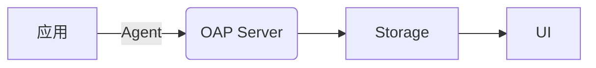
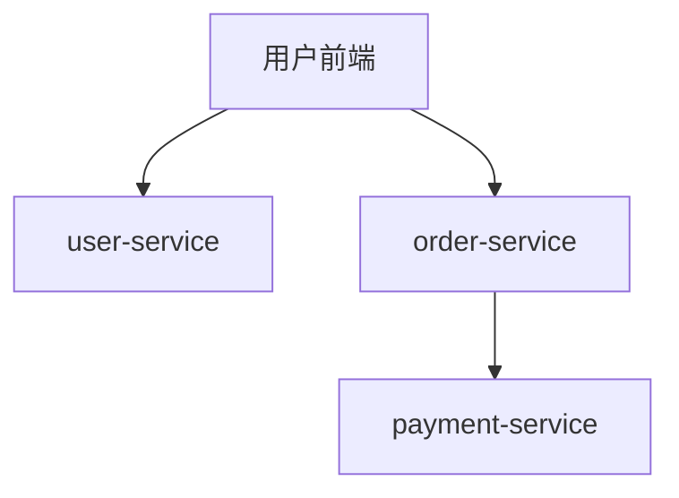

# SkyWalking 云原生应用监控

## 介绍

Apache SkyWalking 是一款开源的 **应用性能监控（APM）** 和 **分布式追踪系统**，专为云原生环境设计。它能够帮助开发者监控微服务架构、容器化应用和 Kubernetes 集群，提供从基础设施到应用层的全栈可观测性。

在云原生环境中，应用通常以微服务形式部署，并动态扩展。SkyWalking 通过以下核心功能支持云原生监控：
- **分布式追踪**：跟踪请求在多个服务间的流转路径。
- **指标收集**：监控服务性能指标（如响应时间、错误率）。
- **拓扑分析**：自动生成服务依赖关系图。
- **告警机制**：基于阈值触发通知。

## 核心概念

### 1. 架构组件
SkyWalking 的核心组件包括：
- **OAP（Observability Analysis Platform）**：负责数据分析和存储。
- **UI**：可视化监控数据。
- **Agent**：集成到应用中收集数据（支持 Java、Go、Node.js 等）。



### 2. 数据模型
SkyWalking 使用以下数据模型：
- **Service**：一个独立的应用或微服务。
- **Instance**：服务的运行实例（如 Kubernetes Pod）。
- **Endpoint**：服务暴露的接口（如 HTTP API）。

## 部署配置

### 1. 安装 SkyWalking
以下是通过 Helm 在 Kubernetes 中快速部署 SkyWalking 的示例：

```bash
helm repo add skywalking https://apache.jfrog.io/artifactory/skywalking-helm
helm install skywalking skywalking/skywalking -n skywalking --create-namespace
```

### 2. 集成应用 Agent
以 Java 应用为例，添加 SkyWalking Agent 启动参数：

```bash
java -javaagent:/path/to/skywalking-agent.jar \
     -Dskywalking.agent.service_name=my-service \
     -Dskywalking.collector.backend_service=oap:11800 \
     -jar my-app.jar
```

## 实际案例

### 场景：监控 Spring Cloud 微服务
假设有一个由以下服务组成的电商系统：
- `user-service`（用户管理）
- `order-service`（订单处理）
- `payment-service`（支付网关）

#### 步骤 1：为所有服务添加 Agent
在每个服务的启动命令中配置 SkyWalking Agent（如上述 Java 示例）。

#### 步骤 2：查看监控结果
在 SkyWalking UI 中可以看到：
- 服务间的调用拓扑图。
- 每个接口的响应时间和错误率。



:::tip
在 Kubernetes 中，可以通过 Sidecar 模式自动注入 Agent，避免手动修改部署配置。
:::

## 最佳实践

1. **标签与自定义指标**  
   使用 `@Trace` 注解（Java）或 SDK 添加自定义标签：
   ```java
   @Trace(operationName = "process_payment")
   public void processPayment() {
       // 业务逻辑
   }
   ```

2. **告警规则配置**  
   在 `alarm-settings.yml` 中定义阈值告警：
   ```yaml
   rules:
     - name: high_error_rate
       expression: endpoint_cpm > 100 && endpoint_success_rate < 80%
   ```

3. **存储优化**  
   对于生产环境，建议使用 Elasticsearch 替代默认的 H2 存储：
   ```yaml
   storage:
     selector: elasticsearch
     elasticsearch:
       namespace: skywalking
       clusterNodes: elasticsearch:9200
   ```

## 总结

SkyWalking 为云原生应用提供了以下关键价值：
- **全栈监控**：覆盖从基础设施到业务逻辑。
- **低侵入性**：通过 Agent 实现无代码修改的集成。
- **动态扩展支持**：天然适配 Kubernetes 环境。

## 扩展资源

- 官方文档：[https://skywalking.apache.org/docs/](https://skywalking.apache.org/docs/)
- 练习：尝试在本地 Minikube 集群中部署 SkyWalking 并监控一个简单微服务。