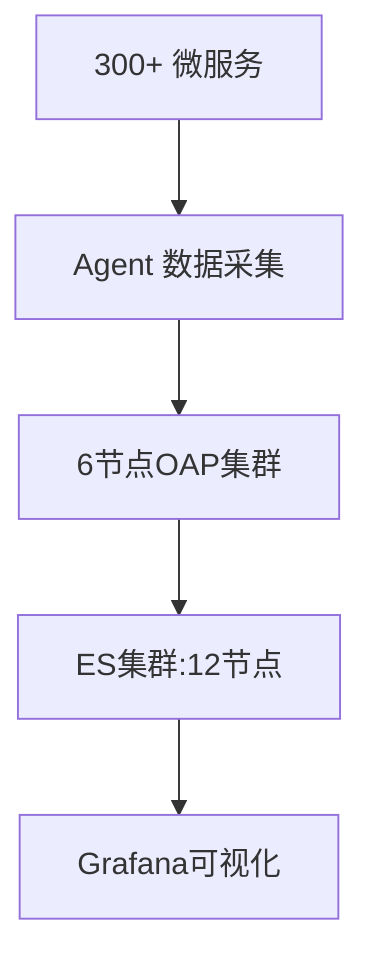

## 引言

Apache SkyWalking 是一款开源的分布式系统监控和追踪工具，特别适合微服务和云原生架构。当系统规模扩大时，SkyWalking 的部署会面临性能、稳定性和资源管理的挑战。本章将指导您完成大规模部署的关键步骤，并通过实际案例展示最佳实践。

---

## 大规模部署的核心挑战

大规模部署 SkyWalking 需要解决以下问题：
1. **高吞吐量处理**：海量监控数据的收集和分析。
2. **水平扩展**：OAP（Observability Analysis Platform）集群的扩展能力。
3. **存储优化**：高效使用 Elasticsearch/MySQL 等存储后端。
4. **网络延迟**：跨地域部署时的数据传输效率。

---

## 架构设计实践

### 1. 集群化部署
SkyWalking 的核心组件 OAP 需要以集群模式运行。示例配置（`application.yml`）：
```yaml
cluster:
  selector: ${SW_CLUSTER:standalone}
  standalone: # 开发模式
  kubernetes: # 生产推荐
    namespace: ${SW_CLUSTER_K8S_NAMESPACE:default}
    serviceName: ${SW_CLUSTER_K8S_SERVICE_NAME:skywalking-oap}
```

### 2. 负载均衡策略
使用 Nginx 分发流量到多个 OAP 节点：
```nginx
upstream oap_servers {
  server oap-node1:12800;
  server oap-node2:12800;
}
server {
  listen 12800;
  location / {
    proxy_pass http://oap_servers;
  }
}
```

---

## 存储优化方案

### Elasticsearch 分片策略
大规模数据场景下，调整 ElasticSearch 的索引模板：
```json
PUT _template/skywalking_metrics
{
  "index_patterns": ["sw_metrics*"],
  "settings": {
    "number_of_shards": 6,
    "number_of_replicas": 2
  }
}
```

:::tip
- 分片数（`number_of_shards`）建议按 `每日数据量/30GB` 计算
- 副本数（`number_of_replicas`）至少为 1 以保证高可用
:::

---

## 性能调优实战

### JVM 参数优化
OAP 服务器的 JVM 配置建议：
```bash
# 在 startup.sh 中修改
JAVA_OPTS="-Xms8G -Xmx8G -XX:+UseG1GC -XX:MaxGCPauseMillis=200"
```

### 线程池配置
调整 `application.yml` 中的处理线程：
```yaml
core:
  default:
    # 根据 CPU 核数调整
    maxThreads: ${SW_CORE_MAX_THREADS:16}
    queueSize: ${SW_CORE_QUEUE_SIZE:10000}
```

---

## 真实案例：电商平台监控

### 场景描述
某跨境电商平台部署架构：


### 关键配置
- 每日处理 20TB 追踪数据
- 使用 Kubernetes 动态扩展 OAP 节点
- 采用冷热数据分离的 ES 存储方案

---

## 总结与练习

### 核心要点
1. OAP 集群化是大规模部署的基础
2. 存储后端需要根据数据规模预先规划
3. JVM 和线程调优直接影响吞吐量

### 动手练习
1. 使用 Helm 在 Kubernetes 中部署 3 节点 OAP 集群
2. 模拟高负载场景（如 JMeter），观察 ES 的索引性能
3. 尝试调整 `queueSize` 参数并监控处理延迟变化

### 扩展阅读
- [SkyWalking 官方性能调优指南](https://skywalking.apache.org/docs/)
- 《分布式系统监控实战》第 7 章
