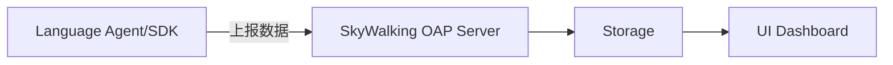

# SkyWalking 多语言应用监控

## 介绍

SkyWalking是一个开源的**应用性能监控（APM）**系统，专为分布式、多语言环境设计。它支持对Java、Python、Go、Node.js等多种语言的应用程序进行链路追踪、指标收集和可视化分析。本章将介绍如何在不同语言中集成SkyWalking，并展示实际监控场景。

:::note 核心能力
- **跨语言追踪**：统一监控异构技术栈的服务调用链。
- **低侵入性**：通过Agent或SDK实现集成，无需修改业务代码。
- **实时拓扑图**：动态展示服务间依赖关系。
:::

---

## 多语言支持原理

SkyWalking通过以下组件实现多语言监控：



- **Agent**（如Java）：以探针形式注入运行时（如JVM）。
- **SDK**（如Python/Go）：需在代码中显式调用API。

---

## 语言集成实践

### 1. Java应用监控
通过Java Agent启动应用，自动捕获HTTP/Database调用：

```bash
java -javaagent:/path/skywalking-agent.jar \
     -Dskywalking.agent.service_name=my-java-app \
     -jar your-app.jar
```

**输出效果**：在SkyWalking UI中查看完整的调用链和JVM指标。

---

### 2. Python应用监控
使用`skywalking-python`包，需手动装饰函数：

```python
from skywalking import agent, config

config.init(agent_collector_backend_services='127.0.0.1:11800',
            agent_name='my-python-app')
agent.start()

@app.route("/hello")  # Flask示例
def hello():
    return "Hello World"
```

:::tip 自动追踪
支持Django、Flask等框架的自动埋点，数据库操作也会被记录。
:::

---

### 3. Go应用监控
通过`go2sky`SDK创建手动埋点：

```go
import "github.com/SkyAPM/go2sky"

func main() {
    tracer, _ := go2sky.NewTracer("my-go-service")
    span, ctx, _ := tracer.CreateLocalSpan(context.Background())
    defer span.End()
    // 业务代码...
}
```

---

## 实际案例：电商系统监控

假设一个多语言架构的电商系统：
- **前端**：Node.js（使用`skywalking-nodejs`）
- **订单服务**：Java（Agent自动接入）
- **支付服务**：Go（手动埋点）


**监控效果**：
- 每个服务的响应时间、错误率一目了然
- 跨语言调用链完整串联

---

## 总结与练习

### 关键总结
1. 不同语言需选择对应接入方式（Agent/SDK）
2. 确保所有服务上报到同一个SkyWalking OAP集群
3. 跨服务调用时传递`trace_id`（通常自动完成）

### 扩展练习
1. 尝试在本地同时启动Java和Python服务，并观察调用链
2. 使用SkyWalking的`Alarm`功能为Go服务设置慢请求告警

:::caution 常见问题
- **数据不上报**：检查OAP地址和网络连通性
- **调用链断裂**：确保跨进程的`trace`上下文正确传递
:::
``` 

（注：实际使用时请移除首尾的` 